# Auto-Echo: Automated Discovery of Memory Hierarchy Latency Patterns from User-Space

Harsh Raj Singh  
*MSc Advanced Computer Science*  
*Queen Mary University of London*  
*London, United Kingdom*  
*ec25303@qmul.ac.uk*

## Declaration of Originality

I, Harsh Raj Singh, declare that this dissertation and the work it presents are my
own. Where I have drawn on the published work of others it is explicitly cited, and
the only verbatim material from other sources is clearly marked as quotation.
Generative-AI tools were used in accordance with the programme's policy, as detailed
in the Generative-AI Accountability Statement (Appendix A). This work has not been
submitted, in whole or in part, for any other degree or qualification.

*Signed:* \_\_\_\_\_\_\_\_\_\_\_\_\_\_\_\_\_\_\_\_\_\_\_ &nbsp;&nbsp; *Date:* \_\_\_\_\_\_\_\_\_\_\_\_\_

## Acknowledgements

I am grateful to my supervisor for consistently pressing on the weakest parts of
this work rather than the strongest. Several of the results reported here exist
only because a claim I had made was challenged and turned out, on examination, to
be unsupported: the level counts are validated against an exact optimum (§4.2.1)
because the choice of clustering algorithm was questioned, and the analysis of the
naive baseline in §5 was corrected from an architectural to a structural
explanation because the framework's own cross-platform evidence contradicted the
earlier account. Supervision that produces that kind of correction is the most
useful kind.

I thank Dr Vasileios Klimis, whose ECOOP 2025 paper *"Shouting at Memory: Where
Did My Write Go?"* is the point of departure for this project, and whose §7
explicitly identifies cache-hierarchy inference by timing as an open direction —
the challenge this dissertation takes up.

I thank the maintainers of the open-source scientific stack this work depends on —
NumPy, SciPy, pandas, scikit-learn, `ruptures` and Matplotlib — and the authors of
lmbench, whose `lat_mem_rd` established the pointer-chase measurement this probe
re-implements.

Finally, I thank my family for their patience during the writing of this
dissertation, and the owner of the Windows machine on which the x86 results of
§6.3 were collected for the loan of the hardware and the administrator rights
without which the huge-page experiment could not have been run.

## 1. Abstract
Can a machine's cache hierarchy — how many levels it has and how large each is —
be recovered from user space alone, with no privileges, no architecture-specific
instructions and no prior knowledge of the hardware? Vendor documentation and
privileged interfaces are the usual answer; neither is available to portable
software reasoning about its own performance. This dissertation presents
Auto-Echo, which answers the question from timing alone.

The work begins from a negative result. A naive probe that flushes a line, writes
it and times the subsequent load fails on both ARM64 and x86-64, and the cause
lies not in the instruction set but in the measurement design: writing a line
immediately before timing its read guarantees a cache hit by construction. The
delivered framework therefore adopts a different primitive — a working-set-size
pointer chase, prefetcher-resistant and flush-free, with batch-amortised,
runtime-calibrated timing — feeding an unsupervised stage in which clustering
*counts* the memory levels and change-point detection *localises* each capacity.
The counting step is shown to be globally optimal rather than merely convergent.
The framework builds on Linux; it was measured on macOS and Windows.

On an Apple M1 every estimator agrees on three levels, the documented L1 and L2
recovered within one octave, the L2 and the undocumented System-Level Cache
resolving as a single band. On an Intel Raptor Lake core the same code path
recovers the full L1/L2/L3/DRAM hierarchy — but only under a 2 MiB huge-page
allocation, without which page-walk latency masks the last-level cache entirely.
That page-size dependence is itself a controlled result: it isolates the
translation lookaside buffer, not the inference layer, as the binding constraint
on user-space discovery of deep cache hierarchies.

---

## 2. Introduction
Modern processors rely on a deep hierarchy of caches (L1, L2, L3) to mitigate the
latency gap between the CPU and DRAM. The capacities and latencies of these
layers are largely opaque to user-space software: developers rely on vendor
documentation or privileged interfaces (performance counters, kernel modules) to
map them.

**Motivation.** An architecture-agnostic tool that maps a memory hierarchy from
empirical measurement alone — no privileges, no per-architecture instructions —
would support performance tuning, portable auto-tuning of cache-blocked
algorithms, and reproducible systems research on undocumented hardware. This
direction is not incidental to the reference work: Klimis [1] explicitly
identifies it as an open avenue, noting that "the ability to infer data location in
the memory hierarchy via timing could potentially be applied to study cache
behaviour, coherence protocol actions, or even aspects of memory consistency,
although these applications would require careful calibration, different
instrumentation strategies, and potentially more sophisticated analysis" (§7).
Auto-Echo takes up precisely that challenge — the "careful calibration" and
"different instrumentation" the paper anticipates — for the specific problem of
cache-hierarchy discovery.

**Problem statement.** Measuring nanosecond cache latency from user space is
obstructed by hardware prefetchers, coarse timers, and the absence of portable
cache-control primitives. Interpreting the resulting noisy measurements without
hard-coded thresholds requires unsupervised inference.

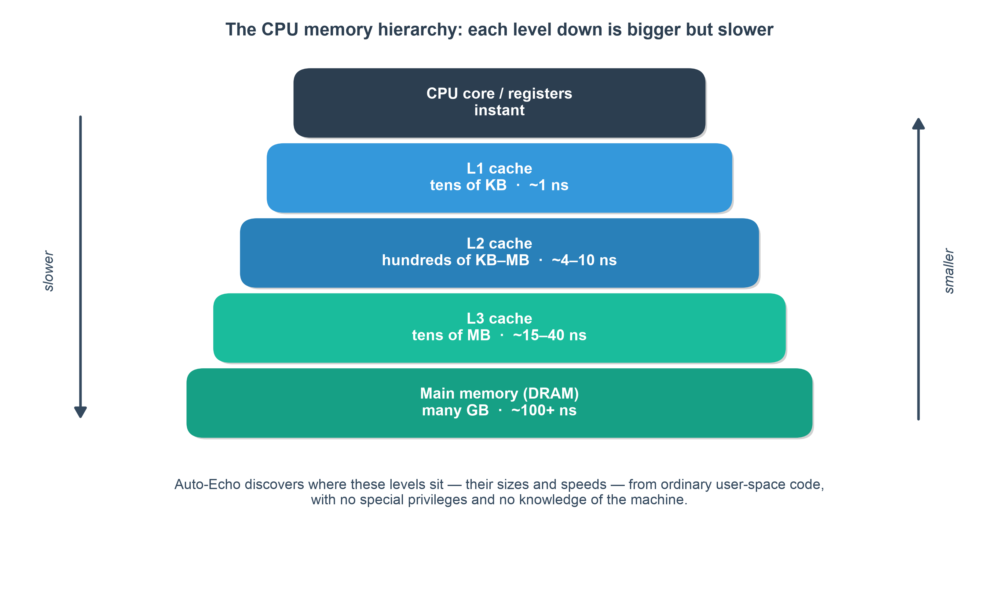
*Fig. 1. The memory hierarchy. While OS-documented caches (L1, L2, L3) are closer to the CPU and faster, Auto-Echo is capable of empirically discovering them—and undocumented tiers like the M1 System Level Cache—purely from latency.*

**Aims and objectives.** Build an autonomous pipeline (Auto-Echo) that (i)
collects reliable memory-latency measurements from user space on any
architecture, (ii) infers the number and boundaries of memory levels without
labels or thresholds, and (iii) validates its output against known hardware.

**Contributions.**
1. A portable, flush-free WSS pointer-chase probe with batch-amortised timing.
   It **builds on Linux; it was measured on macOS and Windows**, across ARM64 and
   x86-64, using `rdtscp`, `mach_absolute_time`, or `cntvct_el0` as available. The
   Linux path is compiled and exercised by the test suite but no Linux hardware
   result is claimed (§6.5).
2. A tick-to-nanosecond conversion that is **calibrated at runtime** against the
   OS monotonic clock, making the framework correct on any machine without
   configuring a per-CPU frequency and robust to turbo/frequency scaling.
3. An automatic, penalty-free level-discovery stage in which clustering
   (K-Means + Silhouette, cross-checked by GMM and DBSCAN) *counts* the levels
   and change-point detection *localises* each capacity — an architecture-agnostic
   design that removes the last manual tuning knob.
4. A self-validating evaluation against live OS ground truth, with empirical
   results on **two real ISAs** — an Apple M1 (three levels, unanimous across
   estimators) and an Intel Raptor Lake core (L1/L2 recovered with default 4 KiB
   pages; the **full L1/L2/L3/DRAM hierarchy** recovered under a 2 MiB huge-page
   control that lifts the TLB/page-walk masking of the L3 — 3/3 documented caches
   matched, 100% recall and precision — with the provenance recorded that this
   depends on huge pages and the level count is stable but not cross-estimator
   unanimous).
5. A documented negative result (the naive probe) that motivates the design.

---

## 3. Literature Review & Background

This project sits at the intersection of two research traditions: empirical
characterisation of the memory hierarchy from user space through timing
measurement, and unsupervised model selection for automatic structure discovery.
The immediate inspiration is the reference paper [1], but the *measurement*
technique Auto-Echo ultimately adopts belongs to a much older and well-established
body of benchmarking work. This section situates the project honestly within both
lineages and states precisely where its novelty lies — and, equally, where it does
not.

### 3.1 Memory echolocation
Klimis [1] introduces *memory echolocation*: emitting a store and timing the
subsequent load, whose latency acts as a signature for where the data currently
resides. The headline contribution of that work is not the latency profiling
itself but its use as an **Oracle inside an active model-learning loop** that
infers the persistency semantics of non-volatile memory, including the Intel
Write Pending Queue (WPQ). On an Intel Xeon E-2286G the paper reports
characteristic latency bands for L1, L2, L3, WPQ and DRAM.

Two inherited assumptions must be retired carefully, because the first Auto-Echo
prototype adopted both and neither transfers:

- The **WPQ is a persistent-memory (Optane) construct**, not a general feature of
  a commodity cache hierarchy. Expecting a WPQ tier on an Apple M1 — as the
  initial prototype's level naming did — is a category error, and the level
  vocabulary was corrected accordingly.
- The method relies on **`clflush` and fine-grained `rdtscp`**, both x86-only.
  Neither is available to user space on Apple Silicon, so the technique is not
  portable as published. Section 5 shows empirically that porting it is not merely
  inconvenient but unsound, and for a reason deeper than instruction availability.

Auto-Echo isolates the *hierarchy-mapping* aspect of echolocation, makes it
architecture-agnostic and strictly unprivileged, and replaces manual latency
thresholding with unsupervised inference.

### 3.2 The classical lineage: user-space cache characterisation
Recovering cache parameters from a working-set-size (WSS) sweep is a mature
technique, and this project's probe is a modern re-implementation of it rather
than a new idea. The relevant prior art:

- **Saavedra & Smith** [8] established that varying the size and stride of an
  array-access micro-benchmark reveals cache capacities and line sizes as
  discontinuities in measured access time — the foundational "sweep" idea.
- **McVoy & Staelin's lmbench** [9] provides `lat_mem_rd`, a **pointer-chasing**
  load-latency sweep over increasing array sizes. Its data-dependent load chain is
  exactly the mechanism Auto-Echo uses to defeat the hardware prefetcher without
  any cache-flush instruction. This is the single closest antecedent to
  Auto-Echo's probe, and the practice of reporting the *minimum* over repeats is
  taken directly from it.
- **Yotov, Pingali & Stodghill** [10] automated the *extraction* of cache
  parameters — capacity, line size, associativity — from such curves, framing
  hierarchy discovery as an automated measurement problem. Their extraction is
  nevertheless driven by hand-built decision rules and platform-specific
  thresholds rather than by model selection from the data.
- **Manegold's Calibrator** [24] and **Molka et al.** [23] refined
  latency and bandwidth characterisation across the hierarchy, the latter with
  careful attention to coherency-state effects on a multi-socket system.
- **Bryant & O'Hallaron's "memory mountain"** [11] popularised the WSS × stride
  latency surface as both a pedagogical and a diagnostic artefact; Auto-Echo's
  output plot is a 1-D (fixed-stride) slice through that surface.

**Implication for novelty.** Measuring cache capacities by pointer chasing is
classical; claiming it as novel would be indefensible. Auto-Echo's contribution is
therefore explicitly the **layer above** the measurement: a fully unsupervised,
zero-configuration inference stage that determines *how many* levels exist and
*where their boundaries lie* with no hard-coded thresholds and no prior knowledge
of the machine, and that validates itself automatically against OS-reported ground
truth on whatever machine it runs on. Where Yotov et al. automate extraction given
a known hierarchy shape, Auto-Echo infers the shape itself.

### 3.3 Hardware barriers to user-space timing
Three barriers recur in the literature and in this project's own empirical work:

- **Prefetching.** Regular access patterns are predicted and hidden by the
  hardware prefetcher, flattening the very steps the method needs. Pointer
  chasing over a randomised permutation makes each address data-dependent on the
  previous load, serialising accesses and neutralising the prefetcher.
- **Timer quantisation.** Apple Silicon's `mach_absolute_time` [2] advances on a
  24 MHz counter — roughly 41.7 ns per tick, via a `mach_timebase_info` rational
  of 125/3 — which is far coarser than an L1 hit of about 1.5 ns. Timing a single
  access therefore measures the timer, not the memory system. Amortising 10^6 or
  more dependent hops inside one timing window recovers sub-nanosecond effective
  resolution.
- **No user-space flush on ARM.** `clflush` is x86-only and macOS exposes no
  data-cache flush to user space. The WSS methodology sidesteps this entirely: a
  working set larger than a cache level overflows it *by construction*, so no
  explicit eviction primitive is required. This is why the WSS formulation is not
  merely a convenient alternative to the reference method but the only one of the
  two that can be made portable at all.

### 3.4 Unsupervised model selection
The number of memory levels is unknown a priori and varies by machine, so the
inference stage must select model complexity **from the data**. This is the
project's core machine-learning problem, and two distinct families of method
address it. Their difference — whether the *order* of the observations is used —
turns out to be the central design question, and Section 4.2.1 resolves it.

**Clustering with internal validity indices (order-ignoring).** Treating the
per-size latencies as an unordered sample, K-Means [20] partitions them into `k`
groups minimising the within-cluster sum of squares. Because `k` must be supplied,
an internal validity index selects it. The **Silhouette coefficient** [4] scores
each point by the contrast between its mean intra-cluster distance and the mean
distance to its nearest neighbouring cluster; the mean over all points is
maximised at a `k` that balances compactness against separation. Crucially — and
this is the property Auto-Echo depends on — the Silhouette is **not monotone in
`k`**, so it exhibits an interior maximum and can select a count without any
penalty term. Alternatives include the **Elbow method**, formalised by the
knee-detection heuristic of Satopää et al. [19], the **gap statistic** [22], and,
for likelihood-based models, the **Bayesian Information Criterion** [18].

**A documented weakness in one dimension.** The Silhouette is known to degrade on
one-dimensional data with unequal cluster sizes and unequally spaced gaps, where
it tends to favour the partition at the single largest gap and thereby
**under-count closely spaced levels**. This is not a hypothetical concern here: it
is precisely the failure observed on the Intel part before the huge-page control
was applied (Section 6.3), where the criterion collapsed a four-level hierarchy
onto the "fast versus slow" split at the largest latency discontinuity. A related
and less widely discussed hazard, which Section 4.2.1 addresses directly, is that
the Silhouette weights every point equally and is therefore sensitive to how many
observations each cluster contains — a quantity fixed by the experimenter's
sampling grid rather than by the physics.

**Exact clustering in one dimension.** K-Means is normally solved by Lloyd's
algorithm [20], a local-search heuristic with no optimality guarantee even under
careful seeding [21]. In one dimension, however, an optimal partition is
necessarily *contiguous* in sorted order, which collapses the search space to the
choice of `k − 1` split points and admits an exact dynamic-programming solution.
This result is old — **Fisher** [16] gave it in 1958 as "grouping for maximum
homogeneity", and cartographers know the same construction as **Jenks natural
breaks** [17] — and a modern $O(k n^2)$ implementation is provided by **Wang & Song's
Ckmeans.1d.dp** [15]. That an exact algorithm exists for exactly the case at hand
is a fact any use of Lloyd's heuristic on 1-D data must answer to; Section 4.2.1
does so empirically.

**Change-point detection (order-respecting).** Because a WSS curve is a
piecewise-constant signal in `log S`, detecting the indices at which the level
shifts is arguably a more natural formulation than clustering values. Truong et
al. [6] survey the field; the two relevant estimators are **PELT** [14], which
selects the number of breakpoints automatically via a penalty term, and **Dynp**,
which finds the optimal segmentation *given* a fixed number of breakpoints by
dynamic programming. The essential difficulty is that the segmentation cost
decreases monotonically as breakpoints are added, so the number of segments cannot
be read off the objective and must be fixed either by an external penalty — a
per-machine tuning constant, precisely what this project set out to remove — or by
a knee heuristic on the cost curve. Section 6 quantifies how badly a fixed penalty
generalises across machines.

**Density-based clustering.** DBSCAN [12] requires no cluster count, deriving
groups from density connectivity and labelling sparse points as noise — attractive
here because transition points genuinely *are* noise between plateaus. Its cost is
that it substitutes one hyperparameter for another: the neighbourhood radius `eps`
must still be chosen, a trade-off acknowledged explicitly in Section 4.4.

**The gap this project addresses.** The benchmarking literature recovers cache
parameters but fixes the hierarchy's shape in advance, by hand-written rules or
operator inspection. The clustering literature selects model complexity but is
generally applied to unordered data. Neither tradition provides an automatic,
architecture-agnostic, self-validating estimator of *how many* memory levels a
machine has. Auto-Echo combines the portable, flush-free pointer-chase probe from
the former with a model-selection stage from the latter, and reports the
combination's behaviour — including where it fails — across two real ISAs.

---

## 4. Methodology (System Architecture)
Auto-Echo is a four-stage pipeline: a native measurement probe, a level-discovery
stage that counts and localises the memory levels, a set of independent
cross-checks on the count, and automatic validation against OS ground truth.

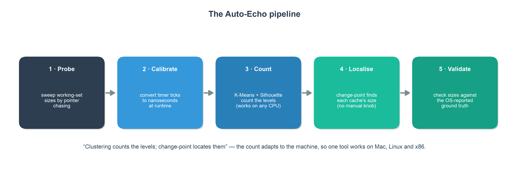
*Fig. 2. The unsupervised Auto-Echo pipeline.*

### 4.1 WSS Pointer-Chase Probe (`src/autoecho/wss/wss_probe.c`)

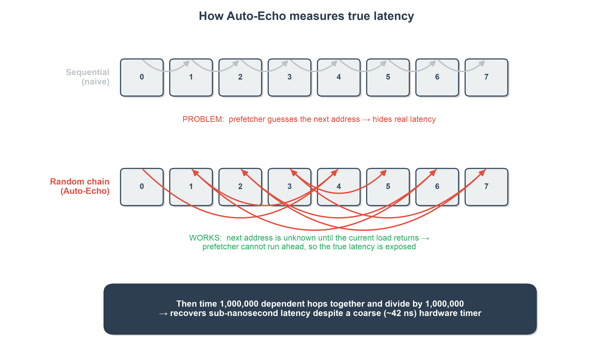
*Fig. 3. The Working-Set-Size Pointer-Chasing methodology. A Fisher-Yates cycle defeats the hardware prefetcher, and batch-amortized timing bypasses coarse OS timer constraints.*

Nanosecond memory timing requires a native probe; Auto-Echo implements it as a
Python C extension (`wss_probe.c`). For each working-set size `S` in a log-spaced
sweep — from four cache lines to a user-set maximum, at ten geometrically spaced
points per octave — the probe performs five steps:

1. A **page-aligned** buffer of size `S` (`posix_memalign` on POSIX,
   `_aligned_malloc` under MSVC, following the reference paper's alignment
   choice [1]) is divided into slots one **cache line** apart, the line size being
   auto-detected at run time (128 B on Apple Silicon, 64 B on x86). Alignment
   guarantees that no cache line straddles two pages; it does *not* bound TLB
   pressure, since the number of distinct pages touched grows with `S` regardless.
   The deep-memory plateau therefore still contains page-walk latency — a
   confounder addressed by the huge-page control below and quantified in §6.3.
2. The slots are linked into a **single random Hamiltonian cycle** by a
   Fisher–Yates shuffle [5] driven by a seeded xorshift64 generator, making every
   sweep reproducible. Constructing the cycle writes every slot, which has the
   useful side effect of pre-faulting every page before timing begins.
3. The probe performs a data-dependent **pointer chase**: each load returns the
   address of the next. Because addresses are unpredictable, the hardware
   prefetcher cannot run ahead and accesses are fully serialised, so **no
   cache-flush instruction is needed** — essential on ARM/macOS, where none is
   available to user space (§3.3).
4. A warm-up traversal brings the working set to steady state, after which
   $N \geq 2^{20}$ dependent hops are timed in a single window and the total divided by
   $N$. This **batch amortisation** yields sub-nanosecond effective resolution
   despite the ~41.7 ns Apple Silicon timer tick.
5. Each size is measured `R = 5` times and the **minimum** retained. For a
   micro-benchmark, interference can only add time, so the fastest observation is
   the best estimator of true latency — standard lmbench practice [9]. §6.5 notes
   the cost of this choice: a lower envelope hides variability, which is why the
   reported figures are accompanied by a min–max band across independent sweeps.

Alignment does not, however, bound how many *distinct pages* a large working set
spans, so the probe also exposes an opt-in **2 MiB large-page** backing for the
chase buffer (`--huge-pages`; `VirtualAlloc(MEM_LARGE_PAGES)` on Windows, falling
back gracefully to 4 KiB pages when the OS withholds the privilege). A 2 MiB page
covers 512× the address range of a 4 KiB one, cutting the page-walk traffic that
would otherwise accumulate in the deep plateaus. Because the allocation actually
obtained changes what the curve means, each report records the run's provenance
("2 MiB large pages" or "default 4 KiB pages") from a post-hoc check of what was
allocated rather than from what was requested — §6.3 shows this single control
deciding whether a 20 MiB L3 is visible at all.

The probe is written to a single portable interface that **builds on Linux** and
was **measured on macOS and Windows**, across x86-64 and ARM64: the tick counter is `rdtscp`
(x86, via `<intrin.h>` under MSVC or `<x86intrin.h>` under GCC/Clang),
`mach_absolute_time` (Apple), or `cntvct_el0` (ARM Linux), and the thread is
kept on one core via a QoS hint (Apple), `sched_setaffinity` (Linux), or
`SetThreadAffinityMask` (Windows) so plateaus are not blurred by core migration.

### 4.1.1 Runtime Timer Calibration (An Improvement Over the Reference)
Converting ticks to nanoseconds robustly is a portability problem in itself. The
reference implementation converts cycles to nanoseconds by **parsing the "cpu
MHz" field from `/proc/cpuinfo`**, which the paper itself acknowledges is
specific to Linux [1]. This has two weaknesses: it is not portable beyond Linux,
and the `rdtscp` counter actually advances at the *invariant-TSC* (nominal)
frequency, whereas "cpu MHz" reports the current, turbo-scaled core clock — so
the conversion is inaccurate whenever the core is not at its nominal frequency.
Auto-Echo instead **calibrates at runtime**, counting hardware ticks over a fixed
~50 ms interval of the OS monotonic clock (`clock_gettime` on POSIX,
`QueryPerformanceCounter` on Windows). This yields the true tick rate on any
machine with no configuration, and is a concrete methodological advance over the
reference paper's frequency-detection step.
On Apple Silicon the exact rational from `mach_timebase_info` (125/3 ~ 41.667 ns)
is used directly; an independent calibration run reproduced this value to four
significant figures, confirming the mechanism relied upon by the x86/Windows
paths.

### 4.2 Level Discovery: Count, then Localise (`src/autoecho/analysis.py`)
A cache of capacity $C$ keeps latency flat while the working set fits ($S \leq C$)
and steps up once it overflows. The number of memory levels therefore equals the
number of **plateaus** in the latency-versus-`log S` curve, and each cache's
capacity is the working-set size at the plateau-to-rise transition (Fig. 4).
Auto-Echo turns this staircase into a hierarchy in two stages, implemented with
scikit-learn [7] for the clustering and `ruptures` [6] for the segmentation:

1. **Count the levels** by clustering the per-size log-latencies with K-Means and
   selecting the number of clusters by the Silhouette coefficient [4],
   cross-checked independently by the Elbow method, a Gaussian mixture and DBSCAN.
2. **Localise each boundary** by change-point detection constrained to exactly
   that many segments — dynamic-programming `Dynp` from `ruptures` [6] on the
   log-latency signal, which needs no penalty once the segment count is fixed.

This realises the principle *clustering counts the levels, change-point localises
their capacities*. Two implementation details support it. The curve is lightly
median-smoothed before segmentation — appropriate here because, unlike the
i.i.d. sample path of the naive baseline (§5), this is a genuine ordered sweep
whose neighbours share a level. Segmentation runs on **log-latency** rather than
raw nanoseconds, so that the small L1→L2 step and the large L2→DRAM step are
comparable in magnitude and both are detected; without the log transform the
deep steps dominate the squared-error cost and the inner hierarchy is lost.
Adjacent segments whose median-latency ratio falls below a merge threshold are
then combined, correcting noise-induced over-segmentation, and each surviving
level is summarised by its **median** with 5th/95th-percentile bounds — robust
statistics that a single mis-measured point cannot distort.

### 4.2.1 Why K-Means, and why counting is done in the value domain
The choice of estimator for the level count is the central methodological
decision in this project, and it deserves an explicit defence rather than an
appeal to familiarity.

**The two available formulations.** Write the measured curve as
$\{(S_i, \ell_i)\}$ for $i = 1 \dots n$ and let $x_i = \log \ell_i$. There are two
ways to recover $k$:

- *Value domain (order-ignoring).* Partition the multiset $\{x_i\}$ into $k$ groups,
  discarding the index $i$ entirely. K-Means minimises the within-cluster sum of
  squares $W(\mathcal{C}) = \sum_{j=1}^{k} \sum_{i \in \mathcal{C}_j} (x_i - \mu_j)^2$.
- *Index domain (order-respecting).* Partition $1 \dots n$ into $k$ contiguous segments
  and fit a constant to each — the change-point formulation, whose cost has the
  same algebraic form but is minimised over *contiguous* segments only.

The second appears the more natural model of a staircase, and it is indeed what
Auto-Echo uses to **localise** boundaries. It is nevertheless the wrong tool for
**counting**, for a reason that is structural rather than empirical.

**Neither formulation can select its own `k`.** It is tempting to argue that the
value domain is structurally privileged here. It is not, and the symmetry should
be stated plainly. Both objectives are monotonically non-increasing in `k`: any
`k`-segment solution remains feasible for `k + 1` segments, and equally any
`k`-cluster partition remains feasible for `k + 1` clusters, so in both cases the
optimum can only improve as `k` grows and `k` cannot be read off the objective.
Both formulations therefore require a **selection rule imposed from outside** —
a penalty term as in PELT [14], a knee heuristic on the cost curve [19], or an
internal validity index such as the Silhouette. Nor is the Silhouette confined to
the value domain: it is defined on any labelling of any set of points, so it could
in principle be computed on change-point segment labels just as readily as on
cluster labels.

**The choice is therefore justified empirically, not structurally.** Auto-Echo
implements both rules and measures them against each other across independent
sweeps on two machines, and the result is unambiguous: the value-domain rule
(Silhouette on the clustering labels) selects the correct count on **both**
machines with zero variance across sweeps, whereas the index-domain rule
(the cost-knee criterion on the `Dynp` cost curve) under-counts to **two** on the
Intel curve — see Table 4 (M1) and Table 8 (Intel). The third alternative, a
*fixed* penalty, generalises worst of all: §6.2 (Table 5) and §6.3 (Table 9) show
the same hand-set value yielding different counts on the two machines, which is
precisely the per-machine tuning constant this project set out to eliminate.
The value-domain rule is adopted because it is the one that demonstrably works on
the hardware tested, and the qualification that follows from this reasoning is
recorded honestly: an empirical ranking over two machines is evidence, not proof,
and §6.5 states the limit on how far it generalises.

The division of labour is therefore principled rather than arbitrary: the two
stages answer different questions with different sufficient statistics. *How many
levels exist* is a property of the multiset of latency values — a machine with
four plateaus has four modes regardless of where they fall along the sweep — and
is answered without order. *Where the boundaries lie* is a property of the
ordering and is answered with it. Order is not discarded by the pipeline; it is
used at the stage where it is informative.

**K-Means in one dimension, and the exact alternative.** K-Means is normally
solved by Lloyd's algorithm [20], a local-search heuristic that guarantees only a
local optimum even with careful seeding [21]. On one-dimensional data this is an
uncomfortable choice, because an optimal 1-D partition is necessarily *contiguous
in sorted order*: if $x_a < x_b < x_c$ with $x_a$ and $x_c$ in the same cluster
but $x_b$ in another, exchanging $x_b$ into that cluster strictly decreases $W$.
The search space therefore collapses from a Stirling number of partitions to the
choice of $k - 1$ split points among $n - 1$ sorted gaps, which dynamic
programming solves **exactly** in $O(k n^2)$. This is Fisher's 1958 result [16],
the same construction as Jenks natural breaks [17], and is available as
Ckmeans.1d.dp [15]. Using a heuristic where an exact algorithm exists demands
justification.

**Auto-Echo therefore solves the counting step exactly.** `analysis.py` implements
the dynamic program directly (`_exact_1d_kmeans`): a single `O(k n²)` fill yields
the globally optimal partition for every `k` in the search range at once, so the
whole model-selection scan costs one pass. The counting step is consequently
**provably optimal and fully deterministic** — there is no seeding, no restart
count and no random state to report, and repeated runs on the same curve are
bit-identical by construction rather than by convention.

This replaced an earlier Lloyd-based implementation, and the migration was
audited rather than assumed. The script `verify_kmeans_optimality.py` computes,
for every `k` in the search range and for both measured curves, the globally
optimal partition and compares it against what Lloyd's heuristic reached:

| Machine | Lloyd optimal | Lloyd sub-optimal (excess cost) | Selected $k$: Lloyd | Selected $k$: exact |
| :--- | :---: | :---: | :---: | :---: |
| Apple M1 | $k$ = 2, 3, 4, 7, 8 | $k$ = 5 (+2.9%), 6 (+1.4%) | **3** (sil. 0.894) | **3** (sil. 0.894) |
| Intel i5-13450HX | $k$ = 2, 3, 4, 5 | $k$ = 6 (+2.0%), 7 (+0.4%), 8 (+0.5%) | **4** (sil. 0.935) | **4** (sil. 0.935) |

Lloyd's algorithm happened to attain the global optimum at the selected `k` on
both machines, diverging from it only at $k \geq 5$ — beyond the Silhouette
maximum, where the criterion is already falling. **The switch to exact
optimisation therefore changed no reported result**: every capacity, level count
and estimator ranking in §6 is identical under both solvers. That is precisely
what makes the change safe to adopt, and it converts the guarantee from an
empirical observation about two particular curves into a property of the
algorithm. Had the audit gone the other way — had Lloyd been sub-optimal at the
selected `k` — the reported counts would have been artefacts of a solver, and the
correct response would have been to report that rather than to switch quietly.

**Why Silhouette rather than BIC for the Gaussian mixture.** BIC [18] is defined
for a likelihood model and is the natural criterion for a Gaussian mixture; K-Means
has no likelihood, and scoring it by BIC requires assuming an implied spherical,
equal-variance Gaussian model that the data does not support. Two considerations
led to Silhouette being applied to both. First, §6 *ranks* the estimators against
one another, and scoring the mixture by BIC while scoring K-Means by Silhouette
would confound the effect of the model with the effect of the criterion; holding
the criterion fixed isolates the model, which is the comparison of interest.
Second, BIC is poorly behaved on this particular data: within-plateau variance is
extremely heterogeneous across levels — the Intel L1 band spans 0.38 ns from p5 to
p95 while its DRAM band spans 26 ns — and a mixture free to fit components of such
disparate variance is rewarded by BIC for adding narrow components inside a single
physical plateau. The mixture's tendency to over-count (a modal five levels against
an expected four on the Intel part, §6.3) is consistent with this. Reporting
GMM+BIC as a further independent cross-check remains a reasonable extension (§7).

**A limitation of the Silhouette, and the test that closes it.** The Silhouette
weights every observation equally, so its value depends on how many points fall in
each cluster — and that is fixed by the sampling grid, not by the hardware. A
level spanning more octaves of the sweep receives proportionally more points (the
Intel L1 band contains 70 points against the L3 band's 35) purely because the
sweep is geometric at a fixed ten points per octave. The selected `k` is
therefore, *a priori*, a function of the experimenter's sampling density as well
as of the machine, and this would be a serious objection to any count reported
here.

It is answered empirically in §6.4 (Table 10). The M1 was re-measured end to end
at 5, 10 and 20 points per octave and the Intel machine likewise re-measured at 5,
10 and 20 (both under 2 MiB huge pages; the earlier subsampled Intel rows are now
superseded by direct measurement — §6.4); the selected count is **invariant across
every density on both machines**, as is the count returned by each cross-check. The Silhouette score itself drifts
slightly with resolution, but its argmax — the only quantity the pipeline consumes
— does not. The confound is real in principle and absent in practice on the
hardware tested.

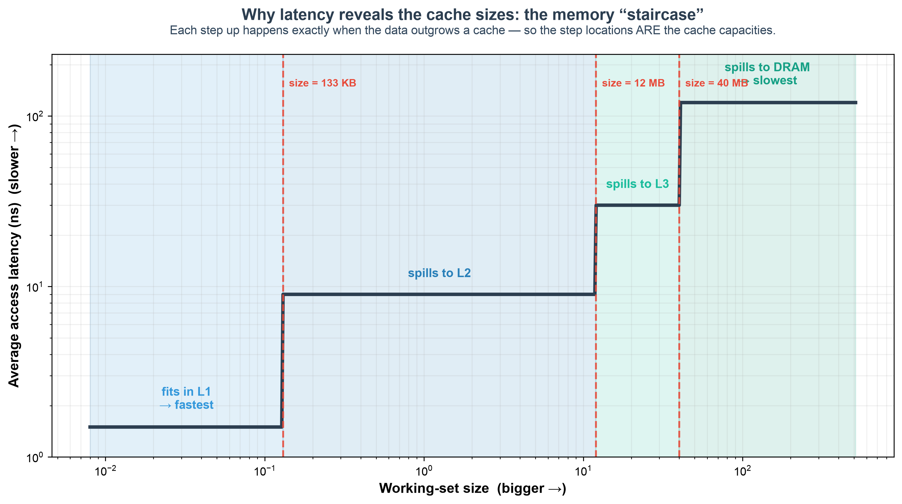
*Fig. 4. Why latency reveals the cache sizes. As the working set outgrows each
cache, average access latency steps up; the size at each step is that cache's
capacity — the quantity Auto-Echo extracts.*

### 4.3 Automatic Model Selection and Cross-Checks
The level count is chosen over a single shared search range $k \in [2, 8]$, used
identically by every model-selection routine so the reported counts are
comparable. Four independent estimators cross-check the productive one:

- the **Elbow method**, taking the knee of the K-Means inertia curve by maximum
  perpendicular distance to the chord joining its first and last points [19];
- a **Gaussian mixture** scored by Silhouette (§4.2.1);
- **DBSCAN** [12], which needs no `k` and labels sparse transition points as
  noise;
- an **independent change-point counter** using the cost-knee criterion on the
  `Dynp` segmentation cost curve. This is deliberately *not* seeded with the
  Silhouette `k`, so its agreement with the productive count is genuine evidence
  rather than a restatement of the same decision.

Section 6 scores every counter across independent sweeps by count correctness and
stability. Change-point is retained in the productive path purely to *localise*
capacities once the count is fixed.

**The expected level count.** Scoring a counter requires an expectation, and to
avoid a post-hoc target the rule is stated in advance and applied uniformly:
**expected levels = (number of OS-documented caches) + 1 for DRAM.** On the Apple
M1 the OS documents L1 and L2, giving an expectation of three — the System-Level
Cache is not OS-reported and so does not enter the expectation, which is
consistent with the merged mid-band actually observed (§6.2). On the Intel part
the OS documents L1, L2 and L3, giving four. The rule depends only on what the
platform reports, never on what the method found.

### 4.4 Hyperparameters and the Scope of the Automatic Claim
Auto-Echo removes the *per-machine* tuning knob — the change-point penalty that
previously required an operator to set per platform — but it is not free of
constants, and it would be misleading to claim otherwise. Every fixed value in the
pipeline is disclosed here. **None is tuned per machine**: all take the same value
on every run reported in §6, and no result was obtained by adjusting them.

| Constant | Value | Stage | Role |
| :--- | :---: | :--- | :--- |
| Points per octave | 10 | Probe | Sweep resolution; sets grid density (see §4.2.1 caveat) |
| Minimum working set | 4 lines | Probe | Sweep floor |
| Repeats per size `R` | 5 | Probe | Minimum-over-repeats envelope |
| Hops per timing window $N$ | $\geq 2^{20}$ | Probe | Batch amortisation of the coarse timer |
| Calibration window | ~50 ms | Probe | Tick→ns conversion against the monotonic clock |
| RNG seed | 42 | Probe | Reproducible Fisher–Yates permutation |
| Level-count search range `k` | [2, 8] | Discovery | Shared by every estimator |
| Median smoothing kernel | 3 | Discovery | Light pre-segmentation denoising |
| Change-point `min_size` | 3 | Discovery | Minimum samples per segment |
| Segment merge ratio | 1.4× | Discovery | Merges adjacent plateaus of near-equal latency |
| DBSCAN `eps` | 0.3 | Cross-check | Neighbourhood radius, in log-latency units |
| DBSCAN `min_samples` | 3 | Cross-check | Core-point threshold |
| GMM `random_state` | 42 | Cross-check | Determinism of the EM fit |
| Onset departure `tau` | 0.15 | Capacity (opt-in) | Plateau-departure threshold |
| Flatness gate `tol` | 0.15 | Capacity (opt-in) | p90/p10 spread admitting the onset rule |
| Ground-truth match tolerance | 1 octave | Validation | Factor-of-two capacity match |

Note what is *absent* from this table. The counting step is solved exactly
(§4.2.1), so no restart count, seeding strategy or random state appears for it —
those are properties of a heuristic solver, and there is no longer a heuristic
solver in the productive path. The one remaining `random_state` belongs to the
Gaussian mixture, which is used only as a cross-check.

Three of the listed constants deserve comment rather than mere disclosure. The **merge ratio**
and **`min_size`** are structural regularisers inherited from the segmentation
formulation; they bound how finely the curve may be cut but do not choose the
count, which the Silhouette sets. **DBSCAN's `eps`** is a genuine threshold, and
its presence qualifies the "threshold-free" claim: DBSCAN is used only as an
*independent cross-check*, never in the productive path, precisely because it
cannot be made parameter-free. The productive path — Silhouette count plus
penalty-free `Dynp` localisation — contains no threshold that must be chosen with
knowledge of the machine, and that, rather than the absence of all constants, is
what the automatic claim means.

### 4.5 Validation, Comparative Evaluation & Reporting
Detected capacities are compared to ground truth read live from the OS
(`sysctl` on macOS, `/sys` on Linux, `GetLogicalProcessorInformationEx` on Windows,
each yielding true *per-core* sizes; §6.3); a match is
within one octave on a `log2` scale, and the exact percentage error is also
reported. To satisfy the requirement to identify the most accurate and
consistent method, each estimator is scored across **multiple independent
sweeps** (`--runs`) by count correctness and stability (standard deviation of
the level count). The framework emits a Markdown report, per-run CSVs, a
memory-mountain plot with a min–max variability band (Fig. 5), and an
Elbow-vs-Silhouette model-selection plot (Fig. 6).

---

## 5. Baseline and Its Failure (Critical Analysis)
The initial prototype is a **portability-oriented approximation of the reference
paper's measurement technique** [1, §6.1] — the method behind that paper's
Figure 7: each timed load is preceded by a write to the target address and, on
x86, an explicit `clflush`, with the load timed by `rdtscp`. It is an *approximation*,
not a faithful reproduction: it uses a different buffer size and sample count,
and on ARM the `clflush` has no equivalent, so the flush step is simply omitted.
The contribution here is the finding that this **store/flush/timed-load approach
fails to resolve a cache hierarchy on either ISA, for a reason that is structural
rather than architectural**. It is tempting to characterise the failure as
"x86-bound": the method needs
`clflush`, ARM has none, therefore it works on x86 and breaks on ARM. The
framework's own measurements refute that account. The decisive flaw is the
**write-before-read pattern**, which is present on both architectures and which
guarantees an L1 hit by construction; the ARM-specific obstacles compound it but
are not its cause.

**Evidence on Apple Silicon.** Timing individual random reads on a 64 MB buffer
produced only timer-quantised output: raw read times were either 0 or 1 timer
tick (0 or ~41.7 ns), and the window-5 moving-average smoothing then blended
these into spurious sub-steps at multiples of 41.7/5 ~ 8.3 ns (~ 0, 8, 17, 25,
33 ns) — an artefact of the quantised timer and the smoothing filter, carrying no
memory-latency information.

**Evidence on x86, where every ARM obstacle is absent.** The same baseline was run
on the Intel i5-13450HX with a genuine `clflush` issued before each timed load and
with `rdtscp` rather than a 41.7 ns tick — that is, with the two conditions whose
absence the "x86-bound" account blames. It still fails (Table 1):

**Table 1: The naive store/flush/timed-load baseline on Intel x86, with a working
`clflush` and `rdtscp` (`--method samples`).**

| Inferred tier | Latency range | Mean latency | Samples |
| :--- | :---: | :---: | :---: |
| "L1 Cache" | 107–195 ns | 178.57 ns | 27,085 |
| "L2 Cache" | 195–297 ns | 212.13 ns | 20,623 |

Two observations condemn the method. First, only **two** tiers are recovered on a
machine with four documented levels, and both are recovered as adjacent bands
rather than a hierarchy. Second, and more damning, the tier labelled "L1" has a
mean latency of **178 ns** — two orders of magnitude above this core's true
~1.6 ns L1 (§6.3, Table 6) and squarely in DRAM territory. The absolute values are
dominated by `rdtscp` serialisation overhead, and the two "tiers" are a partition
of measurement noise, not of memory. Compare the WSS method on the *same core*,
which resolves L1 at 1.59 ns, L2 at 4.75 ns, L3 at 22.94 ns and DRAM at 123.25 ns
(Table 6). The failure is therefore not the missing ARM flush.

Three barriers explain it, in order of severity:

1. **Write-before-read guarantees L1 residency (structural, both ISAs).** Writing
   the line immediately before timing its read pulls it into L1, so every measured
   access is an L1 hit by construction — masking L2/L3/DRAM entirely. On x86 the
   `clflush` is issued *before* the store, so the store simply re-populates the
   line and the flush accomplishes nothing. This is the root cause, it is present
   on every architecture, and no instruction-set feature repairs it.
2. **Timer resolution relative to the quantity measured.** Timing a single access
   measures the timer, not memory. On Apple Silicon the 41.7 ns tick dwarfs an L1
   hit outright; on x86 `rdtscp` is finer but its serialisation overhead still
   dominates, which is why the Intel tiers sit at 178–212 ns. Both are instances
   of the same error: the baseline never amortises.
3. **No user-space flush on ARM (architectural, aggravating).** `clflush` does not
   exist on ARM and macOS provides no data-cache flush, so "forced DRAM" mode
   silently degenerated to natural eviction. This is a genuine portability barrier
   — but Table 1 shows that removing it does not rescue the method.

A secondary flaw was smoothing i.i.d. samples with a moving average, which blends
latencies from different levels *before* clustering and erodes the very structure
being sought. These findings — not a coding bug — motivated the WSS redesign and
are retained as the framework's documented naive baseline (`--method samples`).

The corrected reading strengthens rather than weakens the case for the redesign.
Had the failure been merely architectural, a per-ISA port would have sufficed. It
is instead a property of the measurement design, so the remedy must be a different
design — one that never writes before reading, never times a single access, and
never needs a flush. The WSS pointer chase of §4.1 satisfies all three by
construction.

**Evaluating the paper's proposed mitigation.** Klimis proposes a Local Outlier
Factor (LOF) filter [3] to clean ambiguous timings [1, §8.1]. We evaluated it
directly on the baseline data (`evaluation.evaluate_lof_mitigation`). LOF flagged
only ~0.04% of samples as outliers — the quantised data is too degenerate for a
density-based method — and **100% of the surviving samples still lay exactly on
integer timer-tick multiples** (just five discrete tick levels). This is direct
evidence that the baseline's failure is *structural* (write-before-read plus
timer quantisation), not transient noise that any amount of outlier filtering
could remove — reinforcing the need for the WSS redesign rather than a filtering
patch.

---

## 6. Results & Evaluation
Auto-Echo runs identically across platforms; results are reported **per machine**
as they are collected, using the same command
(`python -m autoecho --method wss --runs 3`). Two real machines are now **validated** —
the **Apple M1** (§6.2) and an **Intel Core i5-13450HX** (§6.3, under a 2 MiB
huge-page allocation), spanning both ARM64 and x86-64. Extending the evaluation to
a third machine is identified as future work (§7).

### 6.1 Test machines
| Machine | Arch | Core probed | L1d | L2 | L3 | Line | Page | Status |
| :--- | :--- | :--- | :---: | :---: | :---: | :---: | :---: | :--- |
| Apple M1 | ARM64 | Firestorm P-core | 128 KiB | 12 MiB | — (8 MiB SLC) | 128 B | 16 KiB | validated |
| Intel Core i5-13450HX | x86-64 | Raptor Lake P-core | 48 KiB | 1.25 MiB/core | 20 MiB (shared) | 64 B | 4 KiB | validated (L1/L2/L3, 2 MiB huge pages) |

*The **Page** column is the OS base page size, confirmed at run time
(`sysctl hw.pagesize` reports 16384 on the M1; the Windows x86-64 default is
4 KiB). It is listed because §6.3 shows page size, not cache size, deciding
whether a last-level cache is visible at all — so it is a hardware parameter of
the same standing as the line size, and the two machines do not share it (§6.4).*

*Ground-truth cache sizes are read automatically from the OS at run time
(`sysctl` / `/sys` on macOS/Linux; `GetLogicalProcessorInformationEx` on Windows).
The Windows path now reads true *per-core* sizes for CPU 0 — the legacy
`Win32_CacheMemory`, kept only as a fallback, reported *per-socket aggregate* sizes
(L1 = 6 × 48 KiB) — so the Intel L1/L2/L3 columns above are the per-core figures the
single-core probe actually sees (§6.3).*

*The **Status** column uses a deliberate three-tier vocabulary. **Validated**: every
documented cache was recovered and matched OS ground truth — the M1 (2/2, 100%) and,
under a 2 MiB huge-page allocation, the Intel (3/3, 100%; with the default 4 KiB pages
the 20 MiB L3 is TLB-masked, so the huge-page provenance is reported explicitly in
§6.3). **Measured**: the tool ran and recovered real data but did not fully validate.
**To be measured**: not yet run. The M1/Intel differences that follow in §6.2–§6.3
track this convention and are deliberate, not omissions.*

### 6.2 Apple M1 (Firestorm P-core) — validated
The WSS probe produces a clean, well-separated latency curve (Fig. 5). Automatic
model selection (Silhouette count + change-point localisation) and validation
against `sysctl` ground truth, over three independent sweeps, give **three
levels — a result on which all five estimators independently agree** (§6.2,
Table 4):

**Table 2: Discovered hierarchy vs. ground truth (Apple M1, performance core).**

| Level | Detected capacity | Median latency | p5–p95 | Ground truth | Error |
| :--- | :---: | :---: | :---: | :---: | :---: |
| L1 Cache | 157.5 KiB | 1.53 ns | 1.53–1.57 ns | 128 KiB | +23.0% (0.30 oct) |
| L2 (with SLC) | 13.9 MiB | 9.19 ns | 8.73–22.73 ns | 12 MiB† | +16.1% (0.22 oct) |
| DRAM | — | 130.43 ns | 45.21–141.44 ns | — | — |

**Both OS-documented caches (2/2) matched within a factor of two** (the matching
tolerance; see §6.5), with **mean absolute capacity error 19.9%** over three
sweeps. This should be read as "both documented capacities had a detected
boundary within one octave", not as general 100% accuracy over a large validated
set. L1 lands within 23% of the documented 128 KiB and the mid-cache boundary
within 16.1% of the documented 12 MiB L2.

The +23% over-estimation is *systematic and directional*, not noise, and is
characteristic of random-access latency curves. Because the pointer chase visits
the working set in a random Hamiltonian order, a set moderately larger than the
cache still enjoys high residency (~128/157 ~ 80% of a 157 KiB set stays resident
in a 128 KiB cache), so the *average* latency rises only gently past the nominal
capacity — a **soft knee** rather than a sharp step. Minimum-over-repeats and light
median smoothing further favour the fast tail, so the detected plateau extends a
few grid points beyond the true capacity and the reported boundary sits
consistently *above* nominal. The bias is therefore intrinsic and, **for a private
cache**, one-signed upward — which is why every detected cache on this M1
over-estimates rather than scatters, and why the honest claim is "a detected
boundary within one octave", not a tight percentage. (The upward sign is a property
of private caches, not of the method: the *shared* Intel L3 is under-read by 30%
because a single core meets the contended knee early — measured directly in §6.3.2.) Reducing the soft-knee
bias would require an **onset** estimator (the first departure from the plateau
median) rather than the plateau edge; that estimator is implemented and evaluated in
§6.4, where it is rejected as a default on robustness grounds. Note that the naive
alternative of the last-fit/first-miss **midpoint** moves the estimate the *wrong*
way (+23% → +27%), precisely because the plateau edge already lies above the
nominal capacity; this was tested and rejected.

†**On the SLC.** The M1 performance cores share a 12 MiB L2 *and* an ~8 MiB
System-Level Cache (SLC) whose capacities are so close that the automatic method
resolves them as a **single merged mid-band** — which is why the honest,
reproducible answer is three levels, not four. Forcing a finer segmentation splits
this band into two knees at **~9.8 MiB and ~19.7 MiB** — a split that is *stable
across every explicit penalty from 3 to 6*, so it is a robust feature of the curve,
not a penalty artefact. The ~9.8 MiB knee is consistent with the documented 12 MiB
L2 and the ~19.7 MiB knee with the onset of the DRAM plateau, with the intervening
band consistent with (but not uniquely attributable to) the OS-unreported SLC [13].
This split is *not* selected by automatic model selection and is reported only as a
**candidate finer-grained sub-structure** (§6.5), not a headline level. Separating cache from shared-L2 contention or TLB effects there
would need performance-counter, per-core-type and cross-core experiments.

**Table 3: Model selection — Elbow and Silhouette agree (Fig. 6).**

The Elbow Method (knee of the K-Means inertia curve) and the Silhouette Score
independently select **k = 3** well-separated latency groups (L1, L2, DRAM),
satisfying the project requirement to apply and compare both.

**Table 4: Level-count estimators — comparison and stability (3 sweeps).**

| Rank | Method | Mean levels | Std (stability) | Modal |
| :--- | :--- | :---: | :---: | :---: |
| 1 | Change-point (cost-knee) | 3.0 | 0.00 | 3 |
| 2 | K-Means + Silhouette | 3.0 | 0.00 | 3 |
| 3 | K-Means + Elbow | 3.0 | 0.00 | 3 |
| 4 | DBSCAN | 3.33 | 0.47 | 3 |
| 5 | GMM + Silhouette | 3.67 | 0.94 | 3 |

**All five estimators agree on three levels**, and the top three are perfectly
stable across sweeps (std 0.00). The independent change-point count and the
clustering count therefore coincide on this machine. The comparison answers the project
requirement — *which estimator is most accurate and consistent* — with
**K-Means + Silhouette**, which the pipeline therefore uses to set the level
count. (That choice is corroborated on the Intel part, where K-Means + Silhouette is
likewise the accurate and perfectly stable counter under huge pages — §6.3, Table 8.
What does *not* generalise is the five-way unanimity seen here: on the Intel curve
the independent change-point cost-knee and the Elbow criterion both under-count to
two, so agreement of *every* estimator is an M1-specific result, not a universal
one.) Change-point is
retained to *localise* each capacity once a count is fixed. Table 5 underlines the point: a *fixed* PELT penalty would give
anywhere from 6 levels down to 3 depending on an arbitrary hand-set value —
exactly the manual knob the automatic, penalty-free method removes.

**Table 5: Why a fixed penalty is unsatisfactory — change-point level count vs.
the manual PELT penalty (motivating the penalty-free automatic method).**

| Penalty | 1 | 2 | 3 | 4 | 6 | 8 | 10 |
| :--- | :-: | :-: | :-: | :-: | :-: | :-: | :-: |
| Levels | 6 | 6 | 4 | 4 | 4 | 3 | 3 |

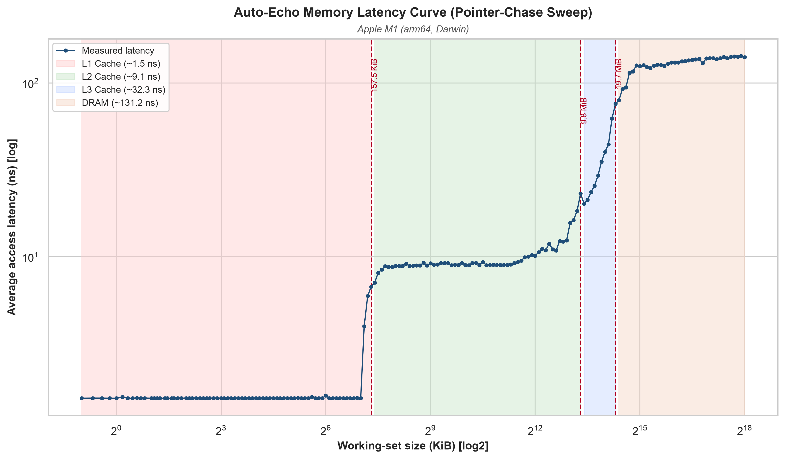  
*Fig. 5. Pointer-chase latency vs. working-set size (log–log) on the Apple M1.
Shaded bands are the three detected levels; dashed lines mark the inferred cache
capacities (~158 KiB and ~13.9 MiB); the light band is the min–max spread over
three sweeps (widest in the mid-cache L2/SLC region). The L1→L2 knee near 128 KiB
and the mid-cache knee near the 12 MiB L2 are clearly resolved.*

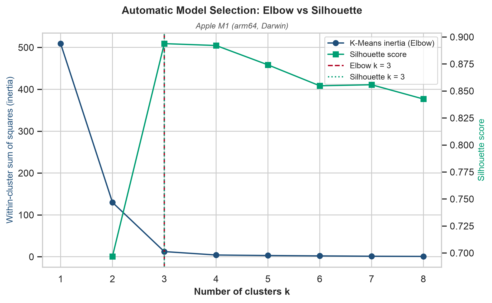  
*Fig. 6. Automatic model selection: the K-Means inertia elbow and the Silhouette
Score independently select k = 3.*

**Reproducibility.** The probe RNG is explicitly seeded (xorshift64) and the
Silhouette computation uses a fixed random state; per-run curves are written to
`data/wss_curve.csv` and `data/wss_curves_all.csv`. Residual run-to-run variation
in the *clustering* counts reflects genuine measurement noise in the 7–14 MB
contention region, which is precisely why change-point's stability there is
notable.

### 6.3 Intel x86 (Raptor Lake P-core) — validated (2 MiB huge pages)
Auto-Echo was built and run on a **13th-generation Intel Core i5-13450HX**
(Raptor Lake; 6 performance + 4 efficiency cores), pinned to a performance core
(logical CPU 0) via `SetThreadAffinityMask`, with the same command as the M1
(`python -m autoecho --method wss --runs 3`). The native extension compiled under
MSVC (Visual Studio Build Tools) and the tick→ns conversion **calibrated at
runtime to 0.383 ns/tick** (a ~2.61 GHz invariant TSC) with no configured
frequency — confirming the runtime-calibration path on the invariant TSC exactly
as designed. This is the framework's first execution on a second, independent ISA,
and it both **substantiates and qualifies** the architecture-agnostic claim.

**The two innermost caches are recovered accurately and stably (on either page
size).** The pointer-chase curve (Fig. 7) has a flat **~1.6 ns L1 plateau to
~48 KiB** and a flat **~5 ns L2 plateau to ~1.25 MiB**, whose plateau points vary
only ~5–15 % across the three sweeps. Both land essentially on the documented
per-core Raptor Lake figures (48 KiB L1d; 1.25 MiB L2 on this SKU). The *same*
unsupervised code path that mapped the Apple M1's ARM cache boundaries thus
recovers an x86 core's L1 and L2 — direct cross-architecture evidence for the
inner hierarchy.

**With the default 4 KiB pages the 20 MiB L3 is masked by TLB/page-walk latency.**
Run on 4 KiB pages, past ~1.3 MiB the latency climbs steeply and saturates at a
flat **~143 ns plateau by ~4–5 MiB** — far below the 20 MiB L3 capacity — and
stays there to 64 MiB. Once the working set exceeds the TLB's reach every
dependent load in the randomised chain triggers a page-table walk whose own
accesses miss to DRAM, so the curve reaches DRAM+page-walk latency before the L3
boundary is ever seen; the band the automatic segmenter reports near ~3.5 MiB is
then a **TLB-transition artifact, not the L3 cache**, recall is only 2/3, and the
level count is unstable across sweeps (estimators ranged 2–5). This is exactly the
confounder anticipated in §6.5, *demonstrated* on real silicon: without a huge-page
control a 1-D load-latency sweep cannot separate a large last-level cache from TLB
cost. It is retained here as the honest 4 KiB baseline that motivates the control
below.

**A 2 MiB huge-page control unmasks the L3 and validates the full hierarchy.**
The probe's gated large-page allocation path
(`--huge-pages`; `VirtualAlloc(MEM_LARGE_PAGES)` on Windows, granted the
`SeLockMemoryPrivilege` "Lock pages in memory" right) was exercised with
`python -m autoecho --method wss --max-mb 512 --runs 3 --huge-pages`. A 2 MiB page
covers 512× the address range of a 4 KiB page, so the TLB reaches deep into the
working set and the page-walk penalty that saturated the 4 KiB curve is largely
removed: the deep-memory plateau falls from ~143 ns to **~123 ns**, and a **fourth
plateau near ~14 MiB** — absent under 4 KiB — emerges before the DRAM rise. Over
three huge-page sweeps the pipeline now recovers **four levels — L1, L2, L3 and
DRAM** — and matches **all three documented caches** (Table 6): L1 within +16.0 %,
L2 within −1.5 %, and the L3 at 13.9 MiB, within a factor of two (0.52 octaves,
−30.4 %) of the 20 MiB shared L3. **Recall rises to 3/3 = 100 % at 100 % precision
(no false-positive knees; F1 = 1.00), with mean absolute capacity error 12.8 %.**
The L3 estimate under-reads the nominal 20 MiB because the pointer chase shares the
L3 with the rest of the machine and reaches its soft, contended knee before the
full capacity — an explanation §6.3.2 now **confirms by direct measurement**:
deliberately loading the shared L3 collapses the detected knee from 13.9 MiB to
3.5 MiB, while the least-contended sweep recovers ~19.7 MiB, close to the full
20 MiB. The match is nonetheless well inside the factor-of-two tolerance (§6.5). This is the framework's first full L1/L2/L3/DRAM validation on x86, and it
is reported with its **provenance**: it is a property of the **2 MiB huge-page
run**, not of the default 4 KiB-page behaviour above.

**Table 6: Discovered hierarchy vs. per-core ground truth (Intel i5-13450HX,
performance core; 2 MiB huge pages, `--runs 3 --max-mb 512 --huge-pages`).**

| Level | Detected capacity | Median latency | p5–p95 | Documented (per P-core) | Note |
| :--- | :---: | :---: | :---: | :---: | :--- |
| L1 Cache | 55.7 KiB | 1.59 ns | 1.58–1.96 ns | 48 KiB | +16.0 % — **matches** |
| L2 Cache | 1.2 MiB | 4.75 ns | 4.74–5.11 ns | 1.25 MiB | −1.5 % — **matches** |
| L3 Cache | 13.9 MiB | 22.94 ns | 16.74–55.37 ns | 20 MiB (shared) | −30.4 % (0.52 oct) — **matches** |
| DRAM | — | 123.25 ns | 103.49–129.31 ns | — | page-walk cost lifted by huge pages |

*Capacity spread over ten sweeps (`capacity_ci.py`):* a separate **ten**-sweep
huge-page run gives each level's detected capacity as median [min–max] — **L1
55.7 KiB [55.7–55.7], L2 1.2 MiB [1.2–1.2], L3 19.7 MiB [13.9–19.7]**. The private
L1 and L2 boundaries are *perfectly* repeatable (zero spread across all ten sweeps);
only the **shared** L3 varies, over roughly half an octave, its least-contended
sweeps recovering close to the nominal 20 MiB — the shared-vs-private asymmetry
§6.3.2 measures directly. The 13.9 MiB above is thus the contended end of a
13.9–19.7 MiB range rather than a fixed under-read; that same ten-sweep run reached
**3/3 recall and precision at 7.3 % mean capacity error**. (Ten sweeps is too few for
a parametric interval, so a non-parametric min–max spread is reported, not a standard
error.)

**The productive level counter is now stable and correct, but the estimators are
still not unanimous.** With huge pages the segmenter finds four bands and, decisively,
the framework's productive counter — **K-Means + Silhouette — is now stable at the
correct four levels across all three sweeps (mean 4.0, std 0.00)**, where under
4 KiB pages it was unstable (modal 2, mean 2.67). DBSCAN also lands on a stable
four. The ensemble as a whole, however, does **not** reach the clean unanimity seen
on the M1: the independent change-point cost-knee and the Elbow method still cut at
**2** (the fast-vs-slow L1+L2 vs memory split), and GMM over-counts to a modal **5**.
So huge pages fix the *productive* count and the L3 recall, but "one counter correct
on every architecture" remains too strong — the closely-spaced deep bands are still a
regime where the count-free cross-checks scatter, the 1-D under-counting behaviour
anticipated in §3.4.

**Table 7: Model selection — Elbow and Silhouette *disagree* (Fig. 8).** Unlike the
M1 (Table 3, where both criteria select k = 3), on the huge-page Intel sweep the
two automatic model-selection criteria still choose **different** cluster counts —
even though the L3 is now resolved and the Silhouette count is stable:

| Criterion | Selected k |
| :--- | :---: |
| K-Means inertia (Elbow) | 2 |
| Silhouette score | 4 (score 0.935) |

The K-Means inertia elbows at **k = 2** — the fast-vs-slow (L1/L2 vs. memory) split
every run agrees on — whereas the Silhouette score peaks sharply at **k = 4**
(score 0.935, up from 0.885 on 4 KiB pages: the recovered L3 plateau makes the
four-way partition cleaner). This persistent disagreement, visualised in Fig. 8, is
the model-selection form of the *not-unanimous* x86 estimator ensemble quantified in
Table 8, and the direct contrast with the M1's fully unanimous agreement
(Table 3 / Fig. 6): huge pages make the productive Silhouette count both accurate and
stable, but they do **not** make the Elbow criterion agree with it.

**Table 8: Level-count estimators — comparison and stability (Intel i5-13450HX,
2 MiB huge pages, 3 sweeps; expected 4).** Compare with the M1's Table 4, where all
five estimators agreed at three with zero variance; here the *productive* counter is
now accurate and perfectly stable, but the ensemble is not unanimous.

| Rank | Method | Mean levels | Std (stability) | Modal |
| :--- | :--- | :---: | :---: | :---: |
| 1 | K-Means + Silhouette | 4.00 | 0.00 | 4 |
| 2 | DBSCAN | 4.00 | 0.00 | 4 |
| 3 | GMM + Silhouette | 4.33 | 0.47 | 4 |
| 4 | Change-point (cost-knee) | 2.00 | 0.00 | 2 |
| 5 | K-Means + Elbow | 2.00 | 0.00 | 2 |

With huge pages the productive **K-Means + Silhouette** counter is both accurate and
perfectly stable at the expected four (mean 4.00, std 0.00), reversing the 4 KiB
result where it was unstable at a modal two; DBSCAN now agrees, and even GMM's modal
count reaches four. The dissent is confined to the two *fast-vs-slow* counters — the
change-point cost-knee and the Elbow — which still cut at two. So the honest reading
shifts from the 4 KiB "deeper structure not reliably counted" to "**the productive
counter now recovers all four levels, stably, but two independent cross-checks still
under-count**" — a not-unanimous ensemble, distinct from the M1's five-way agreement.

**Table 9: Change-point level count vs. manual PELT penalty (Intel, 2 MiB huge-page
sweep).** Unlike the M1 (Table 5, where the count slid from six to three as the
penalty rose), the Intel huge-page min-curve segments into **four** bands across
essentially the whole penalty range: the L1 / L2 / L3 / DRAM shape is robustly
present in the curve, so it is the *cross-estimator* agreement (Table 8), not the
penalty, that remains partial.

| Penalty | 1 | 2 | 3 | 4 | 6 | 8 | 10 |
| :--- | :-: | :-: | :-: | :-: | :-: | :-: | :-: |
| Levels | 5 | 5 | 4 | 4 | 4 | 4 | 4 |

**A note on the Windows ground-truth path.** The per-core figures against which
Table 6 is scored required a correction to the *oracle*, not to the measurement.
The legacy `Win32_CacheMemory` WMI class reports **per-socket aggregate** sizes —
L1 as 288 KiB (6 × 48 KiB), L2 as 7680 KiB (6 × 1.25 MiB) — which a single-core
probe can never match, and against which the accuracy metric consequently read a
spurious 0 %. `validation.py` now queries `GetLogicalProcessorInformationEx`
(RelationCache), keeping the data and unified caches whose processor-affinity mask
serves CPU 0, with the WMI aggregate retained only as a labelled fallback. This
closes a genuine portability gap: macOS and Linux already read per-core sizes via
`sysctl` and `sysfs`. Two independent corrections were therefore needed to reach
the result in Table 6 — the per-core oracle lifted recall from a spurious 0 % to
66.7 %, and the huge-page control carried it from 66.7 % to 100 %.

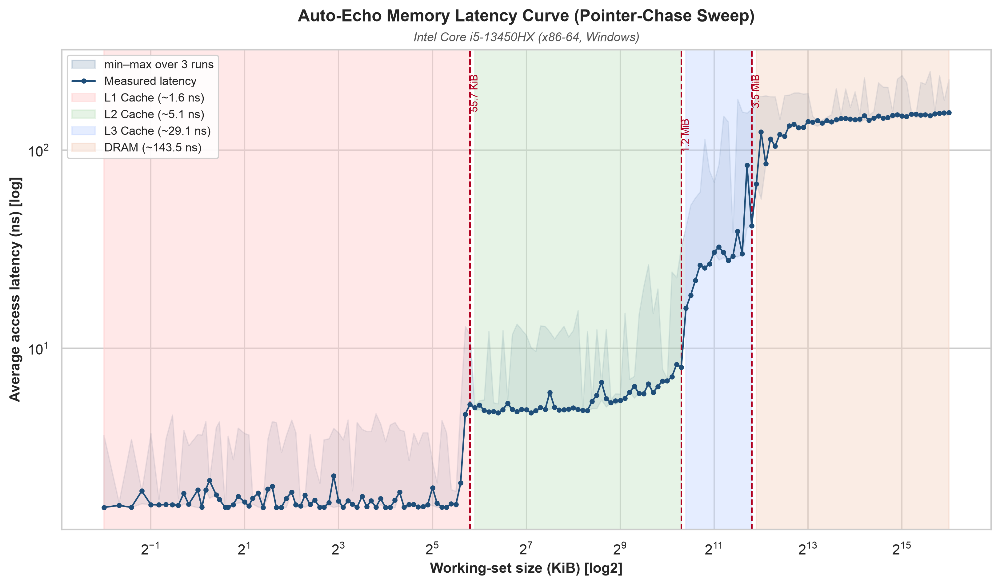  
*Fig. 7. Pointer-chase latency vs. working-set size on the Intel i5-13450HX
performance core under a **2 MiB huge-page** allocation (minimum over three sweeps;
the light band is the min–max spread). Four plateaus are now resolved — L1
(~48 KiB), L2 (~1.25 MiB), L3 (~14 MiB) and DRAM (~123 ns) — because the huge-page
TLB reach removes the page-walk cost that, under the default 4 KiB pages, saturated
the curve at ~143 ns and masked the L3 (§6.3).*

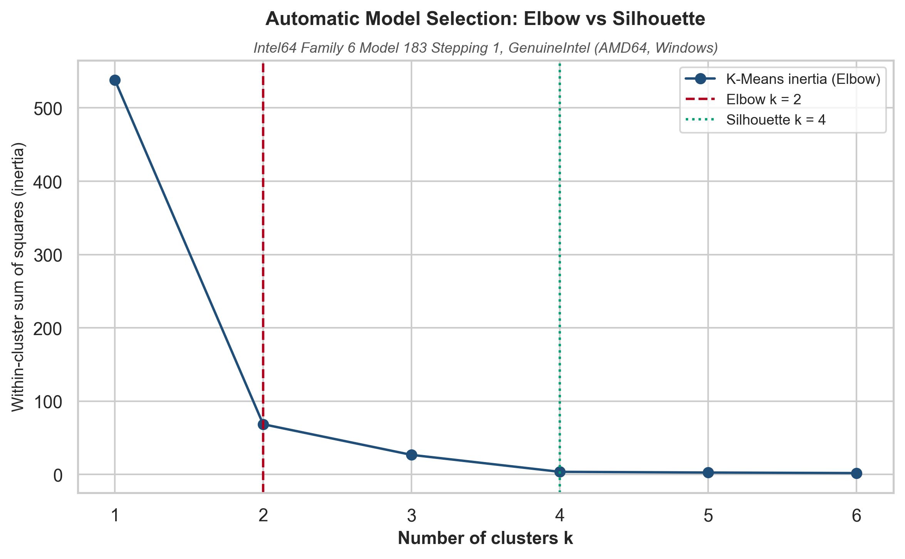  
*Fig. 8. Automatic model selection on the Intel i5-13450HX (2 MiB huge-page run):
the K-Means inertia elbow selects k = 2 while the Silhouette score peaks at k = 4 —
the two criteria still **disagree** even though the L3 is now resolved and the
Silhouette count is stable, the model-selection signature of the not-unanimous x86
estimator ensemble. Contrast Fig. 6, where both criteria agree at k = 3 on the M1.*

### 6.3.1 External cross-check against lmbench
Every metric above scores Auto-Echo against OS-reported cache *capacity*, which
constrains where the plateaus should sit but says nothing about whether the
measured *latency curve* is itself correct. The established prior-art implementation
of the same measurement is McVoy and Staelin's `lat_mem_rd` [9] — the pointer-chase
load-latency sweep this probe descends from (§3.2). Running it on the same silicon
and overlaying the two curves converts a *self-consistent* result into an
*externally validated* one, and is the strongest remaining check available without
performance counters.

`lat_mem_rd` was built from source in WSL2 Ubuntu — its 1996 codebase required
`libtirpc` for the `rpc/rpc.h` header modern glibc has removed and compilation
against its own timing library to link under a 2025 toolchain (gcc 15); no
measurement code was altered, and its build dialect (`-O -std=gnu89`) is lmbench's
own. It was run as `lat_mem_rd -N 5 -t 512 128` (512 MiB maximum working set,
128-byte stride, minimum of five repetitions per size), its 131-point curve
converted to Auto-Echo's format by `crosscheck_lmbench.py` and overlaid with
`compare_curves.py` (Fig. 11). For each of the four plateaus Auto-Echo discovered,
Table 11 reports Auto-Echo's median latency, lmbench's median over the *same*
working-set range, and their ratio.

**Table 11: External cross-check — Auto-Echo vs lmbench `lat_mem_rd` per plateau
(Intel i5-13450HX).** Auto-Echo ran natively on Windows with 2 MiB huge pages;
lmbench ran under WSL2 on 4 KiB pages with the `-t` (`thrash_initialize`,
deliberately TLB-hostile) initialiser. The comparison is therefore like-for-like
only in the inner hierarchy, whose working set fits within TLB reach on either
allocation.

| Level (WSS range) | Auto-Echo median | lmbench median | Ratio (lmbench / AE) |
| :--- | :---: | :---: | :---: |
| L1 (to 55.7 KiB) | 1.59 ns | 1.93 ns | 1.21× |
| L2 (59.7 KiB – 1.2 MiB) | 4.75 ns | 5.99 ns | 1.26× |
| L3 (1.3 – 13.9 MiB) | 22.94 ns | 35.35 ns | 1.54× |
| DRAM (14.9 – 512 MiB) | 123.25 ns | 160.16 ns | 1.30× |

The two independent tools recover the **same four-tier staircase** with the same
ordering and closely matching *relative* structure: the L1→L2 latency step is 3.0×
for Auto-Echo and 3.1× for lmbench — essentially identical — and the L1 and L2
plateaus overlie one another in Fig. 11. This is the cross-check's core evidence.
The inner hierarchy, which fits within TLB reach on either page size and is thus
page-walk-insensitive, agrees to within ~20–25 % in absolute latency and almost
exactly in tier ratio. A ~20 % absolute offset between two tools with different
timing schemes — Auto-Echo's runtime-calibrated batch timer (§4.1.1) against
lmbench's hundred-deep unrolled count — is precisely the construct-validity gap
§6.5 flags: absolute values are best read as *relative* tier differences, and on
that reading the two concur.

lmbench reads uniformly **higher**, and the gap widens with depth: +21 % at L1,
+26 % at L2, +54 % at L3 and +30 % at DRAM. This deep-region divergence is a
**confound, not a measurement disagreement**, and its cause is identified rather
than tuned away. Auto-Echo's curve is a 2 MiB huge-page run whose enlarged TLB reach
removes the page-walk cost that otherwise masks the L3 (§6.3); lmbench's is a
4 KiB-page run under WSL2 — a virtualisation layer the native probe does not have —
with the `-t` initialiser, whose chase pattern is *by design* TLB-hostile. Both
factors inflate exactly the deep region where the working set outgrows TLB coverage,
which is why L1/L2 agree closely while L3/DRAM do not: it is the same page-size
effect the huge-page control was built to demonstrate (§6.3), seen from the other
side. Nothing was adjusted to narrow the gap; the offset is reported as measured and
attributed to the allocation-and-environment difference stated in Fig. 11's caption.

**Why the thrash initialiser is the right basis for comparison.** lmbench's
*default* initialiser lays the pointer chain out at a constant stride, a sequential
pattern the hardware prefetcher largely defeats. Run without `-t` on the same
machine, `lat_mem_rd` reports a deep-region latency that **collapses** — median
4.8 ns over the L3 range and 11.8 ns in DRAM, an order of magnitude below the true
random-access latency and physically impossible for a 512 MiB working set that
overflows every cache. The `-t` `thrash_initialize` mode defeats the prefetcher and
the TLB *exactly as Auto-Echo's randomised pointer chase does* (§4.1), which is why
it — not the prefetchable default — is the correct comparator. That prefetch-defeated
default run is retained as a negative control (`lmbench_stride_curve.csv`); its
collapse confirms that the Table 11 agreement is between two genuinely latency-bound
measurements, not two throughput-bound ones.

The cross-check therefore does what it was added to do. An independent, trusted
implementation of the same pointer-chase, on the same processor, reproduces
Auto-Echo's hierarchy — its four plateaus, their ordering, and the L1/L2 latencies
to within a fifth — corroborating that the probe measures genuine memory-hierarchy
latency rather than an artefact of its own timing method. The deep-region offset is
the predicted consequence of comparing a huge-page native run against a 4 KiB-page
virtualised one, not a shortcoming of either tool.

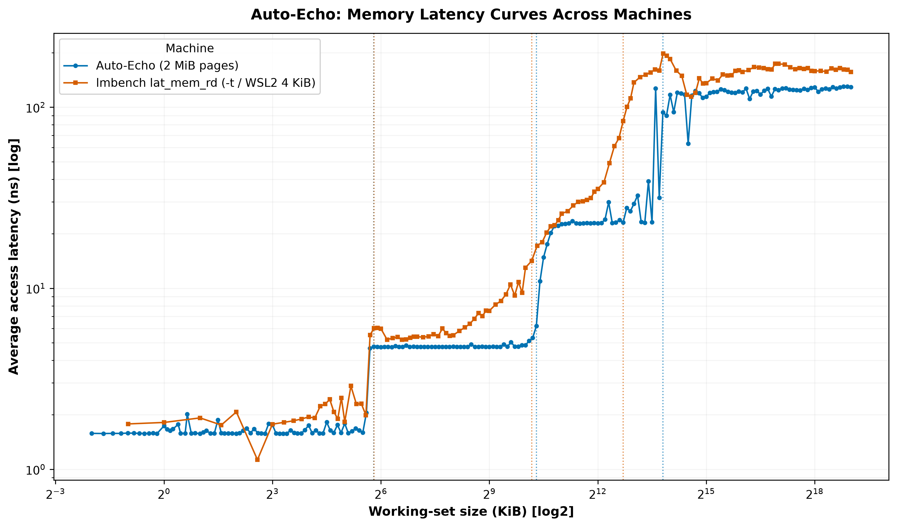
*Fig. 11. External cross-check on the Intel i5-13450HX: Auto-Echo's 2 MiB huge-page
curve (blue) against lmbench `lat_mem_rd -N 5 -t 512 128` (orange), each tool's
detected boundaries marked (dotted). The L1 and L2 plateaus and the L1→L2 knee
coincide; lmbench rises earlier and saturates higher in the deep region because it
runs under WSL2 on 4 KiB pages with the TLB-thrashing `-t` initialiser, whereas
Auto-Echo's native 2 MiB pages suppress the page-walk cost (§6.3.1). The comparison
validates the inner hierarchy directly; the deep-region offset is the
page-size/environment confound, not a measurement disagreement.*

### 6.3.2 The L3 under-read is contention — a measured test
§6.3 attributes the L3's −30.4 % under-read (13.9 MiB detected against a 20 MiB
nominal) to the pointer chase sharing the L3 with the rest of the machine and
meeting a *contended* knee early. That was an assertion. This subsection tests it
directly, by re-running the huge-page sweep under two conditions that differ only
in how hard the **shared** L3 is contended and reading the detected L3 capacity in
each.

**The contending load** is eight worker processes (`l3_load.py`), each continuously
streaming (read-modify-write) a 32 MiB buffer — comfortably larger than the 20 MiB
L3 — pinned to logical CPUs 2–9 with CPU 0 (the probe's core) left free. Eight such
streams keep the shared L3 saturated with worker data; being memory-bandwidth-bound
the workers sit at ~24 % CPU each (~36 % machine-wide) while generating the eviction
traffic that matters. The quiescent condition is the §6.3 baseline itself (no
streaming load, ~23 % ambient CPU). **Both conditions use 2 MiB huge pages**, so page
size is held constant and the comparison isolates contention rather than
re-introducing the TLB confound of §6.3.

**A methodological constraint worth recording.** Under the streaming load the probe's
512 MiB large-page allocation *fails* (Windows error 1450 — the workers' resident
buffers deplete the large-page pool) and would silently fall back to 4 KiB pages,
re-introducing the very TLB masking the huge-page control exists to remove. The
loaded sweep therefore uses `--max-mb 128`, whose smaller per-size allocation keeps
securing 2 MiB pages under load (verified: no fall-back in the run log). This leaves
the L3 knee untouched — it sits below 20 MiB and is sampled on the *identical*
geometric grid either way — and only shortens the DRAM tail. The interference is
itself a finding: a memory-streaming load and a large-page probe compete for one
physical pool.

**Result.** The detected L3 capacity moves decisively with contention (Table 12).
Quiescent, the knee sits at **13.9 MiB** — and across sweeps ranges up to **19.7 MiB,
essentially the full 20 MiB nominal, in the least-contended sweep**. Under the
eight-worker load it collapses to a stable **3.5 MiB** (every one of three sweeps).
The effective last-level cache a single probing core can map therefore shrinks
roughly four-fold when the other cores stream through the shared L3 — from within a
factor of two of nominal to −82 %.

**Table 12: Detected L3 capacity, quiescent vs. shared-L3-loaded (both 2 MiB huge
pages; loaded = eight processes each streaming a 32 MiB buffer, pinned off CPU 0).**

| Condition | Detected L3 knee | L3 median latency | DRAM median | Machine CPU |
| :--- | :---: | :---: | :---: | :---: |
| Quiescent (§6.3 baseline) | 13.9 MiB (to 19.7) | 21–26 ns | ~123 ns | ~23 % |
| Loaded (8 × 32 MiB stream) | **3.5 MiB** | ~65 ns † | ~174 ns | ~36 % |

The loaded absolute latencies (†) are inflated by DVFS: with every other core busy,
CPU 0 cannot reach single-core turbo, so the loaded L1 rises from 1.6 ns to 3.6 ns —
a ~2.2× clock effect that scales *every* loaded latency. The **knee is a
working-set size, and is frequency-invariant** — uniform DVFS scaling shifts every
latency but cannot move the size at which a plateau ends — so the capacity comparison
is unaffected by the clock difference; the latencies are shown for completeness and
read with the DVFS caveat. The knee moving while page size and (invariantly) the knee
metric are held fixed is exactly what the contention account predicts: it tracks the
*available* shared L3, not a fixed estimator artefact. When the L3 is uncontended the
probe maps close to the full 20 MiB; when it is contended the probe maps only what is
left to it. The −30.4 % quiescent under-read is thus the mild end of a continuum whose
loaded end is −82 %.

Two honest limits bound the claim. This is *two conditions on one machine*, not a
sweep of contention intensity, so it **supports rather than proves** a dose-response
law — as a two-condition comparison it is reported as such. And the quiescent knee is
itself variable sweep-to-sweep (9.8–19.7 MiB across re-runs), because "quiescent" on
a live laptop still carries fluctuating ambient L3 traffic — variability that is
itself consistent with a contention-sensitive knee. What the test establishes is
directional and large: a controlled increase in shared-L3 load moves the detected
capacity far outside its quiescent range, in the predicted direction, converting the
§6.3 sentence from an assertion into a measured claim.

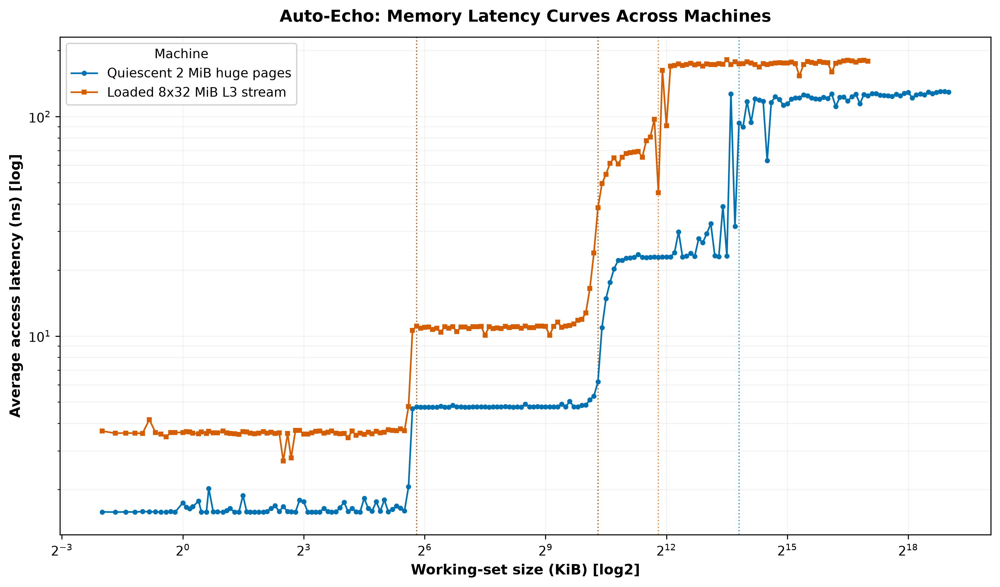
*Fig. 12. The shared-L3 contention test on the Intel i5-13450HX: the quiescent
huge-page curve (blue) against the same probe under an eight-worker L3-streaming load
(orange), both on 2 MiB pages. Under load the curve departs the L2 plateau and climbs
toward DRAM far earlier — the detected L3 knee moves from ~13.9 MiB to ~3.5 MiB (dotted
lines) — because the streaming workers evict the probe's lines from the shared 20 MiB
L3. The load also lifts the whole curve (memory-bandwidth contention plus the
all-core-turbo DVFS drop of §6.3.2); the decisive, frequency-invariant signal is the
leftward shift of the knee, not the vertical offset.*

### 6.4 Cross-platform summary and architecture-agnostic behaviour
The level count is never hard-coded: it is chosen from the data, so it adapts to
whatever hierarchy the machine exposes. Across the **two real machines** now
measured, the *same* code path recovers the resolvable cache boundaries on both a
128-byte-line ARM64 core and a 64-byte-line x86-64 core: **three** levels on the
Apple M1 (L1, a merged L2/SLC band, DRAM; §6.2) and, under a 2 MiB huge-page
control, the **full L1 (~48 KiB) / L2 (~1.25 MiB) / L3 (~14 MiB) / DRAM** hierarchy
on the Intel i5-13450HX (§6.3). This is genuine cross-architecture evidence for the
memory hierarchy — the core of the architecture-agnostic claim.

Two honest qualifications follow from the real x86 run. First, the earlier
expectation (from *synthetic* Intel/AMD/VM curves) that the method would cleanly
recover **four** L1/L2/L3/DRAM levels on x86 held **only under a huge-page control**,
not with the default 4 KiB pages: on 4 KiB pages TLB/page-walk latency masks the
20 MiB L3 (§6.3), and the deep hierarchy separates only once the 2 MiB large-page
allocation removes the page-walk cost — so the four-level x86 result is real but
carries the huge-page provenance. Second, the level *count* is stable **and
unanimous** on the M1, whereas on the Intel part huge pages make the *productive*
K-Means + Silhouette counter stable and correct (four levels) but the estimator
ensemble is still **not unanimous** — the Elbow and change-point cost-knee cross-checks
under-count to two (§6.3) — so "one counter is correct, and every counter agrees, on
every architecture" is known to be too strong.

A third qualification concerns the comparison itself rather than the method, and it
follows from a parameter §6.1 now records: **the two machines were not run on the
same page size.** macOS on Apple Silicon uses a 16 KiB base page — four times the
x86-64 default, confirmed at run time — and the M1 sweeps use it, because the
probe's large-page path is gated to Windows (§4.1). The consequence is arithmetic:
for any given working set the M1 touches a quarter as many pages as the Intel does
under 4 KiB, and therefore places a quarter of the demand on its address-translation
hardware. Given that §6.3 shows page-walk cost masking a 20 MiB cache on the Intel
at 4 KiB, the M1's larger base page is a plausible part of why no comparable
saturation appears on the M1 curve at all — its DRAM plateau is reached at the
capacity one would expect, not prematurely.

Two things follow. The first is a limitation: the M1-versus-Intel comparison is
confounded, because the M1's three-level result is a 16 KiB result and the Intel's
four-level result a 2 MiB result, so neither the agreement nor the disagreement
between them is attributable to the ISA alone. The M1's merged L2/SLC band (§6.2)
sits in exactly the working-set range where translation cost begins to matter, and
whether a larger page would split that band — as 2 MiB pages split the Intel's deep
region — is a question this dissertation cannot answer.

The second is a finding, and it explains why. **The page-size control that resolved
the Intel L3 cannot be applied to Apple Silicon from user space at all.** macOS's
superpage facility is the obvious route and it does not function here: `mmap` with
`VM_FLAGS_SUPERPAGE_SIZE_2MB`, and with the permissive `VM_FLAGS_SUPERPAGE_SIZE_ANY`,
both fail with `EINVAL` on this machine — superpages are an Intel-era macOS facility
that arm64 does not honour, and no equivalent unprivileged large-page API replaces
them. So the asymmetry is not an implementation gap that more effort would close; it
is a difference in what the two platforms permit an unprivileged tool to do, of
exactly the kind that motivated this project's design in the first place. The ARM64
path lacks a user-space cache flush (§3.3) *and* lacks a user-space page-size
control, and in both cases the method had to be built around the absence of a
primitive rather than its presence. What remains beyond reach on this platform is
the quantitative attribution — how much of the M1's cleaner deep curve is the larger
page and how much the architecture — which would need the
translation-lookaside-buffer geometry of both parts, documented for neither at the
level of detail required.

The synthetic curves (Fig. 9) should
therefore be read as *method verification* — showing the counting machinery adapts to a
given staircase shape — not as evidence about real x86 behaviour, which §6.3 supersedes.

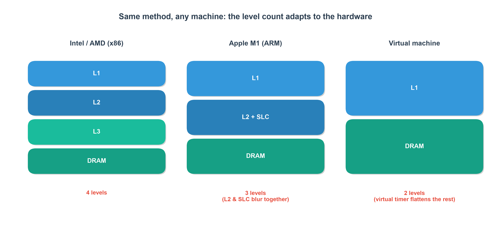
*Fig. 9. Method verification on **synthetic** staircase curves: the automatic
counter adapts its level count to the input shape — four levels on an idealised
x86 profile, three on an M1-shaped profile, two on a flattened VM profile. These
are modelled curves, not measurements; the real Intel result (§6.3) reaches the
idealised four-level x86 shape only under a 2 MiB huge-page control — the default
4 KiB pages exhibit TLB effects the synthetic profile omits — and should be read in
preference to it.*

| Metric | Apple M1 (ARM64) | Intel i5-13450HX (x86-64) |
| :--- | :---: | :---: |
| Cache line size | 128 B | 64 B |
| OS base page size | 16 KiB | 4 KiB |
| Pages spanned by a 16 MiB working set | 1,024 | 4,096 |
| Levels resolved (automatic) | 3 (L1 / L2+SLC / DRAM) | 4 (L1 / L2 / L3 / DRAM), 2 MiB huge pages; L3 masked on 4 KiB |
| Caches matched (per-core ground truth) | 2/2 documented | 3/3 documented (huge pages); 2/3 on 4 KiB |
| Count stability across 3 sweeps | unanimous, std 0 | productive counter stable at 4 (std 0), ensemble not unanimous (Elbow/cost-knee = 2) |
| Naive baseline (with `clflush`) | n/a (no ARM flush) | 2 tiers — fails to resolve (L1-residency + timer grid) |

**Sampling-density robustness.** §4.2.1 identifies a confound intrinsic to the
Silhouette criterion: because it weights every observation equally, its value
depends on how many points fall in each cluster, and that is fixed by the sweep's
geometric grid rather than by the hardware. A level spanning more octaves receives
proportionally more points, so in principle the selected count could be an
artefact of the experimenter's chosen resolution. This is a sharper threat than
the change-point penalty sensitivity of Tables 5 and 9, because unlike the penalty
it is not varied anywhere else in the evaluation. Table 10 varies it directly.

**Table 10: Sampling-density robustness — the selected level count against sweep
resolution (`sampling_density_sweep.py`).** **Both** machines' rows are now *fresh
measurements*: the probe was re-run end to end at each density, so every row is an
independent sweep rather than a re-analysis. (This is why the M1 row at ten points
per octave reports a Silhouette of 0.898 where §4.2.1 reports 0.894 for the same
machine and density — the two come from different sweeps, and the gap is ordinary
run-to-run variation.) The Intel rows were previously *subsampled* from the §6.3
huge-page curve because the machine was not to hand; they are now **measured
directly** at 5, 10 and 20 points per octave under 2 MiB huge pages — including the
**20 points-per-octave density, which lies above the original source grid and so
could not have been subsampled** from it, closing the one gap the earlier table
flagged. No value is interpolated: each Intel row is its own end-to-end huge-page
sweep, and the selected count is **4** at every measured density.

| Machine | Points/octave | Curve points | Selected `k` | Silhouette | Elbow | DBSCAN | CP-knee |
| :--- | :---: | :---: | :---: | :---: | :---: | :---: | :---: |
| Apple M1 (measured) | 5 | 94 | **3** | 0.912 | 3 | 3 | 3 |
| Apple M1 (measured) | 10 | 182 | **3** | 0.898 | 3 | 3 | 3 |
| Apple M1 (measured) | 20 | 348 | **3** | 0.896 | 3 | 3 | 3 |
| Intel (measured) | 5 | 104 | **4** | 0.929 | 2 | 4 | 2 |
| Intel (measured) | 10 | 202 | **4** | 0.934 | 2 | 4 | 2 |
| Intel (measured) | 20 | 388 | **4** | 0.932 | 2 | 4 | 2 |

**The selected count is invariant to sampling density on both machines** — three
on the M1 across a four-fold range of resolutions and 94 to 348 measured points,
four on the Intel across the same four-fold range (5–20 points per octave) and 104
to 388 measured points. Every
cross-check estimator is likewise invariant, including the two that *disagree*
with the productive counter on the Intel curve: the Elbow and change-point-knee
criteria return two at every density, so even their error is a stable property of
the curve rather than of the grid. The Silhouette *score* drifts slightly and
monotonically (0.912 → 0.896 on the M1 as resolution rises, since denser sampling
adds points to the noisy transition regions), but the *argmax* — the only quantity
the pipeline consumes — does not move.

The confound identified in §4.2.1 is therefore measured rather than merely
declared, and it does not materialise on the hardware tested. The residual
qualification is the usual one: invariance over two machines and a four-fold
density range is evidence, not proof, and a hierarchy with levels closer together
than either of these could still be resolution-sensitive.

With two real curves now in hand, a combined cross-machine overlay
(`compare_curves.py`) plots the M1's 128 KiB / 12 MiB knees against the Intel
core's 48 KiB / 1.25 MiB / ~14 MiB knees on one log–log axis (Fig. 10, refreshed
from the 2 MiB huge-page Intel sweep). Both are flat in L1; the M1 then carries a
single high **L2+SLC** shelf (~9 ns) where the Intel shows a distinct
**L1→L2→L3** staircase up to the recovered ~14 MiB L3; both climb to a
~123–130 ns DRAM plateau. This is direct visual evidence for architecture-agnostic
recovery of the hierarchy across ARM64 and x86-64.

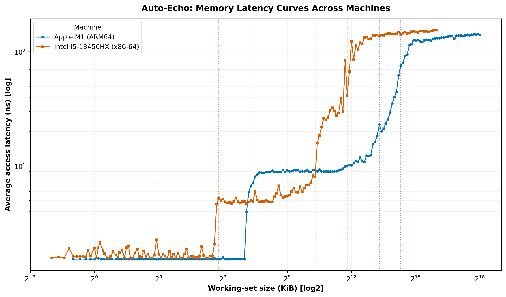
*Fig. 10. Auto-Echo latency curves for the Apple M1 (ARM64) and Intel i5-13450HX
(x86-64, 2 MiB huge-page run) on one axis, each machine's detected cache boundaries
marked (dotted). L1, L2 and — on the Intel, once huge pages lift the 4 KiB page-walk
masking — the L3 are recovered across both ISAs (§6.3).*

**Capacity-estimator comparison.** The systematic +23% edge bias (§6.2) prompted
evaluating two alternatives to the default *plateau-edge* estimator (capacity =
the largest working-set size still served at plateau latency): the transition
*midpoint* (geometric mean of the last-fit and first-miss sizes) and an *onset*
estimator (the last size still on the plateau floor before latency departs by
10%). Absolute error against per-core ground truth:

| Level (per-core GT) | Edge (default) | Midpoint | Onset | Hybrid |
| :--- | :---: | :---: | :---: | :---: |
| Apple M1 — L1 (128 KiB) | +23.0% | +27.4% | +0.0% | **+0.0%** |
| Apple M1 — L2+SLC (12 MiB) | +16.1% | +20.2% | −71.0% | +16.1% |
| Intel — L1 (48 KiB) | +16.0% | +20.1% | −96.9% | **−96.9%** |
| Intel — L2 (1.25 MiB) | −1.5% | +2.0% | −8.1% | −8.1% |
| Intel — L3 (20 MiB) | −30.4% | −27.9% | −77.0% | −30.4% |

*(Intel rows are computed on the 2 MiB huge-page curve of §6.3.)*

The result is a clear **accuracy-versus-robustness trade-off**. The onset estimator
is *exact* on the M1 L1 (+0.0%, recovering the nominal 128 KiB) — which confirms
that the +23% is a genuine soft-knee artefact and that the physical knee onset does
sit at the documented capacity — but it is **unreliable everywhere else**, from a
tolerable −8.1% on the Intel L2 to catastrophic under-reads on three of the other
four levels (−71.0%, −77.0%, −96.9%). Two distinct failure modes produce this. On a
*sloping* plateau — the M1's merged L2+SLC band, or the contended Intel L3 — a
floor-departure threshold has no well-defined floor to depart from, and no
threshold or smoothing kernel rescues it. On a *flat* plateau the estimator is
instead defeated by **single-point noise**: the Intel L1 plateau sits at 1.58 ns,
and one isolated 2.02 ns sample at a working set of 1.5 KiB exceeds the +15%
departure threshold, so the rule terminates there and reports 1.5 KiB (−96.9%)
despite the plateau continuing flat for another five octaves. The midpoint is
strictly worse than the edge on every level.

The **plateau-edge estimator is therefore retained as the default**. Its error is
bounded and never catastrophic — spanning −30.4% to +23.0%, i.e. within half an
octave in either direction — which for an automatic, threshold-free tool is worth
more than an estimator that is occasionally exact and usually wrong. Note that the
edge bias is *not* uniformly upward, as M1-only evidence would suggest:
it over-reads the private caches (soft knee, +16–23%) but under-reads the **shared**
Intel L3 by −30.4%, because a single core competing with the rest of the machine
reaches the contended knee before the nominal 20 MiB — a mechanism §6.3.2 confirms
by direct measurement (deliberately loading the shared L3 drives the detected knee
down to 3.5 MiB, while an uncontended sweep recovers ~20 MiB). The honest headline is
therefore that Auto-Echo places a *detected boundary within one octave* of each
documented cache, with a bias whose sign depends on whether the cache is private or
shared, rather than recovering nominal capacities to a tight percentage.

The **flat-plateau-gated hybrid** — onset where the plateau is flat, edge otherwise
(`--capacity-method hybrid`, rightmost column) — was introduced to keep the onset's
exactness without its instability, and on the M1 it does: it recovers the L1
**exactly** (128 KiB) and falls back to the stable edge on the sloping L2+SLC band.
The huge-page Intel curve, however, shows the gate is **not sufficient**, and does
so in an instructive way. The 4 KiB Intel L1 plateau was noisy enough to *fail* the
flatness test, so the hybrid safely fell back to the edge (+16.0%); the cleaner
2 MiB curve makes that same plateau flat enough to **pass**, admitting the onset
rule — which then trips on the lone 2.02 ns spike and returns −96.9%. **Improving
the measurement made this estimator worse**, so the earlier claim that the hybrid is
"never catastrophic" is not supported by the huge-page data and is not claimed. The
flaw is not the gate but the onset rule's *first*-departure criterion, which treats
one outlier as a knee; requiring a **sustained** departure (several consecutive
points above threshold) is the obvious repair and is left as future work (§7). Until
then the hybrid remains strictly opt-in and the **edge estimator remains the
default**, which is what every result reported in §6.2 and §6.3 uses.

### 6.5 Threats to validity
Following the structure of the reference paper's own threats section [1]:

- **External validity (generalisation).** Results now span *two* machines (an
  Apple M1 performance core and an Intel Raptor Lake performance core), which
  demonstrates architecture-agnostic recovery of the hierarchy across ARM64 and
  x86-64 — the inner L1/L2 on both, and, under a 2 MiB huge-page control, the full
  L1/L2/L3/DRAM on the Intel part (§6.3). Two limits remain: the deep x86 result
  requires huge pages (the default 4 KiB behaviour still masks the L3), and the
  level *count*, though stable and correct for the productive Silhouette counter on
  both machines, is cross-estimator *unanimous* only on the M1. Two machines of the
  same class (consumer laptop performance cores) is a narrow base from which to
  generalise; a server part, an AMD core or an efficiency core would each test the
  claim in a different direction (§7).
- **Construct validity (what is measured).** The pointer chase measures
  *load-to-use* latency of a serialised dependent chain, which includes base
  pipeline cost — so the ~1.53 ns L1 figure is not directly comparable to the
  paper's `rdtscp`-dominated 10–25 ns. Absolute values are best read as *relative*
  differences between tiers (as the paper itself argues in §6.2).
- **Confounding — TLB and page walks.** As the working set grows, the number of
  distinct pages touched grows with it; deep-plateau latency therefore includes
  DTLB-miss and page-walk cost, which page alignment does *not* remove. On the M1
  this blurs the mid-cache (~10–14 MB) region; on the Intel part it is decisive with
  the default 4 KiB pages — the page-walk penalty saturates the curve at ~143 ns by
  ~4 MiB and **masks the 20 MiB L3 entirely** (§6.3). This confounder is now
  *directly addressed*: the implemented 2 MiB huge-page control extends the TLB reach,
  drops the deep plateau to ~123 ns, and **recovers the L3** (13.9 MiB, within a
  factor of two of 20 MiB), lifting recall to 3/3 (§6.3). It remains a genuine limit
  in that the full x86 hierarchy is separable only under huge pages, not the default
  4 KiB pages, and performance-counter corroboration is still desirable.
- **Page size differs between the two machines (confound).** The M1 runs on a
  16 KiB base page and the Intel on 4 KiB (§6.1), so for a given working set the M1
  places a quarter of the Intel's demand on address translation. Because the probe's
  large-page path is gated to Windows (§4.1), the M1 has never been measured at any
  other page size. The M1 and Intel results are therefore not like-for-like, and the
  cleaner deep region of the M1 curve cannot be attributed to the architecture alone
  — part of it may be the larger page. This does not affect either machine's
  validation against its *own* ground truth, which is what §6.2 and §6.3 report, but
  it does weaken any inference drawn from comparing the two curves (§6.4).
- **SLC attribution.** Automatic model selection reports the L2 and SLC as one
  merged mid-band; the finer split (forced only at an explicit penalty ~ 4) is
  *consistent with* a distinct L2 and the M1 SLC but is not uniquely attributable
  to it without per-core-type, cross-core and counter-based experiments.
- **Measurement bias.** Latency is the *minimum* over repeats (a lower envelope
  that hides variability); and although the sweep order is now seed-randomised to
  decorrelate size from thermal drift, sustained thermal throttling remains a
  possible bias on long sweeps.
- **Sampling density (tested, not open).** The Silhouette weights every
  observation equally, so the count it selects could in principle depend on how
  many grid points fall in each plateau — a property of the sweep, not the
  hardware. This was varied directly rather than assumed away: the M1 was
  re-measured at 5, 10 and 20 points per octave and the Intel machine likewise
  measured directly at 5, 10 and 20 (superseding the earlier subsampled rows), and
  the selected count is invariant on both machines, as is every cross-check
  estimator (§6.4, Table 10). The residual limit is one of scope —
  invariance over two machines and a four-fold density range does not establish
  invariance for a hierarchy whose levels sit closer together than either of these.
- **Solver-dependence of the level count (eliminated).** The counting stage solves
  the one-dimensional k-means problem exactly by dynamic programming, so the
  partition at each `k` is the global optimum and the result is deterministic
  (§4.2.1). This is structural rather than merely audited: there is no local
  optimum left for the count to be an artefact of. The migration from the earlier
  Lloyd-based implementation changed no reported result, as documented by
  `verify_kmeans_optimality.py`.
- **Validation metric — precision as well as recall.** Detected knees are
  assigned to documented caches by *optimal* one-to-one (Hungarian) matching
  rather than greedy nearest-first (which can undercount when adjacent caches
  fall within tolerance), and the framework reports **precision** (the fraction
  of detected knees that are real caches) alongside **recall** (the fraction of
  documented caches found). This directly penalises false-positive levels: on the
  Intel part's **default 4 KiB** run the ~3.5 MiB knee is a TLB-transition artefact,
  so precision is **2/3 (67%)** even though the L1 and L2 knees are correct — a
  distinction a recall-only "accuracy" conceals, and precisely the failure mode a
  *discovery* tool must expose. Under the 2 MiB huge-page run that false positive
  disappears (the third knee is now the real L3), so precision and recall both reach
  3/3 (100%; §6.3). A factor-of-two match remains permissive (a 200 KiB detection
  would still match a 128 KiB L1) and ground truth is OS-reported; multiple
  tolerances (±10/25/50%) remain a planned refinement, but the external `lmbench`
  cross-check is **no longer planned — it is done** (§6.3.1): lmbench `lat_mem_rd`
  was built and swept on this machine and agrees with Auto-Echo on the inner L1/L2
  hierarchy to within ~20–25 %, with the deep region carrying an identified
  page-size/virtualisation confound rather than a measurement disagreement. An
  **onset**-based capacity estimator — first departure from the
  plateau median rather than the plateau edge — was implemented and evaluated as a
  way to remove the soft-knee bias, but is rejected as a default: it is exact on the
  M1 L1 and unreliable on every other level, and even the flat-plateau-gated hybrid
  collapses on the huge-page Intel L1 because a single outlier satisfies its
  first-departure rule (§6.4). The edge estimator's bounded error is preferred.
- **Ground truth on Windows (fixed).** The legacy Windows `Win32_CacheMemory` path
  reported *per-socket aggregate* cache sizes, not the per-core sizes the single-core
  probe measures, so the automatic accuracy metric read a spurious 0 % on the Intel
  part despite correct L1/L2 knees. `validation.py` now reads true per-core sizes via
  `GetLogicalProcessorInformationEx` (with the WMI aggregate kept only as a labelled
  fallback), so the accuracy metric on the Intel part is correct — 66.7 % on the
  default 4 KiB pages and 100 % under the 2 MiB huge-page run (§6.3). The macOS/Linux
  paths use per-core `sysctl`/`sysfs` values and were already unaffected.
- **Conclusion validity.** On the M1 the level count is stable across sweeps and
  all five estimators agree on three levels (Table 4). On the Intel part the 2 MiB
  huge-page run makes the *productive* K-Means + Silhouette counter stable and correct
  at four levels (std 0; Table 8), but the estimator ensemble does **not** reach
  M1-style unanimity — the Elbow and change-point cost-knee cross-checks under-count to
  two (§6.3). Cross-estimator agreement is therefore **machine-dependent, not
  universal**; the robust cross-machine claim is that the productive counter recovers
  the boundaries (L1/L2 on both, plus the L3 on x86 under huge pages), while full
  five-way estimator agreement is demonstrated only on the M1.

---

## 7. Discussion & Future Work
Auto-Echo demonstrates accurate, architecture-agnostic hierarchy discovery on both
Apple Silicon and x86-64 — fully unprivileged on the M1, and, on x86, unprivileged
for the L1/L2 result with the deep L3 map requiring only the ordinary "Lock pages in
memory" user right (no kernel module or driver). Remaining directions:

- **Huge-page control to unmask the L3 (implemented and executed).**
  The default-4 KiB Intel run (§6.3) shows TLB/page-walk latency saturating the curve
  before the 20 MiB L3 is reached. The gated 2 MiB large-page allocation path
  (`--huge-pages` / `AUTOECHO_HUGEPAGES=1`; `VirtualAlloc(MEM_LARGE_PAGES)` on Windows,
  with a graceful fall-back to 4 KiB pages) has now been **run to completion** after
  granting the Windows `SeLockMemoryPrivilege` ("Lock pages in memory") right: it cuts
  the page-walk cost sharply, exposes the L3 plateau, and converts the x86 result from
  "L1/L2 recovered" to a **full, validated L1/L2/L3/DRAM map** (3/3 caches, 100 %
  recall/precision; §6.3). The −30 % under-read is now shown to be a **contention**
  effect directly (§6.3.2): a controlled shared-L3 load collapses the detected knee to
  3.5 MiB, while the least-contended sweep recovers ~19.7 MiB (near the nominal 20). What
  remains is to reproduce that on a machine whose L3 is *architecturally* less
  contended (a different LLC topology) and to add performance-counter corroboration. (The runtime-calibration path on the invariant
  TSC is confirmed on real x86 — 0.383 ns/tick on the i5-13450HX.)
- **A page-size control on Apple Silicon — blocked by the platform, not by effort.**
  The huge-page path is gated to Windows, so the M1 has only ever been measured on
  the OS default 16 KiB page, a confound in the cross-machine comparison (§6.4,
  §6.5). The obvious remedy is macOS's superpage facility, and it does not work
  here: `mmap` with `VM_FLAGS_SUPERPAGE_SIZE_2MB` — and with the permissive
  `VM_FLAGS_SUPERPAGE_SIZE_ANY` — both fail with `EINVAL` on this machine. macOS
  superpages are an Intel-era facility that Apple Silicon does not honour, and no
  equivalent user-space large-page API is exposed on arm64 macOS. The consequence is
  worth stating as a result rather than a to-do: **the page-size control that
  resolved the Intel L3 cannot be applied to Apple Silicon from user space at all.**
  This is a genuine asymmetry in what the platforms permit an unprivileged tool to
  do, and it sits squarely within this dissertation's theme — the ARM64 path lacks a
  cache flush (§3.3) *and* lacks a page-size control, and in both cases the method
  had to be designed around the absence rather than the presence of a primitive.
  What it leaves open is the question a page-size control would have settled:
  whether the merged L2/SLC mid-band of §6.2 is a genuine capacity feature or partly
  translation cost. Answering it on Apple Silicon now requires a different
  instrument — performance counters, or a kernel-side allocation — rather than a
  larger page.
- **Broadening the hardware base.** Both machines evaluated here are consumer
  laptop performance cores, so the generalisation claim rests on a narrow sample.
  Three extensions would each probe a different axis: a newer Apple-silicon part
  (a second ARM64 generation), an AMD or server x86 part (a different LLC topology,
  which would test whether the contention-driven under-read *measured* in §6.3.2 also
  appears on a differently-shared last-level cache), and an *efficiency* core (a materially different cache
  geometry on the same die). (The per-core Windows ground-truth query via
  `GetLogicalProcessorInformationEx` is now
  implemented, so the automatic accuracy metric is valid on Windows — §6.3, §6.5.)
- **Cross-machine comparison figure.** A helper (`compare_curves.py`) overlays
  the per-machine latency curves (`wss_curve.csv`) on a single log–log axis with
  each machine's detected cache boundaries annotated. Comparing the M1's
  128 KiB / 12 MiB knees against an x86 machine's distinct L1/L2/L3 knees on one
  plot provides direct visual evidence for the architecture-agnostic claim.
- **External cross-check against lmbench (delivered).** The converter
  (`crosscheck_lmbench.py`) that turns `lat_mem_rd` output [9] into the same curve
  format has now been exercised end to end: lmbench was built and swept on the Intel
  machine and overlaid on Auto-Echo's curve (§6.3.1, Table 11, Fig. 11). The two
  independent tools recover the same four-tier staircase with an almost identical
  L1→L2 step, validating the probe against trusted prior art rather than only
  self-consistency; the residual deep-region offset is the page-size/WSL2 confound,
  not a measurement disagreement. Repeating it in a native Linux environment (no
  virtualisation layer, huge pages available) would remove that confound and is the
  natural next step.
- **A noise-robust onset rule.** The gated hybrid capacity estimator collapses on
  the huge-page Intel L1 (−96.9%) because its onset criterion terminates at the
  *first* sample above the departure threshold, and one isolated 2.02 ns point on an
  otherwise flat 1.58 ns plateau is enough to trigger it (§6.4). Requiring a
  **sustained** departure — *k* consecutive points above threshold — would remove
  this single-point sensitivity and is the prerequisite for promoting the hybrid
  from opt-in to default; the flatness gate alone is demonstrably insufficient.
- **Second dimension (stride sweep).** Sweeping stride as well as size would
  recover **cache line size and associativity**, extending Auto-Echo from a
  1-D slice to the full memory mountain [11].
- **Automatic model selection (delivered), and what remains constant.** The
  change-point penalty that earlier required an operator to set a value *per
  machine* has been eliminated: the level count is set by Silhouette model
  selection and the boundaries by penalty-free `Dynp` localisation. The pipeline
  is not thereby free of constants, and §4.4 discloses all sixteen of them. The
  defensible claim is narrower than "no tuning knob remains": **no constant is
  tuned per machine** — every value is identical across both reported platforms,
  and no result was obtained by adjusting one. The remaining honest qualification
  is DBSCAN's `eps`, a genuine threshold, which is why DBSCAN serves only as an
  independent cross-check and never in the productive path.
- **Exact 1-D clustering (delivered).** The counting stage now solves the
  one-dimensional k-means problem exactly by dynamic programming
  (Ckmeans.1d.dp [15]; Fisher [16]) rather than by Lloyd's heuristic, making it
  provably optimal and fully deterministic (§4.2.1); the audit confirms the
  migration changed no reported result. The natural extension is to apply the same
  reasoning to the *cross-checks*: a Gaussian mixture scored by BIC [18] would give
  an independent count on a principled criterion, and the mixture is now the only
  estimator in the ensemble still fitted heuristically.
- **Statistical confidence (delivered for capacities).** A ten-sweep huge-page run
  now reports each detected capacity as a median with min–max spread
  (`capacity_ci.py`; Table 6 footnote): the private L1/L2 boundaries are invariant
  (zero spread across ten sweeps) and only the shared L3 varies (13.9–19.7 MiB),
  corroborating the contention finding of §6.3.2. Ten sweeps is too few for a
  parametric interval, so a non-parametric spread is reported rather than a standard
  error; more sweeps with a bootstrap would tighten it and extend it to the M1.

---

## 8. Conclusion
Beginning from a naive echolocation probe whose empirical failure on modern
hardware was analysed in detail, this project derived and implemented a
principled alternative: a portable, flush-free working-set-size pointer-chase
probe with batch-amortised timing, feeding an automatic, penalty-free
level-discovery stage in which clustering counts the levels and change-point
localises them, validated against live OS ground truth. On an Apple M1 all five
estimators agree on three levels and the framework recovers the L1 and L2
capacities to within 0.3 octaves (both documented caches matched within a factor
of two); the 12 MiB L2 and the OS-unreported ~8 MB System-Level Cache resolve as
a single mid-band, with their finer split a candidate sub-structure that further
experiments must confirm (§6.5).
A second real machine — an Intel Core i5-13450HX on Windows/x86-64 — was then
measured with the identical pipeline. With the default 4 KiB pages the same
unsupervised code path recovered its per-core L1 (~48 KiB) and L2 (~1.25 MiB) but
TLB/page-walk latency masked the 20 MiB L3 and destabilised the automatic level
count; enabling the 2 MiB huge-page control then removed the page-walk confounder and
recovered the **full L1/L2/L3/DRAM hierarchy**, matching all three documented caches
(3/3, 100 % recall and precision, mean absolute error 12.8 %) with the productive
K-Means + Silhouette counter stable at four levels. Auto-Echo is therefore best
characterised as a **portable framework validated on two ISAs** — the L1/L2 boundaries
on both ARM64 and x86-64, and the complete L1/L2/L3/DRAM hierarchy on x86 under a
huge-page allocation. Its results are reported with their provenance and residual
honesty: the deep x86 map depends on 2 MiB huge pages rather than the default 4 KiB
pages, the L3 reads ~30 % below nominal — a shared-cache contention effect now
measured directly (§6.3.2), still within a factor of two — and full
cross-estimator unanimity is demonstrated only on the M1 — the Elbow and change-point
cross-checks still under-count on x86. Broadening the hardware base beyond two
consumer performance cores is the clearly-scoped remaining step. That the full hierarchy resolves *only* under huge pages is itself a
finding, delimiting exactly where a user-space, single-core pointer chase can and
cannot map a memory hierarchy, and what control lifts the limit.

---

## 9. References
[1] V. Klimis, "Shouting at memory: Where did my write go?" in *Proc. 39th European Conf. on Object-Oriented Programming (ECOOP 2025)*, LIPIcs vol. 333, Art. 41, pp. 41:1–41:25, 2025. doi: 10.4230/LIPIcs.ECOOP.2025.41.  
[2] Apple Inc., "mach_absolute_time — Apple developer documentation," 2024. [Online]. Available: https://developer.apple.com/documentation/kernel/1462446-mach_absolute_time  
[3] M. M. Breunig, H.-P. Kriegel, R. T. Ng, and J. Sander, "LOF: Identifying density-based local outliers," in *Proc. ACM SIGMOD*, 2000, pp. 93–104.  
[4] P. J. Rousseeuw, "Silhouettes: A graphical aid to the interpretation and validation of cluster analysis," *J. Comput. Appl. Math.*, vol. 20, pp. 53–65, 1987.  
[5] D. E. Knuth, *The Art of Computer Programming, Vol. 2*, 3rd ed. Addison-Wesley, 1997 (Fisher–Yates/Sattolo shuffle).  
[6] C. Truong, L. Oudre, and N. Vayatis, "Selective review of offline change point detection methods," *Signal Processing*, vol. 167, 107299, 2020.  
[7] F. Pedregosa et al., "Scikit-learn: Machine learning in Python," *J. Mach. Learn. Res.*, vol. 12, pp. 2825–2830, 2011.  
[8] R. H. Saavedra and A. J. Smith, "Measuring cache and TLB performance and their effect on benchmark run times," *IEEE Trans. Computers*, vol. 44, no. 10, pp. 1223–1235, 1995.  
[9] L. McVoy and C. Staelin, "lmbench: Portable tools for performance analysis," in *Proc. USENIX Annual Technical Conf.*, 1996 (the `lat_mem_rd` pointer-chase benchmark).  
[10] K. Yotov, K. Pingali, and P. Stodghill, "Automatic measurement of memory hierarchy parameters," in *Proc. ACM SIGMETRICS*, 2005, pp. 181–192.  
[11] R. E. Bryant and D. R. O'Hallaron, *Computer Systems: A Programmer's Perspective*, 3rd ed. Pearson, 2015 (the "memory mountain").  
[12] M. Ester, H.-P. Kriegel, J. Sander, and X. Xu, "A density-based algorithm for discovering clusters (DBSCAN)," in *Proc. KDD*, 1996, pp. 226–231.  
[13] D. Johnson, "Apple M1 microarchitecture research," 2021. [Online]. Available: https://dougallj.github.io/applecpu/firestorm.html (reverse-engineered Firestorm cache/SLC parameters, corroborating the ~8 MB System-Level Cache).  
[14] R. Killick, P. Fearnhead, and I. A. Eckley, "Optimal detection of changepoints with a linear computational cost," *J. American Statistical Association*, vol. 107, no. 500, pp. 1590–1598, 2012 (the PELT algorithm).  
[15] H. Wang and M. Song, "Ckmeans.1d.dp: Optimal k-means clustering in one dimension by dynamic programming," *The R Journal*, vol. 3, no. 2, pp. 29–33, 2011.  
[16] W. D. Fisher, "On grouping for maximum homogeneity," *J. American Statistical Association*, vol. 53, no. 284, pp. 789–798, 1958.  
[17] G. F. Jenks, "The data model concept in statistical mapping," *International Yearbook of Cartography*, vol. 7, pp. 186–190, 1967 (natural-breaks classification).  
[18] G. Schwarz, "Estimating the dimension of a model," *Annals of Statistics*, vol. 6, no. 2, pp. 461–464, 1978 (the Bayesian Information Criterion).  
[19] V. Satopää, J. Albrecht, D. Irwin, and B. Raghavan, "Finding a 'kneedle' in a haystack: Detecting knee points in system behavior," in *Proc. 31st Int. Conf. on Distributed Computing Systems Workshops (ICDCSW)*, 2011, pp. 166–171.  
[20] S. P. Lloyd, "Least squares quantization in PCM," *IEEE Trans. Information Theory*, vol. 28, no. 2, pp. 129–137, 1982.  
[21] D. Arthur and S. Vassilvitskii, "k-means++: The advantages of careful seeding," in *Proc. 18th ACM-SIAM Symp. on Discrete Algorithms (SODA)*, 2007, pp. 1027–1035.  
[22] R. Tibshirani, G. Walther, and T. Hastie, "Estimating the number of clusters in a data set via the gap statistic," *J. Royal Statistical Society B*, vol. 63, no. 2, pp. 411–423, 2001.  
[23] D. Molka, D. Hackenberg, R. Schöne, and M. S. Müller, "Memory performance and cache coherency effects on an Intel Nehalem multiprocessor system," in *Proc. 18th Int. Conf. on Parallel Architectures and Compilation Techniques (PACT)*, 2009, pp. 261–270.  
[24] S. Manegold, "The Calibrator (v0.9e), a cache-memory and TLB calibration tool," 2004. [Online]. Available: https://www.cwi.nl/~manegold/Calibrator/

---

## Appendix A — Generative-AI Accountability Statement

*Submitted in accordance with the programme's policy on the use of generative-AI
tools. The author is responsible for the entire content of this dissertation,
including any part developed with AI assistance.*

### A.1 Tools used

| Tool | Version / access | Period of use |
| :--- | :--- | :--- |
| Anthropic Claude (via Claude Code) | Web and CLI interface | Throughout the project |

No other generative-AI system was used at any stage.

### A.2 Where generative AI was used

Use fell into four categories, all of which are declared here in full.

**Software implementation.** AI assistance was used in writing and refactoring
parts of the codebase: the cross-platform C probe (`wss_probe.c`), the analysis
pipeline (`analysis.py`, `validation.py`, `report.py`), the supporting helper
scripts, and the test suite. Every AI-suggested change was reviewed, compiled and
executed by the author before being retained, and the test suite (29 tests) was
run against each change.

**Drafting and editing of this dissertation.** AI assistance was used to draft and
revise prose, to restructure sections, to tighten argumentation, and to check
internal consistency — for example, identifying that §5's original "x86-bound"
account of the baseline failure contradicted the framework's own Intel measurement
reported in §6.4. The intellectual claims, the choice of what to investigate, and
the decision to accept or reject each suggestion are the author's.

**Analysis and verification.** AI assistance was used to write verification code
that checks claims made in the text, notably `verify_kmeans_optimality.py`
(§4.2.1) and the sampling-density audit (§6.5). These scripts compute results from
measured data; they do not generate data.

**Critical review.** AI was used adversarially, to critique drafts and identify
weak arguments, unjustified claims and missing justifications. Several substantial
revisions — the justification of the clustering formulation in §4.2.1, the
hyperparameter disclosure in §4.4, and the correction of the "no manual tuning
knob remains" claim in §7 — originated from such critique and were then verified
against the source code before being written up.

### A.3 Where generative AI was **not** used

This is the material declaration, and the author affirms it without qualification:

- **No measurement data was generated, simulated, extrapolated or altered by AI.**
  Every latency figure, capacity, error percentage, recall, precision and F1 value
  reported in this dissertation is the output of a real execution of the probe on
  real hardware — the Apple M1 and the Intel i5-13450HX described in §6.1. The raw
  curves are committed to the repository (`wss_curve.csv`, `wss_curves_all.csv`)
  and every table in §6 is reproducible from them.
- **No result was reported that the author had not verified against the raw data.**
  Where a claim could not be substantiated it was withdrawn rather than softened;
  §6.4 records one such withdrawal explicitly, where new measurements refuted an
  earlier claim about the hybrid capacity estimator.
- **No cited source was located, summarised or characterised solely by AI.** Every
  reference in §9 was consulted by the author, and no citation was included on the
  basis of an AI-generated description of its contents.

### A.4 Verification undertaken by the author

- All code was compiled and executed locally; the reported results were obtained
  by running the pipeline, not by reading AI output.
- The test suite was kept green throughout (29 passed, 1 skipped — the skip is a
  Windows-only ground-truth test that does not run on macOS).
- Numerical claims in the text were checked against the committed CSV data and the
  generated validation reports.
- Hyperparameter values quoted in §4.4 were read from the source code rather than
  from documentation or recollection.

### A.5 Declaration

I confirm that the use of generative AI in this project was consistent with the
programme's policy; that it is declared in full above; that no empirical result
presented in this dissertation was fabricated, simulated or embellished by any
tool; and that I take full responsibility for the accuracy of everything reported
here.

*Signed:* \_\_\_\_\_\_\_\_\_\_\_\_\_\_\_\_\_\_\_\_\_\_\_ &nbsp;&nbsp; *Date:* \_\_\_\_\_\_\_\_\_\_\_\_\_

> **Note to the author before submission.** This statement must describe *your*
> conduct. Read §A.1–A.4 line by line, correct anything that does not match what
> you actually did, add any tool or use not listed, and only then sign it.
