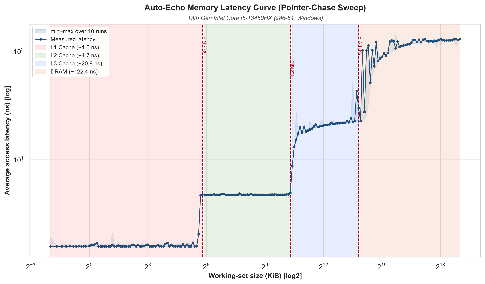
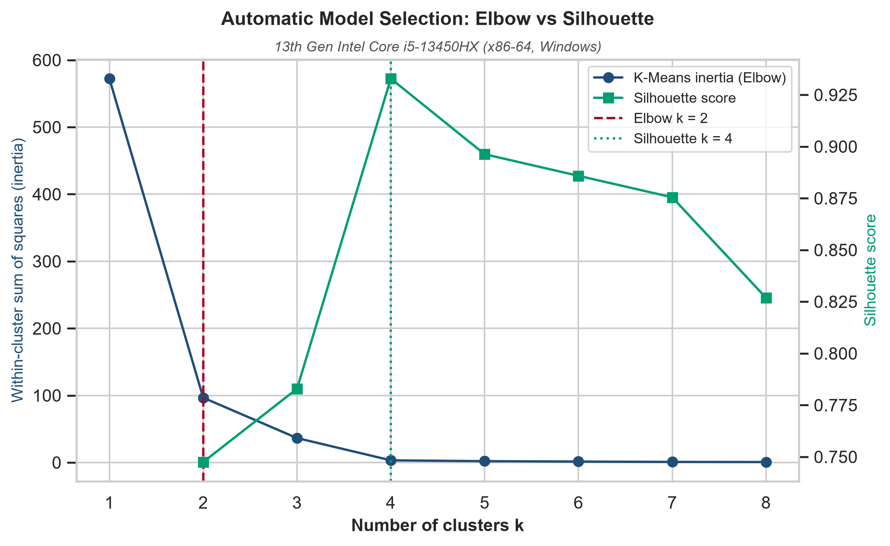

# Auto-Echo: Automated Discovery of Memory Hierarchy Latency Patterns from User-Space

Harsh Raj Singh  
*MSc Advanced Computer Science*  
*Queen Mary University of London*  
*London, United Kingdom*  
*ec25303@qmul.ac.uk*

## Declaration of Originality

I, Harsh Raj Singh, declare that this dissertation and the work it presents are my
own. Where I have drawn on the published work of others it is explicitly cited, and
the only verbatim material from other sources is clearly marked as quotation.
Generative-AI tools were used in accordance with the programme's policy, as detailed
in the Generative-AI Accountability Statement (Appendix A). This work has not been
submitted, in whole or in part, for any other degree or qualification.

*Signed:* \_\_\_\_\_\_\_\_\_\_\_\_\_\_\_\_\_\_\_\_\_\_\_ &nbsp;&nbsp; *Date:* \_\_\_\_\_\_\_\_\_\_\_\_\_

## Acknowledgements

I am grateful to my supervisor for consistently pressing on the weakest parts of
this work rather than the strongest. Several of the results reported here exist
only because a claim I had made was challenged and turned out, on examination, to
be unsupported: the level counts are validated against an exact optimum (§3.2.1)
because the choice of clustering algorithm was questioned, and the analysis of the
naive baseline in §4 was corrected from an architectural to a structural
explanation because the framework's own cross-platform evidence contradicted the
earlier account. Supervision that produces that kind of correction is the most
useful kind.

I thank Dr Vasileios Klimis, whose ECOOP 2025 paper *"Shouting at Memory: Where
Did My Write Go?"* is the point of departure for this project, and whose §6
explicitly identifies cache-hierarchy inference by timing as an open direction —
the challenge this dissertation takes up.

I thank the maintainers of the open-source scientific stack this work depends on —
NumPy, SciPy, pandas, scikit-learn, `ruptures` and Matplotlib — and the authors of
lmbench, whose `lat_mem_rd` established the pointer-chase measurement this probe
re-implements.

Finally, I thank my family for their patience during the writing of this
dissertation, and the owner of the Windows machine on which the x86 results of
§5.3 were collected for the loan of the hardware and the administrator rights
without which the huge-page experiment could not have been run.

## Abstract
Can a machine's cache hierarchy — how many levels it has and how large each is —
be recovered from user space alone, with no privileges, no architecture-specific
instructions and no prior knowledge of the hardware? Vendor documentation and
privileged interfaces are the usual answer; neither is available to portable
software reasoning about its own performance. This dissertation presents
Auto-Echo, which answers the question from timing alone.

The case for measuring rather than reading is made by describing the same two
machines through **three lenses**: the vendor's system report, which names no cache
at all; the operating system's topology descriptor as read by `lstopo`, which is
accurate wherever the vendor filled in the table; and direct latency measurement.
The second lens fails in two distinct ways that the third does not, and both are
demonstrated here on real hardware — the descriptor is *incomplete* on the Apple M1,
which never reports its System-Level Cache, and on the Intel part it is *complete but
not behavioural*, since a correctly reported 20 MiB L3 proves unreachable under the
default page size. Measurement is therefore not a less accurate substitute for the
descriptor; it answers a different question.

The work begins from a negative result. A naive probe that flushes a line, writes
it and times the subsequent load fails on both ARM64 and x86-64, and the cause
lies not in the instruction set but in the measurement design: writing a line
immediately before timing its read guarantees a cache hit by construction. The
delivered framework therefore adopts a different primitive — a working-set-size
pointer chase, prefetcher-resistant and flush-free, with batch-amortised,
runtime-calibrated timing — feeding an unsupervised stage in which clustering
*counts* the memory levels and change-point detection *localises* each capacity.
The counting step is shown to be globally optimal rather than merely convergent.
The framework compiles on Linux and was measured on macOS and Windows.

On an Apple M1 every estimator agrees on three levels; the documented L1 and L2 are
recovered within one octave, with the L2 and the undocumented System-Level Cache
resolving as a single band. On an Intel Raptor Lake core the same code path
recovers the full L1/L2/L3/DRAM hierarchy, all three documented capacities within
1.5–16 % — but only under a 2 MiB huge-page allocation, without which page-walk
latency masks the last-level cache entirely. That page-size dependence is itself a
controlled result: it isolates the translation lookaside buffer, not the inference
layer, as the binding constraint on user-space discovery of deep cache hierarchies.
A controlled contention experiment establishes a second such boundary — what the
probe recovers of a *shared* cache is not its capacity but the share left to the
probing core, which an eight-core streaming load drives down by a factor of six.
Finally, the inference stage is validated against prior art rather than only
against itself: applied unmodified to a curve measured by lmbench's `lat_mem_rd`,
it selects the correct level count and recovers both TLB-unmasked capacities.

---

## 1. Introduction
Modern processors rely on a deep hierarchy of caches (L1, L2, L3) to mitigate the
latency gap between the CPU and DRAM — the "memory wall" Wulf and McKee [30]
identified as the structural consequence of processor and memory speeds improving at
different exponential rates, and which remains the dominant constraint on
data-intensive code [31]. Drepper's practitioner survey [32] makes the corollary
explicit: performance on modern hardware is largely determined by how a program's
working set maps onto the cache hierarchy, so knowing that hierarchy's shape is a
precondition for reasoning about it.

The capacities and latencies of these layers are nevertheless largely opaque to
user-space software, so developers reach for a table someone else has already filled
in: `hwloc`/`lstopo` [27], which reports what the OS and firmware expose; the x86
`CPUID` deterministic cache-parameter leaf (04H) [28], which is architecture-specific
by construction; a vendor tool such as Intel's Memory Latency Checker [29]; or
privileged interfaces — performance counters via PAPI [33] or LIKWID [34], and kernel
modules. Each is more accurate than measurement on the hardware it covers, and each
fails in the same way: it presupposes that the hierarchy has already been described
somewhere (§2.2).

**Three lenses on the same silicon.** The two machines evaluated in §5 make that
presupposition concrete, because each can be described three times over by three
sources operating at different levels of privilege — and the three do not agree.

| | Lens | What it reads | What it answers |
|:--|:-----|:--------------|:----------------|
| 1 | **Commercial** | Windows System Properties; macOS System Information | *What did I buy?* |
| 2 | **Software** | `lstopo`/`hwloc` [27] over the OS cache descriptors | *What has the OS been told?* |
| 3 | **Physical** | Auto-Echo — latency alone, from user space | *How does this silicon behave?* |

The **commercial** lens is the one most users ever consult, and on both machines it
reports the processor, its core count and its installed memory — and **not one figure
about the cache hierarchy**. Anyone who needs to know the size of L1 has already been
forced to a second tool.

The **software** lens is that second tool, and on hardware whose vendor has filled in
the table it is excellent: on the Intel Core i5-13450HX, `lstopo` reports a complete
and correct hierarchy — 48 KB L1d and 1280 KB L2 per performance core, a 20 MB shared
L3 — which independent measurement then confirms. Nothing in this dissertation
disputes that, and any argument for measurement that rests on `lstopo` being
*inaccurate* would be false. Its limitation is narrower and more interesting: its
chain of trust terminates at what the operating system was told, so it inherits the
firmware's omissions exactly.

That limitation bites in **two distinct ways**, and this project exists because of
both:

1. **The table is incomplete.** On the Apple M1, `lstopo` reports the 128 KB L1d and
   the 12 MB L2 and then stops. The ~8 MiB System-Level Cache is simply absent — not
   misreported, *absent* — because Apple does not export it through any interface
   `hwloc` can read. §5.2 shows the probe responding to capacity well beyond the
   documented 12 MB L2, resolving the L2 and the SLC as a single 13.9 MiB band. What
   was never written down cannot be looked up; it can only be measured.

2. **The table is complete but topology is not behaviour.** On the Intel machine
   `lstopo`'s 20 MB L3 is entirely correct as a statement about the *silicon* — and
   under the default 4 KiB pages that L3 is nonetheless **behaviourally
   unreachable**. Past ~1.3 MiB the measured curve climbs and saturates at a flat
   ~143 ns plateau by ~4–5 MiB, because once the working set outruns the TLB's reach
   every dependent load triggers a page-table walk that itself misses to DRAM. The
   cache is there; the machine cannot get to it before translation cost dominates.
   A 2 MiB huge-page allocation lifts the masking and the same code path then
   recovers the L3 at 19.7 MiB, within −1.5 % of nominal (§5.3).

The second case is the sharper of the two, because no descriptor is wrong in it.
A table can only report what a cache *is*; it cannot report what a workload can
*use*, and the gap between those two is a property of the running system — page
size, TLB reach, and, as §5.3.2 shows under load, how much of a shared cache the
other cores have left. Measurement is not offered here as a more accurate substitute
for the descriptor. It answers a **different question**, and the three lenses are
three different claims rather than three attempts at one.

**Motivation.** An architecture-agnostic tool that maps a memory hierarchy from
empirical measurement alone — no privileges, no per-architecture instructions —
would support performance tuning, portable auto-tuning of cache-blocked
algorithms, and reproducible systems research on undocumented hardware. This
direction is not incidental to the reference work: Klimis [1] explicitly
identifies it as an open avenue, noting that "the ability to infer data location in
the memory hierarchy via timing could potentially be applied to study cache
behaviour, coherence protocol actions, or even aspects of memory consistency,
although these applications would require careful calibration, different
instrumentation strategies, and potentially more sophisticated analysis"
[1, §7].
Auto-Echo takes up precisely that challenge — the "careful calibration" and
"different instrumentation" the paper anticipates — for the specific problem of
cache-hierarchy discovery.

**Problem statement.** Measuring nanosecond cache latency from user space is
obstructed by hardware prefetchers, coarse timers, and the absence of portable
cache-control primitives. Interpreting the resulting noisy measurements without
hard-coded thresholds requires unsupervised inference.

*Fig. 1. The memory hierarchy. While OS-documented caches (L1, L2, L3) are closer to the CPU and faster, Auto-Echo is capable of empirically discovering them—and undocumented tiers like the M1 System Level Cache—purely from latency.*

**Aims and objectives.** Build an autonomous pipeline (Auto-Echo) that (i)
collects reliable memory-latency measurements from user space on any
architecture, (ii) infers the number and boundaries of memory levels without
labels or thresholds, and (iii) validates its output against known hardware.

**Contributions.**
1. A portable, flush-free WSS pointer-chase probe with batch-amortised timing.
   It **compiles on Linux and was measured on macOS and Windows**, across ARM64
   and x86-64, using `rdtscp`, `mach_absolute_time`, or `cntvct_el0` as available.
   The Linux path is compiled and exercised by the test suite, but no Linux
   hardware result is claimed.
2. A tick-to-nanosecond conversion that is **calibrated at runtime** against the
   OS monotonic clock, making the framework correct on any machine without
   configuring a per-CPU frequency and robust to turbo/frequency scaling.
3. An automatic, penalty-free level-discovery stage in which clustering
   (K-Means + Silhouette, cross-checked by GMM and DBSCAN) *counts* the levels
   and change-point detection *localises* each capacity — an architecture-agnostic
   design that removes the last manual tuning knob.
4. A self-validating evaluation against live OS ground truth, with empirical
   results on **two real ISAs** — an Apple M1 (three levels, unanimous across
   estimators) and an Intel Raptor Lake core (L1/L2 recovered with default 4 KiB
   pages; the **full L1/L2/L3/DRAM hierarchy** recovered under a 2 MiB huge-page
   control that lifts the TLB/page-walk masking of the L3 — 3/3 documented caches
   matched at 100% recall and precision, mean absolute capacity error 6.3% across the
   three matched caches over ten sweeps — with the provenance recorded that this
   depends on huge pages and that
   the level count is stable on a quiet machine but neither cross-estimator
   unanimous nor stable under ambient load).
5. An external validation of the *inference* layer, not merely the probe: applied
   unmodified to a latency curve measured by lmbench's `lat_mem_rd` [9] on the same
   silicon, the pipeline selects the correct level count and recovers both
   TLB-unmasked capacities (§5.3.1). Two controlled experiments then delimit the
   method: a 2 MiB huge-page control isolates address translation as the binding
   constraint on mapping a deep hierarchy (§5.3), and a shared-L3 load experiment
   shows that what the probe recovers of a *shared* cache is the share available to
   the probing core rather than its nominal capacity (§5.3.2).
6. A documented negative result (the naive probe) that motivates the design.

---

## 2. Literature Review & Background

This project sits at the intersection of two research traditions: empirical
characterisation of the memory hierarchy from user space through timing
measurement, and unsupervised model selection for automatic structure discovery.
A third — microarchitectural side-channel analysis — recovers cache geometry from
user-space timing far more precisely than either, and §2.3 states plainly why its
methods are not the ones this problem admits. The immediate inspiration is the
reference paper [1], but the *measurement* technique Auto-Echo ultimately adopts
belongs to a much older and well-established body of benchmarking work. This section
situates the project within those lineages and states precisely where its novelty
lies — and, equally, where it does not.

### 2.1 Memory echolocation
Klimis [1] introduces *memory echolocation*: emitting a store and timing the
subsequent load, whose latency acts as a signature for where the data currently
resides. The headline contribution of that work is not the latency profiling
itself but its use as an **Oracle inside an active model-learning loop** that
infers the persistency semantics of non-volatile memory, including the Intel
Write Pending Queue (WPQ). On an Intel Xeon E-2286G the paper reports
characteristic latency bands for L1, L2, L3, WPQ and DRAM.

Two inherited assumptions must be retired carefully, because the first Auto-Echo
prototype adopted both and neither transfers:

- The **WPQ is a persistent-memory (Optane) construct**, not a general feature of
  a commodity cache hierarchy. Expecting a WPQ tier on an Apple M1 — as the
  initial prototype's level naming did — is a category error, and the level
  vocabulary was corrected accordingly.
- The method relies on **`clflush` and fine-grained `rdtscp`**, both x86-only.
  Neither is available to user space on Apple Silicon, so the technique is not
  portable as published. §4 shows empirically that porting it is not merely
  inconvenient but unsound, and for a reason deeper than instruction availability.

Auto-Echo isolates the *hierarchy-mapping* aspect of echolocation, makes it
architecture-agnostic and strictly unprivileged, and replaces manual latency
thresholding with unsupervised inference.

### 2.2 The classical lineage: user-space cache characterisation
Recovering cache parameters from a working-set-size (WSS) sweep is a mature
technique, and this project's probe is a modern re-implementation of it rather
than a new idea. The relevant prior art:

- **Saavedra & Smith** [8] established that varying the size and stride of an
  array-access micro-benchmark reveals cache capacities and line sizes as
  discontinuities in measured access time — the foundational "sweep" idea.
- **McVoy & Staelin's lmbench** [9] provides `lat_mem_rd`, a **pointer-chasing**
  load-latency sweep over increasing array sizes. Its data-dependent load chain is
  exactly the mechanism Auto-Echo uses to defeat the hardware prefetcher without
  any cache-flush instruction. This is the single closest antecedent to
  Auto-Echo's probe, and the practice of reporting the *minimum* over repeats is
  taken directly from it.
- **Yotov, Pingali & Stodghill** [10] automated the *extraction* of cache
  parameters — capacity, line size, associativity — from such curves, framing
  hierarchy discovery as an automated measurement problem. Their extraction is
  nevertheless driven by hand-built decision rules and platform-specific
  thresholds rather than by model selection from the data.
- **Manegold's Calibrator** [24] and **Molka et al.** [23] refined
  latency and bandwidth characterisation across the hierarchy, the latter with
  careful attention to coherency-state effects on a multi-socket system.
- **Bryant & O'Hallaron's "memory mountain"** [11] popularised the WSS × stride
  latency surface as both a pedagogical and a diagnostic artefact; Auto-Echo's
  output plot is a 1-D (fixed-stride) slice through that surface.

### 2.3 A second, closer lineage: microarchitectural side channels

There is an adjacent literature that also recovers cache geometry from unprivileged
user-space timing, and it does so far more precisely than anything attempted here. It
would be misleading to present timing-based cache inference as an open problem while
ignoring that work, so this subsection states what it achieves and why its methods are
not the ones this problem admits.

**The measurement primitives.** Percival [35] first demonstrated that cache timing
alone leaks a co-resident process's access pattern, on a hyperthreaded Pentium 4.
Osvik, Shamir and Tromer [25] formalised two primitives that the field still uses:
*Evict+Time* and **Prime+Probe**, in which the attacker fills a cache set and times
its own re-access to learn which sets a victim touched. Yarom and Falkner's
**Flush+Reload** [36] inverted the mechanism — flush a shared line with `clflush`,
let the victim run, then time a reload — achieving single-line resolution on the
last-level cache, and Gruss et al.'s **Flush+Flush** [37] refined it further by
timing the *flush* itself rather than a reload, removing the attacker's own cache
misses and with them the most obvious detection signal. Disselkoen et al. [38]
replaced timing altogether with Intel TSX transactional aborts, obtaining a
noise-free eviction signal. Liu et al. [39] showed Prime+Probe works on the
last-level cache across cores, which is what made these techniques practical against
a co-tenant rather than a co-thread.

Two things in this lineage bear directly on the present work. First, **Flush+Reload
depends on exactly the primitive Auto-Echo cannot use**: an unprivileged line-granular
flush. Its unavailability on Apple Silicon (§2.4) is not an incidental gap but the
same constraint that shapes the entire side-channel literature's portability, and it is
why §4's baseline fails structurally rather than merely inconveniently. Second, the
field's own reverse-engineering results establish how much *is* recoverable from
user-space timing when one is willing to be architecture-specific: Maurice et al. [40]
recovered Intel's undocumented last-level-cache slice hash function using performance
counters, and Irazoqui et al. [41] did so by timing alone.

**The eviction-set problem, and why it is the sharper instrument.** Every set-indexed
attack needs a *minimal eviction set* — a group of addresses that collide in one cache
set. Vila, Köpf and Morales [26] treat finding them as the central algorithmic
problem, giving a reduction from quadratic to near-linear time and, in doing so,
recovering associativity and set structure with an exactness a latency sweep cannot
approach. Ge et al.'s survey [42] catalogues the resulting body of work. The
consequence for this dissertation is worth stating plainly: **if the goal were
associativity or line size, eviction-set construction would be the better tool**, and
the stride sweep §6 proposes for those parameters is the weaker option.

**Why this project takes the other trade.** The distinction is one of **goal and
threat model, not of capability**. The side-channel line recovers fine-grained
geometry — sets, ways, slice functions — for a specific *known* target, and is content
to be architecture-specific, to require many thousands of carefully constructed
accesses, to depend on primitives such as `clflush` or TSX that exist on some ISAs
and not others, and to be re-derived per microarchitecture. Adversarial precision is
the objective and portability is not. Auto-Echo's objective is the opposite trade:
coarse parameters — how many levels exist, how large each is — recovered with *no*
prior knowledge of the machine, no per-architecture instruction, and no operator
tuning, on whatever hardware the tool is dropped onto. Neither dominates; they are
complementary, and the honest summary is that this work occupies the portable,
low-resolution corner of a space whose high-resolution corner is already well mapped.

**What the framework is measured against in practice.** The alternatives a developer
would actually reach for are worth naming rather than gesturing at. `hwloc` and its
`lstopo` front end [27] report a machine's cache topology by reading what the OS and
firmware already expose; on x86 the underlying source is the `CPUID` deterministic
cache-parameter leaf (04H) [28], which returns level, type, line size, associativity
and set count directly. Intel's Memory Latency Checker (MLC) [29] measures latency and
bandwidth across the hierarchy, but is vendor-specific and takes the hierarchy's shape
as given. Each is more accurate than Auto-Echo on the machines it supports, and that
is precisely the point: each depends on a table someone has already filled in — a
firmware description, an architecture-specific instruction, or a vendor's own tool.
The question this dissertation asks is what remains recoverable when none of those is
available, which is the situation of portable software reasoning about hardware it was
not built for, and of any attempt to characterise an undocumented part.

**Implication for novelty.** Measuring cache capacities by pointer chasing is
classical; claiming it as novel would be indefensible. Auto-Echo's contribution is
therefore explicitly the **layer above** the measurement: a fully unsupervised,
zero-configuration inference stage that determines *how many* levels exist and
*where their boundaries lie* with no hard-coded thresholds and no prior knowledge
of the machine, and that validates itself automatically against OS-reported ground
truth on whatever machine it runs on. Where Yotov et al. automate extraction given
a known hierarchy shape, Auto-Echo infers the shape itself; where the side-channel
literature recovers finer geometry, it does so with target-specific knowledge that
this setting denies itself.

### 2.4 Hardware barriers to user-space timing
Four barriers recur in the literature and in this project's own empirical work. The
first three shape the probe's design; the fourth bounds what it can resolve, and is
the subject of the controlled experiment in §5.3.

- **Prefetching.** Regular access patterns are predicted and hidden by the hardware
  prefetcher, flattening the very steps the method needs. Prefetching has been a
  standard mitigation for cache-miss latency since Jouppi's stream buffers [43] and
  Mowry et al.'s compiler-directed scheme [44], and modern implementations combine
  several stride and stream engines per level [45]. Pointer chasing over a randomised
  permutation makes each address data-dependent on the previous load, serialising
  accesses and neutralising these engines — the standard defence, and the one lmbench
  relies on. It is worth noting that this defence is not unconditional: Vicarte et al.
  [46] showed that Apple's M1 contains a *data memory-dependent* prefetcher that
  follows pointer-like values, and Chen et al. [47] built an attack on it. A
  pointer-chase probe is exactly the access pattern such a prefetcher targets, which
  is a threat to the method's core assumption on Apple Silicon specifically. The M1
  curves reported in §5.2 show clean, well-separated plateaus, so the effect is not
  large enough here to flatten the staircase — but this is an empirical observation
  on one part, not a guarantee, and it is recorded as such in §5.5.
- **Timer quantisation.** Apple Silicon's `mach_absolute_time` [2] advances on a
  24 MHz counter — roughly 41.7 ns per tick, via a `mach_timebase_info` rational
  of 125/3 — which is far coarser than an L1 hit of about 1.5 ns. Timing a single
  access therefore measures the timer, not the memory system. Amortising 10^6 or
  more dependent hops inside one timing window recovers sub-nanosecond effective
  resolution.
- **No user-space flush on ARM.** `clflush` is x86-only and macOS exposes no
  data-cache flush to user space. Its absence rules out the whole Flush+Reload family
  [36, 37] on this platform, and rules out the reference paper's primitive with it.
  The WSS methodology sidesteps the problem entirely: a working set larger than a
  cache level overflows it *by construction*, so no explicit eviction primitive is
  required. This is why the WSS formulation is not merely a convenient alternative to
  the reference method but the only one of the two that can be made portable at all.
- **Address translation.** A fourth barrier emerges only at scale and proves decisive
  in §5.3. As the working set grows, so does the number of distinct pages touched, and
  once it exceeds the translation lookaside buffer's reach every dependent load may
  additionally trigger a page-table walk. The cost is well characterised: Bhattacharjee
  and Martonosi [48] documented TLB behaviour as a first-order bottleneck on parallel
  workloads, and Barr et al. [49] analysed the walk itself and the caches that serve
  it. The standard remedy is a larger page — Talluri and Hill [50] set out the
  superpage case, Navarro et al. [51] gave the first practical transparent OS support,
  and Ingens [52] and HawkEye [53] address the fragmentation and fairness problems
  that follow; Basu et al. [54] argue for bypassing paging altogether for large
  regions. Auto-Echo's 2 MiB huge-page control (§3.1) is the applied form of this
  literature, and §5.3 shows it deciding whether a 20 MiB last-level cache is visible
  at all.

### 2.5 Unsupervised model selection
The number of memory levels is unknown a priori and varies by machine, so the
inference stage must select model complexity **from the data**. This is the
project's core machine-learning problem, and two distinct families of method
address it. Their difference — whether the *order* of the observations is used —
turns out to be the central design question, and §3.2.1 resolves it.

**Clustering with internal validity indices (order-ignoring).** Treating the
per-size latencies as an unordered sample, K-Means [20] partitions them into `k`
groups minimising the within-cluster sum of squares. Because `k` must be supplied,
an internal validity index selects it. The **Silhouette coefficient** [4] scores
each point by the contrast between its mean intra-cluster distance and the mean
distance to its nearest neighbouring cluster; the mean over all points is
maximised at a `k` that balances compactness against separation. Crucially — and
this is the property Auto-Echo depends on — the Silhouette is **not monotone in
`k`**, so it exhibits an interior maximum and can select a count without any
penalty term. Alternatives include the **Elbow method**, which descends from
Thorndike [55] and is formalised here by the knee-detection heuristic of Satopää et
al. [19]; the **gap statistic** [22]; the variance-ratio criterion of Caliński and
Harabasz [56]; the within-to-between separation measure of Davies and Bouldin [57];
and, for likelihood-based models, the **Bayesian Information Criterion** [18], used
for cluster counting by Pelleg and Moore's X-means [58]. Milligan and Cooper's
comparative study [59] remains the standard reference on how these indices differ in
practice, and reports no uniform winner — which is why §5 ranks several against each
other on this problem's own data rather than appealing to a general result.

**A documented weakness in one dimension.** The Silhouette is known to degrade on
one-dimensional data with unequal cluster sizes and unequally spaced gaps, where
it tends to favour the partition at the single largest gap and thereby
**under-count closely spaced levels**. This is not a hypothetical concern here: it
is precisely the failure observed on the Intel part before the huge-page control
was applied (§5.3), where the criterion collapsed a four-level hierarchy
onto the "fast versus slow" split at the largest latency discontinuity. A related
and less widely discussed hazard, which §3.2.1 addresses directly, is that
the Silhouette weights every point equally and is therefore sensitive to how many
observations each cluster contains — a quantity fixed by the experimenter's
sampling grid rather than by the physics.

**Exact clustering in one dimension.** K-Means is normally solved by Lloyd's
algorithm [20], a local-search heuristic with no optimality guarantee even under
careful seeding [21]. In one dimension, however, an optimal partition is
necessarily *contiguous* in sorted order, which collapses the search space to the
choice of `k − 1` split points and admits an exact dynamic-programming solution.
This result is old — **Fisher** [16] gave it in 1958 as "grouping for maximum
homogeneity", and cartographers know the same construction as **Jenks natural
breaks** [17] — and a modern $O(k n^2)$ implementation is provided by **Wang & Song's
Ckmeans.1d.dp** [15], whose formulation this project's dynamic program follows.
Grønlund et al. [60] later reduced the bound to $O(n \log n)$ using the objective's
concave-Monge structure; at the sizes here (94–388 points) the quadratic fill costs
milliseconds, so the simpler recurrence is retained deliberately rather than by
oversight. That an exact algorithm exists for exactly the case at hand is a fact any
use of Lloyd's heuristic on 1-D data must answer to; §3.2.1 does so empirically.

**Change-point detection (order-respecting).** Because a WSS curve is a
piecewise-constant signal in `log S`, detecting the indices at which the level
shifts is arguably a more natural formulation than clustering values. Truong et al.
[6] survey the field, and their `ruptures` library [61] supplies the implementations
used here. Three estimators are relevant. **Binary segmentation** — the classical
greedy approach, whose modern treatment and consistency analysis are due to
Fryzlewicz [62] and which descends from Scott and Knott [63] — splits recursively
at the single best breakpoint and is fast but not optimal. **Dynp** finds the
globally optimal segmentation *given* a fixed number of breakpoints, by the
segment-neighbourhood dynamic program of Auger and Lawrence [64]; the optimal
partitioning recurrence of Jackson et al. [65] is the same idea with the count left
free. **PELT** [14] selects the number of breakpoints automatically via a penalty
term, pruning the candidate set to achieve linear expected cost.

The essential difficulty is common to all three and is structural: the segmentation
cost decreases monotonically as breakpoints are added, so the number of segments
cannot be read off the objective and must be fixed either by an external penalty — a
per-machine tuning constant, precisely what this project set out to remove — or by a
knee heuristic on the cost curve. §5 quantifies how badly a fixed penalty generalises
across machines. Auto-Echo's design consequence is to use Dynp for *localisation*
only, with the count supplied from the value domain (§3.2), so that no penalty is
ever chosen.

**Density-based clustering.** DBSCAN [12] requires no cluster count, deriving
groups from density connectivity and labelling sparse points as noise — attractive
here because transition points genuinely *are* noise between plateaus. Its cost is
that it substitutes one hyperparameter for another: the neighbourhood radius `eps`
must still be chosen, a trade-off acknowledged explicitly in §3.4.

**The gap this project addresses.** The benchmarking literature recovers cache
parameters but fixes the hierarchy's shape in advance, by hand-written rules or
operator inspection. The side-channel literature recovers finer geometry than either,
but for a known target and with per-microarchitecture knowledge this setting denies
itself. The clustering literature selects model complexity but is generally applied
to unordered data. None of the three provides an automatic, architecture-agnostic,
self-validating estimator of *how many* memory levels a machine has. Auto-Echo
combines the portable, flush-free pointer-chase probe from the first with a
model-selection stage from the last, and reports the combination's behaviour —
including where it fails — across two real ISAs.

---

## 3. Methodology (System Architecture)
Auto-Echo is a four-stage pipeline: a native measurement probe, a level-discovery
stage that counts and localises the memory levels, a set of independent
cross-checks on the count, and automatic validation against OS ground truth.

*Fig. 2. The unsupervised Auto-Echo pipeline.*

### 3.1 WSS Pointer-Chase Probe (`src/autoecho/wss/wss_probe.c`)

*Fig. 3. The Working-Set-Size Pointer-Chasing methodology. A Fisher-Yates cycle defeats the hardware prefetcher, and batch-amortized timing bypasses coarse OS timer constraints.*

Nanosecond memory timing requires a native probe; Auto-Echo implements it as a
Python C extension (`wss_probe.c`). For each working-set size `S` in a log-spaced
sweep — from four cache lines to a user-set maximum, at ten geometrically spaced
points per octave — the probe performs five steps:

1. A **page-aligned** buffer of size `S` (`posix_memalign` on POSIX,
   `_aligned_malloc` under MSVC, following the reference paper's alignment
   choice [1]) is divided into slots one **cache line** apart, the line size being
   auto-detected at run time (128 B on Apple Silicon, 64 B on x86). Alignment
   guarantees that no cache line straddles two pages; it does *not* bound TLB
   pressure, since the number of distinct pages touched grows with `S` regardless.
   The deep-memory plateau therefore still contains page-walk latency — a
   confounder addressed by the huge-page control below and quantified in §5.3.
2. The slots are linked into a **single random Hamiltonian cycle** by a
   Fisher–Yates shuffle [5] driven by a seeded xorshift64 generator, making every
   sweep reproducible. Constructing the cycle writes every slot, which has the
   useful side effect of pre-faulting every page before timing begins.
3. The probe performs a data-dependent **pointer chase**: each load returns the
   address of the next. Because addresses are unpredictable, the hardware
   prefetcher cannot run ahead and accesses are fully serialised, so **no
   cache-flush instruction is needed** — essential on ARM/macOS, where none is
   available to user space (§2.4).
4. A warm-up traversal brings the working set to steady state, after which
   $N \geq 2^{20}$ dependent hops are timed in a single window and the total divided by
   $N$. This **batch amortisation** yields sub-nanosecond effective resolution
   despite the ~41.7 ns Apple Silicon timer tick.
5. Each size is measured `R = 5` times and the **minimum** retained. For a
   micro-benchmark, interference can only add time, so the fastest observation is
   the best estimator of true latency — standard lmbench practice [9]. §5.5 notes
   the cost of this choice: a lower envelope hides variability, which is why the
   reported figures are accompanied by a min–max band across independent sweeps.

Alignment does not, however, bound how many *distinct pages* a large working set
spans, so the probe also exposes an opt-in **2 MiB large-page** backing for the
chase buffer (`--huge-pages`; `VirtualAlloc(MEM_LARGE_PAGES)` on Windows, falling
back gracefully to 4 KiB pages when the OS withholds the privilege). A 2 MiB page
covers 512× the address range of a 4 KiB one, cutting the page-walk traffic that
would otherwise accumulate in the deep plateaus. Because the allocation actually
obtained changes what the curve means, each report records the run's provenance
("2 MiB large pages" or "default 4 KiB pages") from a post-hoc check of what was
allocated rather than from what was requested — §5.3 shows this single control
deciding whether a 20 MiB L3 is visible at all.

The probe is written to a single portable interface that **compiles on Linux** and
was **measured on macOS and Windows**, across x86-64 and ARM64: the tick counter is `rdtscp`
(x86, via `<intrin.h>` under MSVC or `<x86intrin.h>` under GCC/Clang),
`mach_absolute_time` (Apple), or `cntvct_el0` (ARM Linux), and the thread is held on
one core by `sched_setaffinity` (Linux) or `SetThreadAffinityMask` (Windows), so
plateaus are not blurred by migration between core types.

**Apple Silicon is the exception, and the distinction matters.** macOS exposes no
user-space CPU-affinity API, so strict pinning is *impossible* there; the probe
instead requests a `QOS_CLASS_USER_INTERACTIVE` quality-of-service class, which
biases the scheduler toward the performance cluster but does not guarantee a
particular core. Calling that "pinning" would overstate it. Two independent checks
show the bias took effect. First, `hwloc` reports the M1's performance cluster as
carrying a 128 KiB L1d and a 12 MiB L2, against 64 KiB and 4 MiB on the efficiency
cluster (§5.1). Second, the recovered capacities sit at +23.0 % and +16.1 % against
the performance-core figures; had the probe run on the efficiency cluster the same
measurements would read +146 % and +248 %, far outside the factor-of-two tolerance,
and §5.2 would report a failure rather than a match. The residual risk is migration
*within* the performance cluster, which cannot affect the reported capacities because
all four Firestorm cores have identical L1d and share one L2 — though it remains a
possible source of run-to-run latency noise.

### 3.1.1 Runtime Timer Calibration (An Improvement Over the Reference)
Converting ticks to nanoseconds robustly is a portability problem in itself. The
reference implementation converts cycles to nanoseconds by **parsing the "cpu
MHz" field from `/proc/cpuinfo`**, which the paper itself acknowledges is
specific to Linux [1]. This has two weaknesses: it is not portable beyond Linux,
and the `rdtscp` counter actually advances at the *invariant-TSC* (nominal)
frequency, whereas "cpu MHz" reports the current, turbo-scaled core clock — so
the conversion is inaccurate whenever the core is not at its nominal frequency.
Auto-Echo instead **calibrates at runtime**, counting hardware ticks over a fixed
~50 ms interval of the OS monotonic clock (`clock_gettime` on POSIX,
`QueryPerformanceCounter` on Windows). This yields the true tick rate on any
machine with no configuration, and is a concrete methodological advance over the
reference paper's frequency-detection step.
On Apple Silicon the exact rational from `mach_timebase_info` (125/3 ~ 41.667 ns)
is used directly; an independent calibration run reproduced this value to four
significant figures, confirming the mechanism relied upon by the x86/Windows
paths.
The Intel machine supplies a quantitative counterexample to the alternative. Its
advertised base frequency is 2.40 GHz, whereas calibration measures the invariant
TSC at 2.61 GHz; deriving nanoseconds from the advertised figure would inflate every
reported latency by 8.8 % while leaving capacities untouched, producing an error
confined to the one column no internal check could detect. §5.1 gives the numbers.

### 3.2 Level Discovery: Count, then Localise (`src/autoecho/analysis.py`)
A cache of capacity $C$ keeps latency flat while the working set fits ($S \leq C$)
and steps up once it overflows. The number of memory levels therefore equals the
number of **plateaus** in the latency-versus-`log S` curve, and each cache's
capacity is the working-set size at the plateau-to-rise transition (Fig. 4).
Auto-Echo turns this staircase into a hierarchy in two stages, implemented with
scikit-learn [7] for the clustering and `ruptures` [61] for the segmentation:

1. **Count the levels** by clustering the per-size log-latencies with K-Means and
   selecting the number of clusters by the Silhouette coefficient [4],
   cross-checked independently by the Elbow method, a Gaussian mixture and DBSCAN.
2. **Localise each boundary** by change-point detection constrained to exactly
   that many segments — dynamic-programming `Dynp` from `ruptures` [61], the
   segment-neighbourhood recurrence of Auger and Lawrence [64], on the
   log-latency signal, which needs no penalty once the segment count is fixed.

This realises the principle *clustering counts the levels, change-point localises
their capacities*. Two implementation details support it. The curve is lightly
median-smoothed before segmentation — appropriate here because, unlike the
i.i.d. sample path of the naive baseline (§4), this is a genuine ordered sweep
whose neighbours share a level. Segmentation runs on **log-latency** rather than
raw nanoseconds, so that the small L1→L2 step and the large L2→DRAM step are
comparable in magnitude and both are detected; without the log transform the
deep steps dominate the squared-error cost and the inner hierarchy is lost.
Adjacent segments whose median-latency ratio falls below a merge threshold are
then combined, correcting noise-induced over-segmentation, and each surviving
level is summarised by its **median** with 5th/95th-percentile bounds — robust
statistics that a single mis-measured point cannot distort.

### 3.2.1 Why K-Means, and why counting is done in the value domain
The choice of estimator for the level count is the central methodological
decision in this project, and it deserves an explicit defence rather than an
appeal to familiarity.

**The two available formulations.** Write the measured curve as
$\{(S_i, \ell_i)\}$ for $i = 1 \dots n$ and let $x_i = \log \ell_i$. There are two
ways to recover $k$:

- *Value domain (order-ignoring).* Partition the multiset $\{x_i\}$ into $k$ groups,
  discarding the index $i$ entirely. K-Means minimises the within-cluster sum of
  squares $W(\mathcal{C}) = \sum_{j=1}^{k} \sum_{i \in \mathcal{C}_j} (x_i - \mu_j)^2$.
- *Index domain (order-respecting).* Partition $1 \dots n$ into $k$ contiguous segments
  and fit a constant to each — the change-point formulation, whose cost has the
  same algebraic form but is minimised over *contiguous* segments only.

The second appears the more natural model of a staircase, and it is indeed what
Auto-Echo uses to **localise** boundaries. It is nevertheless the wrong tool for
**counting**, for a reason that is structural rather than empirical.

**Neither formulation can select its own `k`.** It is tempting to argue that the
value domain is structurally privileged here. It is not, and the symmetry should
be stated plainly. Both objectives are monotonically non-increasing in `k`: any
`k`-segment solution remains feasible for `k + 1` segments, and equally any
`k`-cluster partition remains feasible for `k + 1` clusters, so in both cases the
optimum can only improve as `k` grows and `k` cannot be read off the objective.
Both formulations therefore require a **selection rule imposed from outside** —
a penalty term as in PELT [14], a knee heuristic on the cost curve [19], or an
internal validity index such as the Silhouette. Nor is the Silhouette confined to
the value domain: it is defined on any labelling of any set of points, so it could
in principle be computed on change-point segment labels just as readily as on
cluster labels.

**The choice is therefore justified empirically, not structurally.** Auto-Echo
implements both rules and measures them against each other across independent
sweeps on two machines, and the result is unambiguous: the value-domain rule
(Silhouette on the clustering labels) selects the correct count on **both**
machines with zero variance across sweeps, whereas the index-domain rule
(the cost-knee criterion on the `Dynp` cost curve) under-counts to **two** on the
Intel curve — see Table 10 (M1) and Table 14 (Intel). The third alternative, a
*fixed* penalty, generalises worst of all: §5.2 (Table 11) and §5.3 (Table 15) show
the same hand-set value yielding different counts on the two machines, which is
precisely the per-machine tuning constant this project set out to eliminate.
The value-domain rule is adopted because it is the one that demonstrably works on
the hardware tested, and the qualification that follows from this reasoning is
recorded: an empirical ranking over two machines is evidence, not proof,
and §5.5 states the limit on how far it generalises.

The division of labour is therefore principled rather than arbitrary: the two
stages answer different questions with different sufficient statistics. *How many
levels exist* is a property of the multiset of latency values — a machine with
four plateaus has four modes regardless of where they fall along the sweep — and
is answered without order. *Where the boundaries lie* is a property of the
ordering and is answered with it. Order is not discarded by the pipeline; it is
used at the stage where it is informative.

**K-Means in one dimension, and the exact alternative.** K-Means is normally
solved by Lloyd's algorithm [20], a local-search heuristic that guarantees only a
local optimum even with careful seeding [21]. On one-dimensional data this is an
uncomfortable choice, because an optimal 1-D partition is necessarily *contiguous
in sorted order*: if $x_a < x_b < x_c$ with $x_a$ and $x_c$ in the same cluster
but $x_b$ in another, exchanging $x_b$ into that cluster strictly decreases $W$.
The search space therefore collapses from a Stirling number of partitions to the
choice of $k - 1$ split points among $n - 1$ sorted gaps, which dynamic
programming solves **exactly** in $O(k n^2)$ — or $O(n \log n)$ with the sharper
analysis of Grønlund et al. [60]. This is Fisher's 1958 result [16],
the same construction as Jenks natural breaks [17], and is available as
Ckmeans.1d.dp [15]. Using a heuristic where an exact algorithm exists demands
justification.

**Auto-Echo therefore solves the counting step exactly.** `analysis.py` implements
the dynamic program directly (`_exact_1d_kmeans`): a single `O(k n²)` fill yields
the globally optimal partition for every `k` in the search range at once, so the
whole model-selection scan costs one pass. The counting step is consequently
**provably optimal and fully deterministic** — there is no seeding, no restart
count and no random state to report, and repeated runs on the same curve are
bit-identical by construction rather than by convention.

This replaced an earlier Lloyd-based implementation, and the migration was
audited rather than assumed. The script `scripts/verify_kmeans_optimality.py` computes,
for every `k` in the search range and for both measured curves, the globally
optimal partition and compares it against what Lloyd's heuristic reached
(Table 1):

**Table 1: Solver audit — Lloyd's heuristic against the exact dynamic
program, per `k`, on both measured curves (`scripts/verify_kmeans_optimality.py`).**

| Machine | Lloyd optimal | Lloyd sub-optimal (excess cost) | Selected $k$: Lloyd | Selected $k$: exact |
| :--- | :---: | :---: | :---: | :---: |
| Apple M1 | $k$ = 2, 3, 4, 7, 8 | $k$ = 5 (+2.9%), 6 (+1.4%) | **3** (sil. 0.894) | **3** (sil. 0.894) |
| Intel i5-13450HX | $k$ = 2, 3, 4, 5 | $k$ = 6 (+2.0%), 7 (+0.4%), 8 (+0.5%) | **4** (sil. 0.935) | **4** (sil. 0.935) |

Lloyd's algorithm happened to attain the global optimum at the selected `k` on
both machines, diverging from it only at $k \geq 5$ — beyond the Silhouette
maximum, where the criterion is already falling. **The switch to exact
optimisation therefore changed no reported result**: every capacity, level count
and estimator ranking in §5 is identical under both solvers. That is precisely
what makes the change safe to adopt, and it converts the guarantee from an
empirical observation about two particular curves into a property of the
algorithm. Had the audit gone the other way — had Lloyd been sub-optimal at the
selected `k` — the reported counts would have been artefacts of a solver, and the
correct response would have been to report that rather than to switch quietly.

**Why Silhouette rather than BIC for the Gaussian mixture.** BIC [18] is defined
for a likelihood model and is the natural criterion for a Gaussian mixture; K-Means
has no likelihood, and scoring it by BIC requires assuming an implied spherical,
equal-variance Gaussian model that the data does not support. Two considerations
led to Silhouette being applied to both. First, §5 *ranks* the estimators against
one another, and scoring the mixture by BIC while scoring K-Means by Silhouette
would confound the effect of the model with the effect of the criterion; holding
the criterion fixed isolates the model, which is the comparison of interest.
Second, BIC is poorly behaved on this particular data: within-plateau variance is
extremely heterogeneous across levels — the Intel L1 band spans 0.38 ns from p5 to
p95 while its DRAM band spans 26 ns — and a mixture free to fit components of such
disparate variance is rewarded by BIC for adding narrow components inside a single
physical plateau. The mixture's tendency to over-count (a modal five levels against
an expected four on the Intel part, §5.3) is consistent with this. Reporting
GMM+BIC as a further independent cross-check remains a reasonable extension (§6).

**A limitation of the Silhouette, and the test that closes it.** The Silhouette
weights every observation equally, so its value depends on how many points fall in
each cluster — and that is fixed by the sampling grid, not by the hardware. A
level spanning more octaves of the sweep receives proportionally more points (the
Intel L1 band contains 70 points against the L3 band's 35) purely because the
sweep is geometric at a fixed ten points per octave. The selected `k` is
therefore, *a priori*, a function of the experimenter's sampling density as well
as of the machine, and this would be a serious objection to any count reported
here.

It is answered empirically in §5.4 (Table 22). The M1 was re-measured end to end
at 5, 10 and 20 points per octave and the Intel machine likewise re-measured at 5,
10 and 20 (both under 2 MiB huge pages; the earlier subsampled Intel rows are now
superseded by direct measurement — §5.4); the selected count is **invariant across
every density on both machines**, as is the count returned by each cross-check. The Silhouette score itself drifts
slightly with resolution, but its argmax — the only quantity the pipeline consumes
— does not. The confound is real in principle and absent in practice on the
hardware tested.

*Fig. 4. Why latency reveals the cache sizes. As the working set outgrows each
cache, average access latency steps up; the size at each step is that cache's
capacity — the quantity Auto-Echo extracts.*

### 3.3 Automatic Model Selection and Cross-Checks
The level count is chosen over a single shared search range $k \in [2, 8]$, used
identically by every model-selection routine so the reported counts are
comparable. Four independent estimators cross-check the productive one:

- the **Elbow method**, taking the knee of the K-Means inertia curve by maximum
  perpendicular distance to the chord joining its first and last points [19];
- a **Gaussian mixture** scored by Silhouette (§3.2.1);
- **DBSCAN** [12], which needs no `k` and labels sparse transition points as
  noise;
- an **independent change-point counter** using the cost-knee criterion on the
  `Dynp` segmentation cost curve. This is deliberately *not* seeded with the
  Silhouette `k`, so its agreement with the productive count is genuine evidence
  rather than a restatement of the same decision.

§5 scores every counter across independent sweeps by count correctness and
stability. Change-point is retained in the productive path purely to *localise*
capacities once the count is fixed.

**The expected level count.** Scoring a counter requires an expectation, and to
avoid a post-hoc target the rule is stated in advance and applied uniformly:
**expected levels = (number of OS-documented caches) + 1 for DRAM.** On the Apple
M1 the OS documents L1 and L2, giving an expectation of three — the System-Level
Cache is not OS-reported and so does not enter the expectation, which is
consistent with the merged mid-band actually observed (§5.2). On the Intel part
the OS documents L1, L2 and L3, giving four. The rule depends only on what the
platform reports, never on what the method found.

### 3.4 Hyperparameters and the Scope of the Automatic Claim
Auto-Echo removes the *per-machine* tuning knob — the change-point penalty that
previously required an operator to set per platform — but it is not free of
constants, and it would be misleading to claim otherwise. Every fixed value in the
pipeline is disclosed here. **None is tuned per machine**: all take the same value
on every run reported in §5, and no result was obtained by adjusting them
(Table 2).

**Table 2: Every fixed constant in the pipeline, with its stage and role.
No value differs between the two reported machines.**

| Constant | Value | Stage | Role |
| :--- | :---: | :--- | :--- |
| Points per octave | 10 | Probe | Sweep resolution; sets grid density (see §3.2.1 caveat) |
| Minimum working set | 4 lines | Probe | Sweep floor |
| Repeats per size `R` | 5 | Probe | Minimum-over-repeats envelope |
| Hops per timing window $N$ | $\geq 2^{20}$ | Probe | Batch amortisation of the coarse timer |
| Calibration window | ~50 ms | Probe | Tick→ns conversion against the monotonic clock |
| RNG seed | 42 | Probe | Reproducible Fisher–Yates permutation |
| Level-count search range `k` | [2, 8] | Discovery | Shared by every estimator |
| Median smoothing kernel | 3 | Discovery | Light pre-segmentation denoising |
| Change-point `min_size` | 3 | Discovery | Minimum samples per segment |
| Segment merge ratio | 1.4× | Discovery | Merges adjacent plateaus of near-equal latency |
| DBSCAN `eps` | 0.3 | Cross-check | Neighbourhood radius, in log-latency units |
| DBSCAN `min_samples` | 3 | Cross-check | Core-point threshold |
| GMM `random_state` | 42 | Cross-check | Determinism of the EM fit |
| Onset departure `tau` | 0.15 | Capacity (opt-in) | Plateau-departure threshold |
| Flatness gate `tol` | 0.15 | Capacity (opt-in) | p90/p10 spread admitting the onset rule |
| Ground-truth match tolerance | 1 octave | Validation | Factor-of-two capacity match |

Note what is *absent* from this table. The counting step is solved exactly
(§3.2.1), so no restart count, seeding strategy or random state appears for it —
those are properties of a heuristic solver, and there is no longer a heuristic
solver in the productive path. The one remaining `random_state` belongs to the
Gaussian mixture, which is used only as a cross-check.

Three of the listed constants deserve comment rather than mere disclosure. The **merge ratio**
and **`min_size`** are structural regularisers inherited from the segmentation
formulation; they bound how finely the curve may be cut but do not choose the
count, which the Silhouette sets. **DBSCAN's `eps`** is a genuine threshold, and
its presence qualifies the "threshold-free" claim: DBSCAN is used only as an
*independent cross-check*, never in the productive path, precisely because it
cannot be made parameter-free. The productive path — Silhouette count plus
penalty-free `Dynp` localisation — contains no threshold that must be chosen with
knowledge of the machine, and that, rather than the absence of all constants, is
what the automatic claim means.

**A disclosure about the analysis scripts, not the pipeline.** The claim above is
about the productive path, and two auxiliary scripts previously departed from it in a
way that the earlier draft did not record. `scripts/capacity_ci.py` (the ten-sweep capacity
spread of Table 12) and `compare_curves.py --annotate` (the boundary markers in
Figs. 9, 10 and 12) both localised boundaries with a **fixed PELT penalty of 3.0** —
precisely the hand-set constant §6 claims to have eliminated. Reporting a headline
capacity through an estimator the dissertation elsewhere disowns is indefensible even
when it makes no numerical difference, so both scripts now default to the productive
automatic path, with the penalty available only as an explicit `--penalty` override for
the sensitivity analyses of Tables 10 and 14. It happens to make no difference here —
on the ten-sweep Intel data the two paths return identical per-sweep capacities in all
ten sweeps, which is why the previously published figures stand unchanged — but that
is a fact to be checked and stated, not assumed.

### 3.5 Validation, Comparative Evaluation & Reporting
Detected capacities are compared to ground truth read live from the OS
(`sysctl` on macOS, `/sys` on Linux, `GetLogicalProcessorInformationEx` on Windows,
each yielding true *per-core* sizes; §5.3); a match is
within one octave on a `log2` scale, and the exact percentage error is also
reported. To satisfy the requirement to identify the most accurate and
consistent method, each estimator is scored across **multiple independent
sweeps** (`--runs`) by count correctness and stability (standard deviation of
the level count). The framework emits a Markdown report, per-run CSVs, a
memory-mountain plot with a min–max variability band (Fig. 5), and an
Elbow-vs-Silhouette model-selection plot (Fig. 6).

---

## 4. Baseline and Its Failure (Critical Analysis)
The initial prototype is a **portability-oriented approximation of the reference
paper's measurement technique** [1, §6.1] — the method behind that paper's
Figure 7: each timed load is preceded by a write to the target address and, on
x86, an explicit `clflush`, with the load timed by `rdtscp`. It is an *approximation*,
not a faithful reproduction: it uses a different buffer size and sample count,
and on ARM the `clflush` has no equivalent, so the flush step is simply omitted.
The contribution here is the finding that this **store/flush/timed-load approach
fails to resolve a cache hierarchy on either ISA, for a reason that is structural
rather than architectural**. It is tempting to characterise the failure as
"x86-bound": the method needs
`clflush`, ARM has none, therefore it works on x86 and breaks on ARM. The
framework's own measurements refute that account. The decisive flaw is the
**write-before-read pattern**, which is present on both architectures and which
guarantees an L1 hit by construction; the ARM-specific obstacles compound it but
are not its cause.

**Evidence on Apple Silicon.** Timing individual random reads on a 64 MiB buffer
produced only timer-quantised output: raw read times were either 0 or 1 timer
tick (0 or ~41.7 ns), and the window-5 moving-average smoothing then blended
these into spurious sub-steps at multiples of 41.7/5 ~ 8.3 ns (~ 0, 8, 17, 25,
33 ns) — an artefact of the quantised timer and the smoothing filter, carrying no
memory-latency information.

**Evidence on x86, where every ARM obstacle is absent.** The same baseline was run
on the Intel i5-13450HX with a genuine `clflush` issued before each timed load and
with `rdtscp` rather than a 41.7 ns tick — that is, with the two conditions whose
absence the "x86-bound" account blames. It still fails (Table 3):

**Table 3: The naive store/flush/timed-load baseline on Intel x86, with a working
`clflush` and `rdtscp` (`--method samples`).**

| Inferred tier | Latency range | Mean latency | Samples |
| :--- | :---: | :---: | :---: |
| "L1 Cache" | 107–195 ns | 178.57 ns | 27,085 |
| "L2 Cache" | 195–297 ns | 212.13 ns | 20,623 |

Two observations condemn the method. First, only **two** tiers are recovered on a
machine with four documented levels, and both are recovered as adjacent bands
rather than a hierarchy. Second, and more damning, the tier labelled "L1" has a
mean latency of **178 ns** — two orders of magnitude above this core's true
~1.6 ns L1 (§5.3, Table 12) and squarely in DRAM territory. The absolute values are
dominated by `rdtscp` serialisation overhead, and the two "tiers" are a partition
of measurement noise, not of memory. Compare the WSS method on the *same core*,
which resolves L1 at 1.59 ns, L2 at 4.75 ns, L3 at 22.94 ns and DRAM at 123.25 ns
(Table 12). The failure is therefore not the missing ARM flush.

Three barriers explain it, in order of severity:

1. **Write-before-read guarantees L1 residency (structural, both ISAs).** Writing
   the line immediately before timing its read pulls it into L1, so every measured
   access is an L1 hit by construction — masking L2/L3/DRAM entirely. On x86 the
   `clflush` is issued *before* the store, so the store simply re-populates the
   line and the flush accomplishes nothing. This is the root cause, it is present
   on every architecture, and no instruction-set feature repairs it.
2. **Timer resolution relative to the quantity measured.** Timing a single access
   measures the timer, not memory. On Apple Silicon the 41.7 ns tick dwarfs an L1
   hit outright; on x86 `rdtscp` is finer but its serialisation overhead still
   dominates, which is why the Intel tiers sit at 178–212 ns. Both are instances
   of the same error: the baseline never amortises.
3. **No user-space flush on ARM (architectural, aggravating).** `clflush` does not
   exist on ARM and macOS provides no data-cache flush, so "forced DRAM" mode
   silently degenerated to natural eviction. This is a genuine portability barrier
   — but Table 3 shows that removing it does not rescue the method.

A secondary flaw was smoothing i.i.d. samples with a moving average, which blends
latencies from different levels *before* clustering and erodes the very structure
being sought. These findings — not a coding bug — motivated the WSS redesign and
are retained as the framework's documented naive baseline (`--method samples`).

The corrected reading strengthens rather than weakens the case for the redesign.
Had the failure been merely architectural, a per-ISA port would have sufficed. It
is instead a property of the measurement design, so the remedy must be a different
design — one that never writes before reading, never times a single access, and
never needs a flush. The WSS pointer chase of §3.1 satisfies all three by
construction.

**Evaluating the paper's proposed mitigation.** Klimis proposes a Local Outlier
Factor (LOF) filter [3] to clean ambiguous timings [1, §8.1]. We evaluated it
directly on the baseline data (`evaluation.evaluate_lof_mitigation`). LOF flagged
only ~0.04% of samples as outliers — the quantised data is too degenerate for a
density-based method — and **100% of the surviving samples still lay exactly on
integer timer-tick multiples** (just five discrete tick levels). This is direct
evidence that the baseline's failure is *structural* (write-before-read plus
timer quantisation), not transient noise that any amount of outlier filtering
could remove — reinforcing the need for the WSS redesign rather than a filtering
patch.

---

## 5. Results & Evaluation
Auto-Echo runs identically across platforms; results are reported **per machine**
as they are collected, using the same command
(`python -m autoecho --method wss --runs N`, with the per-machine `--runs`,
`--max-mb` and `--huge-pages` values stated in each subsection). Two real machines
are now **validated** —
the **Apple M1** (§5.2) and an **Intel Core i5-13450HX** (§5.3, under a 2 MiB
huge-page allocation), spanning both ARM64 and x86-64. Extending the evaluation to
a third machine is identified as future work (§6).

The chapter is organised so that the evidence accumulates before it is summarised.
§5.1 establishes where the ground truth comes from and verifies it against an
independent implementation; §5.2 and §5.3 report each machine in turn, with §5.3.1
checking the inference layer against prior art and §5.3.2 testing what contention
does to a shared cache; §5.4 then consolidates. **A reader wanting the validation
result before the argument for it should turn to Table 20 (§5.4)**, which places
every documented cache on both machines against both reference sources in one view.
§5.5 states the threats to validity, including those this chapter demonstrates
rather than merely anticipates.

### 5.1 Test machines

Both machines are consumer laptop parts, and both are described below by all three
lenses of §1 in turn: the vendor's own system report (Table 4a), the OS topology
descriptor (Table 5), and the probe's measurement (§5.2, §5.3). The first lens is
recorded first because it establishes what a user is given *before* any tool is run.

**Table 4a: The commercial view — what each vendor's system report states.**
Verbatim from Windows System Properties and macOS System Information respectively.

| | Intel machine | Apple machine |
| :------------------ | :---------------------------------- | :------------------------------ |
| Processor / chip | 13th Gen Intel Core i5-13450HX @ 2.40 GHz | Apple M1 |
| Model | — | MacBook Air (`MacBookAir10,1`) |
| Physical cores | 10 — 6 performance + 4 efficiency | 8 — 4 performance + 4 efficiency |
| Logical processors | 16 (SMT on the P-cores) | 8 (no SMT) |
| Installed memory | **24.0 GB** (23.7 GB usable) | **8 GB** unified |
| Memory reserved | ~0.3 GB — firmware + Intel UHD Graphics | none fixed — see below |
| Discrete graphics | NVIDIA RTX 5050 Laptop (8 GB) | — (integrated, unified) |
| **Cache hierarchy** | **not reported** | **not reported** |

Three observations follow, and the third is the one that matters to this
dissertation. First, the two memory figures are not directly comparable in kind:
the Intel machine's 24.0 GB is DRAM dedicated to the CPU, from which the
firmware and the integrated Intel UHD adapter reserve roughly 0.3 GB, leaving
23.7 GB usable. The M1's 8 GB is **unified memory** — CPU, GPU and Neural Engine
allocate from a single physical pool on demand, so there is no fixed carve-out to
subtract. Consistent with that, both macOS and `lstopo` report the M1's full 8 GB
(8192 MB) with no discrepancy between them, whereas the Intel machine's advertised
and reported figures do diverge, for a reason traced in §5.1's discussion of
`GetNumaAvailableMemoryNodeEx` below.

Second, the M1 is the **smaller-memory machine by a factor of three** yet carries
the *larger* L2 (12 MiB against 1.25 MiB per core) and an undocumented SLC. Cache
capacity and DRAM capacity are independent design axes, and a specification sheet
that reports only the latter tells a performance engineer almost nothing.

Third, and decisively: **neither vendor reports a single cache figure.** Model,
core count, memory, firmware version, serial number — and nothing about the memory
hierarchy. This is the commercial lens's characteristic failure, and it is total
rather than partial. Everything that follows in this chapter exists because this
table stops here.

**Table 4: The two machines evaluated, with the hardware parameters that
matter to the method.**

| Machine | Arch | Core probed | L1d | L2 | L3 | Line | Page | Status |
| :-------------- | :--------- | :------------- | :--------: | :--------------: | :------------: | :-------: | :-------: | :---------------- |
| Apple M1 | ARM64 | Firestorm P-core | 128 KiB | 12 MiB | — (8 MiB SLC) | 128 B | 16 KiB | validated |
| Intel Core i5-13450HX | x86-64 | Raptor Lake P-core | 48 KiB | 1.25 MiB/core | 20 MiB (shared) | 64 B | 4 KiB | validated (L1/L2/L3, 2 MiB huge pages) |

*The **Page** column is the OS base page size, confirmed at run time
(`sysctl hw.pagesize` reports 16384 on the M1; the Windows x86-64 default is
4 KiB). It is listed because §5.3 shows page size, not cache size, deciding
whether a last-level cache is visible at all — so it is a hardware parameter of
the same standing as the line size, and the two machines do not share it (§5.4).*

*Ground-truth cache sizes are read automatically from the OS at run time
(`sysctl` / `/sys` on macOS/Linux; `GetLogicalProcessorInformationEx` on Windows).
The Windows path now reads true *per-core* sizes for CPU 0 — the legacy
`Win32_CacheMemory`, kept only as a fallback, reported *per-socket aggregate* sizes
(L1 = 6 × 48 KiB) — so the Intel L1/L2/L3 columns above are the per-core figures the
single-core probe actually sees (§5.3).*

**Verifying the reference standard itself.** Because every accuracy figure in §5 is
scored against these OS-reported sizes, the ground truth is a reference standard and
warrants checking rather than assuming. Both machines are heterogeneous — Apple's
four Firestorm plus four Icestorm cores, Intel's six performance plus four efficiency
cores — and on such a die the *generic* OS cache keys report one cluster only.
Selecting the wrong one would score a performance-core probe against efficiency-core
figures, an error large enough to invalidate the whole comparison while still looking
plausible. Table 5 records what each source reports, collected by
`scripts/collect_ground_truth.py`.

**Table 5: Ground-truth provenance — what each source reports for the probed core,
and the value the framework uses.** The framework's own reader takes the M1 figures
from `sysctl hw.perflevel0.*` (the performance cluster) and the Intel figures from
`GetLogicalProcessorInformationEx`, filtered to the caches whose processor-affinity
mask serves CPU 0. The third column lists the *generic* interface that would have
been read instead had the per-core distinction been overlooked.

| Machine | Cache | Framework uses | Generic source (not used) | Independent check (`hwloc`) |
| :------------ | :------ | :------------ | :--------------------------------- | :------------------------ |
| Apple M1 | L1d | **128 KiB** | `hw.l1dcachesize` = 64 KiB (E-cluster) | `L1d 128KB`, cores 4–7 ✓ |
| Apple M1 | L2 | **12 MiB** | `hw.l2cachesize` = 4 MiB (E-cluster) | `L2 L#1 (12MB)` ✓ |
| Apple M1 | SLC | *not reported* | — | absent from `lstopo` |
| Intel i5 | L1d | **48 KiB** | `Win32_CacheMemory` = 288 KiB (6 × 48, per socket) | `L1d L#0 (48KB)`, cores 0–5 ✓ |
| Intel i5 | L2 | **1.25 MiB** | `Win32_CacheMemory` = 7680 KiB (6 × 1.25, per socket) | `L2 L#0 (1280KB)` per P-core ✓ |
| Intel i5 | L3 | **20 MiB** | — (shared; per-socket and per-core coincide) | `L3 L#0 (20MB)` ✓ |

Two points follow. First, the **error the generic keys would have introduced is not
subtle**: on the M1 the detected L1 boundary of 157.5 KiB scores +23.0 % against the
Firestorm L1d of 128 KiB, but would score **+146 %** against the Icestorm figure of
64 KiB — far outside the factor-of-two tolerance, so §5.2 would report a validation
failure rather than a match. The same reasoning motivated the Windows per-core
correction described in §5.3; the two platforms required the same care for the same
reason, and only the Windows case was previously documented.

Second, `hwloc` is an **independent implementation, not an independent source**. It
reads the same OS interfaces this framework does, so its agreement confirms the
values are being read correctly, not that they are complete. The M1's System-Level
Cache is absent from `lstopo` exactly as it is absent from `sysctl` — which is the
chain-of-trust argument of §2.2 observed directly on the hardware under test. On the
Intel part, by contrast, `lstopo` reports a **complete** hierarchy (L1d 48 KiB, L2
1280 KiB per core, L3 20 MiB, then memory), and there is no undocumented tier. The
incompleteness argument therefore applies to the M1 and *not* to the Intel machine;
what motivates measurement on the Intel part is the separate finding of §5.3, that a
documented 20 MiB L3 can be behaviourally unreachable.

Third, and consequentially for the probe's core-pinning strategy, **the two
heterogeneous parts number their cores in opposite orders.** `lstopo` places the
Intel's six performance cores first — `Core L#0` carries a 48 KiB L1d and a 1280 KiB
L2, and hosts logical processors `P#0` and `P#1` — with the four efficiency cores
(32 KiB L1d, a shared 2048 KiB L2) last, at `P#12`–`P#15`. On the M1 the order is
reversed: logical CPUs 0–3 are Icestorm efficiency cores and 4–7 are Firestorm
performance cores. The probe's Windows path pins to logical CPU 0
(`SetThreadAffinityMask(..., 1)`), which is therefore a **performance** core on this
Intel part — confirmed by `lstopo` — whereas the same strategy on the M1 would have
selected an *efficiency* core. That is precisely why the Apple path uses a
performance-cluster QoS hint rather than an affinity mask (§3.1). The pinning
strategy is correct on both platforms, but for platform-specific reasons rather than
by a single portable rule.

A further detail follows from the same output and bears on §5.3.2's contention
experiment. The Intel performance cores carry SMT — `Core L#0` hosts both `P#0` and
`P#1` — so pinning to logical CPU 0 leaves a sibling thread sharing that core's L1
and L2. The contention experiment pins its eight workers to logical CPUs 2–9, which
`lstopo` shows to be physical cores 1–4; the probe's own physical core, comprising
`P#0` and `P#1`, is left entirely idle. The measured contention is therefore
last-level-cache contention, not SMT interference within the probing core.

**Two figures reported by the discovery tools do not match the Intel machine's
advertised configuration, and both differences are informative rather than
troubling.** The first concerns memory. Windows System Properties reports
**24.0 GB installed (23.7 GB usable)**, whereas `lstopo` heads its output
`Machine (6928MB total)` — a factor of roughly 3.5. This is not a contradiction
between the two but a difference in what is being reported: hwloc's Windows backend
obtains node memory through `GetNumaAvailableMemoryNodeEx`, which returns the memory
*available* on the node at the instant of the query, not the quantity installed. The
figure is therefore a snapshot of free memory during the run, which is unremarkable
on a machine concurrently hosting the WSL 2 virtual machine used for the lmbench
cross-check of §5.3.1 — WSL 2 reserves a large fraction of host RAM by default. Table 6
supplies the control that confirms this reading. No
result in this chapter turns on the distinction. The sweeps reach 512 MiB, an order
of magnitude below even the smaller figure; every capacity reported is a working-set
size, which is a property of the address range walked and not of installed memory;
and the one place memory pressure genuinely matters — the 512 MiB large-page
allocation failing with Windows error 1450 under load (§5.3.2) — depends on
contiguous *physical* memory and pool fragmentation rather than on total capacity.

The second discrepancy is more consequential, and it corroborates a design decision
taken in §3.1.1. Windows advertises the part as **2.40 GHz**; the framework's runtime
calibration returned **0.383 ns/tick**, that is a **2.61 GHz** invariant TSC — a
difference of **8.8 %**. Again both figures are correct, because they describe
different clocks. The advertised 2.40 GHz is the performance-core *base* frequency,
a quantity that varies continuously in service under turbo and thermal control. The
invariant TSC, by contrast, ticks at a fixed reference rate deliberately decoupled
from core frequency — that decoupling is precisely what makes it invariant, and what
makes it usable as a timebase at all. The two are not required to coincide, and on
this part they do not. The consequence is direct: had the framework converted ticks
to nanoseconds using the advertised 2.40 GHz rather than calibrating, **every latency
in §5.3 would be inflated by 8.8 %** — the L1 plateau reported at 1.57 ns would have
appeared as 1.71 ns, and the L3 plateau at 22.94 ns as 24.96 ns. Detected
*capacities* would have been untouched, since a working-set size never passes through
the tick conversion; the error would have been confined to the latency column, where
no internal consistency check could have exposed it, and where a plausible-looking
wrong number is considerably more dangerous than an obviously wrong one. The
runtime-calibration path (§3.1.1) is thus not a portability convenience but a
correctness requirement, and this machine supplies the counterexample that shows why.

**The M1 supplies the control for the memory-reporting claim, and a compact
illustration of the whole argument.** Table 6 sets the three views of that machine
side by side: what the vendor's own system report states, what `hwloc` derives from
the OS, and what Auto-Echo measures.

**Table 6: Apple M1 — three views of the same machine.** The vendor system report,
an independent topology tool, and this framework, on the machine of §5.2.

| Property | macOS System Information | `lstopo` (hwloc) | Auto-Echo |
| :------------------ | :------------------------ | :---------------------------- | :------------------------- |
| Model | MacBook Air, `MacBookAir10,1`; Apple M1 | — | — |
| Cores | 8 total: 4 performance + 4 efficiency | 8 PUs, `P#0`–`P#7`, in two L2 clusters | probes one performance core |
| Installed memory | 8 GB | `Machine (8192MB total)` — exact | not probed (sweep tops out at 512 MiB) |
| L1d, P-core | *not reported* | `L1d L#4 (128KB)`, cores 4–7 | **157.5 KiB** (+23.0 %) |
| L1d, E-core | *not reported* | `L1d L#0 (64KB)`, cores 0–3 | not probed (P-core pinned) |
| L2, P-cluster | *not reported* | `L2 L#1 (12MB)` | **13.9 MiB** (+16.1 %) |
| L2, E-cluster | *not reported* | `L2 L#0 (4096KB)` | not probed |
| System-Level Cache | *not reported* | *not reported* | resolved within the L2 band |

Three things follow. First, the **vendor's own system report contains no cache
information whatsoever** — model, core count, memory, firmware and serial number, but
not one figure about the memory hierarchy. The user who wants to know the L1 size
must already be reaching for a second tool, which is the practical form of the
motivation set out in §1.

Second, the M1 **resolves the Windows memory anomaly discussed above**. Here `lstopo`
reports `Machine (8192MB total)` against 8 GB installed — an exact match, to the
byte. The same tool therefore reports installed memory correctly on macOS and a much
smaller figure on Windows, which localises the discrepancy to the platform backend
rather than to hwloc or to either machine. This is what makes the
`GetNumaAvailableMemoryNodeEx` explanation a supported inference rather than a
plausible guess: the two platforms constitute a controlled comparison, differing in
the backend and agreeing in the tool.

Third, the E-cluster figures independently **confirm the reading of Table 5**. That
table asserts that the generic `sysctl` keys describe the efficiency cluster rather
than the performance cluster, which is why the framework does not use them. `lstopo`
reports the E-cores at `L1d 64KB` and their shared `L2 L#0 (4096KB)` — exactly the
64 KiB and 4 MiB that `hw.l1dcachesize` and `hw.l2cachesize` return. The generic keys
are not wrong; they describe a different core from the one being probed, and an
evaluation that used them would have scored a Firestorm measurement against Icestorm
hardware. The +146 % error quantified earlier is the size of that mistake.

The last row is the one that matters most for this dissertation's argument. Neither
the vendor nor `hwloc` reports the System-Level Cache at all, yet §5.2 shows the
probe responding to a capacity beyond the 12 MiB L2. The three columns are thus not
three attempts at the same measurement, of which one is best; they are three
*different* claims — what the vendor chooses to publish, what the OS chooses to
export, and what the hardware actually does — and only the third is answerable by
measurement.

**Table 7: Intel Core i5-13450HX — three views of the same machine.** The same three
sources, on the machine of §5.3. Auto-Echo figures are the 2 MiB huge-page run.

| Property | Windows System Properties | `lstopo` (hwloc) | Auto-Echo |
| :------------------ | :------------------------ | :---------------------------- | :------------------------- |
| Processor | 13th Gen Core i5-13450HX @ 2.40 GHz | — | TSC calibrated to 2.61 GHz |
| Cores | 10 physical: 6 P + 4 E · 16 threads | 16 PUs; P-cores first, `P#0`–`P#11` | probes CPU 0, a P-core |
| Installed memory | 24.0 GB (23.7 GB usable) | `Machine (6928MB total)` — *available*, not installed | not probed (sweep tops out at 512 MiB) |
| L1d, P-core | *not reported* | `L1d L#0 (48KB)`, cores 0–5 | **55.7 KiB** (+16.0 %) |
| L1d, E-core | *not reported* | `L1d (32KB)`, cores 6–9 | not probed (P-core pinned) |
| L2, per P-core | *not reported* | `L2 L#0 (1280KB)`, private | **1.2 MiB** (−1.5 %) |
| L2, E-cluster | *not reported* | `L2 (2048KB)`, shared by all four | not probed |
| L3, shared | *not reported* | `L3 L#0 (20MB)` | **19.7 MiB** (−1.5 %) |
| L3 *reachable* on 4 KiB pages | *not reported* | *not representable* | **~3.5 MiB artefact** (§5.3) |

Set beside Table 6, the pair makes the argument of §1 concrete in a way neither
machine could alone, because **the two lenses fail differently on the two machines.**

On the **commercial** row the two are identical: neither vendor reports a single
cache figure. That failure is total, platform-independent, and the reason a second
tool is needed at all.

On the **software** row they diverge sharply. `lstopo` is **complete and correct** on
the Intel part — 48 KB, 1280 KB, 20 MB, every one confirmed by measurement to within
1.5–16 %. On the M1 it is complete for what it reports and **silent about an entire
~8 MiB tier**. So the case for measurement cannot be that the descriptor is
inaccurate, because on this Intel machine it is not; it is that the descriptor's
*coverage* is a vendor's choice, and one of these two vendors chose differently.

The **last row has no counterpart in Table 6, and it is the sharper finding.** Every
figure in the `lstopo` column is right, including the 20 MB L3 — and under the
default 4 KiB page size that L3 is unreachable, with the segmenter instead reporting
a ~3.5 MiB band that is a TLB artefact rather than a cache (§5.3). The topology
column is not wrong; it is **answering a different question**. It reports what the
silicon *contains*, and cannot report what a workload can *reach*, because
reachability depends on the page size the allocation happens to use — which is a
property of the running system, not of the die. There is no entry a topology tool
could add to fix this, which is why the row is marked *not representable* rather
than *not reported*.

Two smaller points close the pair. The Intel memory row reads 6928 MB against 24.0 GB
installed because hwloc's Windows backend returns memory *available* on the node
rather than installed capacity; the M1 row of Table 6, where `lstopo` reports the full
8192 MB exactly, is the control that localises this to the platform backend rather
than to the tool. And the two machines **number their cores in opposite orders** —
the Intel's performance cores come first, the M1's last — which is why the probe uses
an affinity mask on Windows and a performance-cluster QoS hint on macOS (§3.1), and
why a single portable pinning rule would have selected the wrong core type on one of
the two.

*The **Status** column uses a deliberate three-tier vocabulary. **Validated**: every
documented cache was recovered and matched OS ground truth — the M1 (2/2, 100%) and,
under a 2 MiB huge-page allocation, the Intel (3/3, 100%; with the default 4 KiB pages
the 20 MiB L3 is TLB-masked, so the huge-page provenance is reported explicitly in
§5.3). **Measured**: the tool ran and recovered real data but did not fully validate.
**To be measured**: not yet run. The M1/Intel differences that follow in §5.2–§5.3
track this convention and are deliberate, not omissions.*

### 5.2 Apple M1 (Firestorm P-core) — validated
The WSS probe produces a clean, well-separated latency curve (Fig. 5). Automatic
model selection (Silhouette count + change-point localisation) and validation
against `sysctl` ground truth, over three independent sweeps, give **three
levels — a result on which all five estimators independently agree** (Table 10):

**Table 8: Discovered hierarchy vs. ground truth (Apple M1, performance core).**

| Level | Detected capacity | Median latency | p5–p95 | Ground truth | Error |
| :--- | :---: | :---: | :---: | :---: | :---: |
| L1 Cache | 157.5 KiB | 1.53 ns | 1.53–1.57 ns | 128 KiB | +23.0% (0.30 oct) |
| L2 (with SLC) | 13.9 MiB | 9.19 ns | 8.73–22.73 ns | 12 MiB† | +16.1% (0.22 oct) |
| DRAM | — | 130.43 ns | 45.21–141.44 ns | — | — |

**Both figures are confirmed against an independent implementation.** The 128 KiB
L1d and 12 MiB L2 scored against here are not merely what this framework's own
reader returned from `sysctl`: `hwloc` reports `L1d 128KB` on cores 4–7 and
`L2 L#1 (12MB)` for the same performance cluster (Table 6), so the reference
standard has been checked by software written by other people before the probe is
scored against it. What `hwloc` does *not* report is the System-Level Cache — which
is why the L2 row below is scored against the 12 MiB L2 alone, and why the detected
13.9 MiB exceeds it.

**Both OS-documented caches (2/2) matched within a factor of two** (the matching
tolerance; see §5.5), with **mean absolute capacity error 19.9%** taken over every
sweep and cache individually (three sweeps); the equivalent figure across the two
matched caches as reported in Table 8 is **19.6%**. §5.4 defines both statistics and
tabulates them for each machine, because they are not interchangeable. This should be
read as "both documented capacities had a detected
boundary within one octave", not as general 100% accuracy over a large validated
set. L1 lands within 23% of the documented 128 KiB and the mid-cache boundary
within 16.1% of the documented 12 MiB L2.

The +23% over-estimation is *systematic and directional*, not noise, and is
characteristic of random-access latency curves. Because the pointer chase visits
the working set in a random Hamiltonian order, a set moderately larger than the
cache still enjoys high residency (~128/157 ~ 80% of a 157 KiB set stays resident
in a 128 KiB cache), so the *average* latency rises only gently past the nominal
capacity — a **soft knee** rather than a sharp step. Minimum-over-repeats and light
median smoothing further favour the fast tail, so the detected plateau extends a
few grid points beyond the true capacity and the reported boundary sits
consistently *above* nominal. The bias is therefore intrinsic and, **for a private
cache**, one-signed upward — which is why every detected cache on this M1
over-estimates rather than scatters, and why the defensible claim is "a detected
boundary within one octave", not a tight percentage. (The upward sign is a property
of *private* caches specifically. A **shared** cache carries a competing downward
pull, because a single probing core can only map the share left to it: the Intel L3
reads −1.5 % of nominal on a quiet machine but −83 % under a deliberate shared-L3
load — measured directly in §5.3.2.) Reducing the soft-knee
bias would require an **onset** estimator (the first departure from the plateau
median) rather than the plateau edge; that estimator is implemented and evaluated in
§5.4, where it is rejected as a default on robustness grounds. Note that the naive
alternative of the last-fit/first-miss **midpoint** moves the estimate the *wrong*
way (+23% → +27%), precisely because the plateau edge already lies above the
nominal capacity; this was tested and rejected.

†**On the SLC.** The M1 performance cores share a 12 MiB L2 *and* an ~8 MiB
System-Level Cache (SLC) whose capacities are so close that the automatic method
resolves them as a **single merged mid-band** — which is why the reproducible
answer is three levels, not four. Forcing a finer segmentation splits
this band into two knees at **~9.8 MiB and ~19.7 MiB** — a split that is *stable
across every explicit penalty from 3 to 6*, so it is a robust feature of the curve,
not a penalty artefact. The ~9.8 MiB knee is consistent with the documented 12 MiB
L2 and the ~19.7 MiB knee with the onset of the DRAM plateau, with the intervening
band consistent with (but not uniquely attributable to) the OS-unreported SLC [13].
This split is *not* selected by automatic model selection and is reported only as a
**candidate finer-grained sub-structure** (§5.5), not a headline level. Separating cache from shared-L2 contention or TLB effects there
would need performance-counter, per-core-type and cross-core experiments.

**Table 9: Model selection — Elbow and Silhouette *agree* (Fig. 6).** Contrast
Table 13, where the same two criteria disagree on the Intel curve.

| Criterion | Selected k |
| :--- | :---: |
| K-Means inertia (Elbow) | 3 |
| Silhouette score | 3 (score 0.894) |

The Elbow Method (knee of the K-Means inertia curve) and the Silhouette Score
independently select **k = 3** well-separated latency groups (L1, L2, DRAM),
satisfying the project requirement to apply and compare both.

**Table 10: Level-count estimators — comparison and stability (3 sweeps).**

| Rank | Method | Mean levels | Std (stability) | Modal |
| :--- | :--- | :---: | :---: | :---: |
| 1 | Change-point (cost-knee) | 3.0 | 0.00 | 3 |
| 2 | K-Means + Silhouette | 3.0 | 0.00 | 3 |
| 3 | K-Means + Elbow | 3.0 | 0.00 | 3 |
| 4 | DBSCAN | 3.33 | 0.47 | 3 |
| 5 | GMM + Silhouette | 3.67 | 0.94 | 3 |

**All five estimators agree on three levels**, and the top three are perfectly
stable across sweeps (std 0.00). The independent change-point count and the
clustering count therefore coincide on this machine. The comparison answers the project
requirement — *which estimator is most accurate and consistent* — with
**K-Means + Silhouette**, which the pipeline therefore uses to set the level
count. (That choice is corroborated on the Intel part, where K-Means + Silhouette is
likewise the accurate and perfectly stable counter under huge pages — §5.3, Table 14.
What does *not* generalise is the five-way unanimity seen here: on the Intel curve
the independent change-point cost-knee and the Elbow criterion both under-count to
two, so agreement of *every* estimator is an M1-specific result, not a universal
one.) Change-point is
retained to *localise* each capacity once a count is fixed. Table 11 underlines the point: a *fixed* PELT penalty would give
anywhere from 6 levels down to 3 depending on an arbitrary hand-set value —
exactly the manual knob the automatic, penalty-free method removes.

**Table 11: Why a fixed penalty is unsatisfactory — change-point level count vs.
the manual PELT penalty (motivating the penalty-free automatic method).**

| Penalty | 1 | 2 | 3 | 4 | 6 | 8 | 10 |
| :--- | :-: | :-: | :-: | :-: | :-: | :-: | :-: |
| Levels | 6 | 6 | 4 | 4 | 4 | 3 | 3 |

  
*Fig. 5. Pointer-chase latency vs. working-set size (log–log) on the Apple M1.
Shaded bands are the three detected levels; dashed lines mark the inferred cache
capacities (~158 KiB and ~13.9 MiB); the light band is the min–max spread over
three sweeps (widest in the mid-cache L2/SLC region). The L1→L2 knee near 128 KiB
and the mid-cache knee near the 12 MiB L2 are clearly resolved.*

  
*Fig. 6. Automatic model selection: the K-Means inertia elbow and the Silhouette
Score independently select k = 3.*

**Reproducibility.** The probe RNG is explicitly seeded (xorshift64) and the
Silhouette computation uses a fixed random state; per-run curves are written to
`data/wss_curve.csv` and `data/wss_curves_all.csv`. Residual run-to-run variation
in the *clustering* counts reflects genuine measurement noise in the 7–14 MiB
contention region, which is precisely why change-point's stability there is
notable.

### 5.3 Intel x86 (Raptor Lake P-core) — validated (2 MiB huge pages)
Auto-Echo was built and run on a **13th-generation Intel Core i5-13450HX**
(Raptor Lake; 6 performance + 4 efficiency cores), pinned to a performance core
(logical CPU 0) via `SetThreadAffinityMask`, with the same command as the M1
(`python -m autoecho --method wss --runs 3`). The native extension compiled under
MSVC (Visual Studio Build Tools) and the tick→ns conversion **calibrated at
runtime to 0.383 ns/tick** (a ~2.61 GHz invariant TSC) with no configured
frequency — confirming the runtime-calibration path on the invariant TSC exactly
as designed. This is the framework's first execution on a second, independent ISA,
and it both **substantiates and qualifies** the architecture-agnostic claim.

**The two innermost caches are recovered accurately and stably (on either page
size).** The pointer-chase curve (Fig. 7) has a flat **~1.6 ns L1 plateau to
~48 KiB** and a flat **~5 ns L2 plateau to ~1.25 MiB**, whose plateau points vary
only ~5–15 % across the three sweeps. Both land essentially on the documented
per-core Raptor Lake figures (48 KiB L1d; 1.25 MiB L2 on this SKU). The *same*
unsupervised code path that mapped the Apple M1's ARM cache boundaries thus
recovers an x86 core's L1 and L2 — direct cross-architecture evidence for the
inner hierarchy.

**With the default 4 KiB pages the 20 MiB L3 is masked by TLB/page-walk latency.**
Run on 4 KiB pages, past ~1.3 MiB the latency climbs steeply and saturates at a
flat **~143 ns plateau by ~4–5 MiB** — far below the 20 MiB L3 capacity — and
stays there to 64 MiB. Once the working set exceeds the TLB's reach every
dependent load in the randomised chain triggers a page-table walk whose own
accesses miss to DRAM, so the curve reaches DRAM+page-walk latency before the L3
boundary is ever seen; the band the automatic segmenter reports near ~3.5 MiB is
then a **TLB-transition artifact, not the L3 cache**, recall is only 2/3, and the
level count is unstable across sweeps (estimators ranged 2–5). This is exactly the
confounder anticipated in §5.5, *demonstrated* on real silicon: without a huge-page
control a 1-D load-latency sweep cannot separate a large last-level cache from TLB
cost. It is retained here as the 4 KiB baseline that motivates the control
below.

**A 2 MiB huge-page control unmasks the L3 and validates the full hierarchy.**
The probe's gated large-page allocation path
(`--huge-pages`; `VirtualAlloc(MEM_LARGE_PAGES)` on Windows, granted the
`SeLockMemoryPrivilege` "Lock pages in memory" right) was exercised with
`python -m autoecho --method wss --max-mb 512 --runs 10 --huge-pages`. A 2 MiB page
covers 512× the address range of a 4 KiB page, so the TLB reaches deep into the
working set and the page-walk penalty that saturated the 4 KiB curve is largely
removed: the deep-memory plateau falls from ~143 ns to **~122 ns**, and a **fourth
plateau near ~20 MiB** — absent under 4 KiB — emerges before the DRAM rise. Over
ten huge-page sweeps the pipeline now recovers **four levels — L1, L2, L3 and
DRAM** — and matches **all three documented caches** (Table 12): L1 within +16.0 %,
L2 within −1.5 %, and the L3 at 19.7 MiB, within −1.5 % (0.02 octaves) of the
20 MiB shared L3. **Recall rises to 3/3 = 100 % at 100 % precision (no
false-positive knees; F1 = 1.00), with mean absolute capacity error 6.3 % across
the three matched caches.** This is the framework's first full L1/L2/L3/DRAM
validation on x86, and it is reported with its **provenance**: it is a property of
the **2 MiB huge-page run**, not of the default 4 KiB-page behaviour above.

**The ground truth these three are scored against is independently corroborated.**
`lstopo` reports `L1d L#0 (48KB)` on cores 0–5, `L2 L#0 (1280KB)` private per
performance core, and `L3 L#0 (20MB)` shared (Table 7) — agreeing with
`GetLogicalProcessorInformationEx` on every one of the three capacities. Two
consequences follow, and they pull in opposite directions. The reassuring one is
that the reference standard is verified rather than assumed, so a 3/3 match is a
match against a checked quantity. The more interesting one is that on this machine
`hwloc` is **complete**: unlike the M1, there is no undocumented tier here for
measurement to find, and the incompleteness argument of §2.2 simply does not apply.
What this machine contributes instead is the finding of the paragraph above — that a
**correctly documented** 20 MiB L3 can be behaviourally unreachable — which is a
different limitation of the descriptor and, because no table is wrong in it, a
sharper one (§5.1, Table 7).

**Why the headline is the per-sweep median, not the aggregate curve.** Each level's
capacity is detected in **every sweep independently** and the median across sweeps
reported, rather than detected once on the aggregated curve. The distinction is
material, and earlier drafts got it wrong. Auto-Echo's aggregate `wss_curve.csv`
is the *minimum* over sweeps at each size (§3.1, step 5), and in the noisy
L3→DRAM transition that lower envelope pulls the detected knee down: run on the
aggregate curve the L3 reads **13.9 MiB (−30.4 %)**, whereas **9 of the 10
individual sweeps put it at 19.7 MiB (−1.5 %)** and only one at 13.9 MiB. The
−30.4 % figure reported in earlier drafts was therefore substantially an artefact
of the minimum-over-sweeps aggregation, not a property of the cache — a
lower-envelope estimator applied to a *boundary* rather than to a latency. The
minimum remains the right statistic for latency (interference can only add time),
but it is the wrong statistic for a knee, and the two must not be conflated. The
per-sweep median is reported for all three caches accordingly.

**Table 12: Discovered hierarchy vs. per-core ground truth (Intel i5-13450HX,
performance core; 2 MiB huge pages, `--runs 10 --max-mb 512 --huge-pages`).
Capacities are the median of per-sweep detections; latencies are from the
aggregate minimum-over-sweeps curve.**

| Level | Detected capacity | Median latency | p5–p95 | Documented (per P-core) | Note |
| :-------- | :----------: | :---------: | :------------: | :------------: | :---------------------- |
| L1 Cache | 55.7 KiB | 1.57 ns | 1.57–1.69 ns | 48 KiB | +16.0 % (0.21 oct) — **matches** |
| L2 Cache | 1.2 MiB | 4.71 ns | 4.69–4.77 ns | 1.25 MiB | −1.5 % (0.02 oct) — **matches** |
| L3 Cache | 19.7 MiB | 20.81 ns | 14.53–25.70 ns | 20 MiB (shared) | −1.5 % (0.02 oct) — **matches** |
| DRAM | — | 122.36 ns | 62.66–128.36 ns | — | page-walk cost lifted by huge pages |

*Capacity spread over the ten sweeps (`scripts/capacity_ci.py`):* each level's detected
capacity as median [min–max] — **L1 55.7 KiB [55.7–55.7], L2 1.2 MiB [1.2–1.2],
L3 19.7 MiB [13.9–19.7]**. The private L1 and L2 boundaries are *perfectly*
repeatable (zero spread across all ten sweeps); only the **shared** L3 varies, and
it does so as a 9-versus-1 split rather than a broad scatter — nine sweeps at
19.7 MiB and one at 13.9 MiB, the latter a single contended sweep of the kind
§5.3.2 induces deliberately. The framework's own accuracy metric over the same ten
sweeps reads **3/3 recall and precision at 7.3 % mean capacity error** (7.3 %
rather than the 6.3 % of the medians because it averages the per-sweep errors,
including that one contended sweep). Ten sweeps is too few for a parametric
interval, so a non-parametric min–max spread is reported, not a standard error.

**The productive level counter is now stable and correct, but the estimators are
still not unanimous.** With huge pages the segmenter finds four bands and, decisively,
the framework's productive counter — **K-Means + Silhouette — is now stable at the
correct four levels across all ten sweeps (mean 4.0, std 0.00)**, where under
4 KiB pages it was unstable (modal 2, mean 2.67). DBSCAN and the Gaussian mixture
also land on a stable four. The ensemble as a whole, however, does **not** reach the
clean unanimity seen on the M1: the independent change-point cost-knee and the Elbow
method still cut at **2** (the fast-vs-slow L1+L2 vs memory split). So huge pages fix
the *productive* count and the L3 recall, but "one counter correct on every
architecture" remains too strong — the closely-spaced deep bands are still a regime
where the count-free cross-checks scatter, the 1-D under-counting behaviour
anticipated in §2.5.

**Table 13: Model selection — Elbow and Silhouette *disagree* (Fig. 8).** Unlike the
M1 (Table 9, where both criteria select k = 3), on the huge-page Intel sweep the
two automatic model-selection criteria still choose **different** cluster counts —
even though the L3 is now resolved and the Silhouette count is stable:

| Criterion | Selected k |
| :--- | :---: |
| K-Means inertia (Elbow) | 2 |
| Silhouette score | 4 (score 0.933) |

The K-Means inertia elbows at **k = 2** — the fast-vs-slow (L1/L2 vs. memory) split
every run agrees on — whereas the Silhouette score peaks sharply at **k = 4**
(score 0.933, up from 0.885 on 4 KiB pages: the recovered L3 plateau makes the
four-way partition cleaner). This persistent disagreement, visualised in Fig. 8, is
the model-selection form of the *not-unanimous* x86 estimator ensemble quantified in
Table 14, and the direct contrast with the M1's fully unanimous agreement
(Table 9 / Fig. 6): huge pages make the productive Silhouette count both accurate and
stable, but they do **not** make the Elbow criterion agree with it.

**Table 14: Level-count estimators — comparison and stability (Intel i5-13450HX,
2 MiB huge pages, 10 sweeps; expected 4).** Compare with the M1's Table 10, where all
five estimators agreed at three with zero variance; here the *productive* counter is
accurate and perfectly stable, but the ensemble is not unanimous.

| Rank | Method | Mean levels | Std (stability) | Modal |
| :--- | :--- | :---: | :---: | :---: |
| 1 | K-Means + Silhouette | 4.00 | 0.00 | 4 |
| 2 | GMM + Silhouette | 4.00 | 0.00 | 4 |
| 3 | DBSCAN | 4.00 | 0.00 | 4 |
| 4 | Change-point (cost-knee) | 2.00 | 0.00 | 2 |
| 5 | K-Means + Elbow | 2.00 | 0.00 | 2 |

With huge pages the productive **K-Means + Silhouette** counter is both accurate and
perfectly stable at the expected four (mean 4.00, std 0.00), reversing the 4 KiB
result where it was unstable at a modal two; DBSCAN and the mixture now agree. The
dissent is confined to the two *fast-vs-slow* counters — the change-point cost-knee
and the Elbow — which still cut at two. The reading therefore shifts from the 4 KiB
"deeper structure not reliably counted" to "**the productive counter recovers all
four levels, stably, but two independent cross-checks still under-count**" — a
not-unanimous ensemble, distinct from the M1's five-way agreement.

Two caveats on that stability are recorded rather than buried. First, the zero
variance is *within* this ten-sweep run; §5.3.2 reports a separate huge-page run of
the same machine in which the same counter was **not** stable, and identifies why.
Second, the mixture's agreement here is not a general property: on the earlier
three-sweep run its count was the least stable in the ensemble (mean 4.33, std 0.47,
with individual sweeps reaching five). Its count is the one that moves most between
runs, which is consistent with the variance-heterogeneity argument of §3.2.1.

**Table 15: Change-point level count vs. manual PELT penalty (Intel, 2 MiB huge-page
sweep).** Unlike the M1 (Table 11, where the count slid from six to three as the
penalty rose), the Intel huge-page min-curve segments into **four** bands across
the whole penalty range: the L1 / L2 / L3 / DRAM shape is robustly
present in the curve, so it is the *cross-estimator* agreement (Table 14), not the
penalty, that remains partial.

| Penalty | 1 | 2 | 3 | 4 | 6 | 8 | 10 |
| :--- | :-: | :-: | :-: | :-: | :-: | :-: | :-: |
| Levels | 4 | 4 | 4 | 4 | 4 | 4 | 4 |

**A note on the Windows ground-truth path.** The per-core figures against which
Table 12 is scored required a correction to the *oracle*, not to the measurement.
The legacy `Win32_CacheMemory` WMI class reports **per-socket aggregate** sizes —
L1 as 288 KiB (6 × 48 KiB), L2 as 7680 KiB (6 × 1.25 MiB) — which a single-core
probe can never match, and against which the accuracy metric consequently read a
spurious 0 %. `validation.py` now queries `GetLogicalProcessorInformationEx`
(RelationCache), keeping the data and unified caches whose processor-affinity mask
serves CPU 0, with the WMI aggregate retained only as a labelled fallback. This
closes a genuine portability gap: macOS and Linux already read per-core sizes via
`sysctl` and `sysfs`. Two independent corrections were therefore needed to reach
the result in Table 12 — the per-core oracle lifted recall from a spurious 0 % to
66.7 %, and the huge-page control carried it from 66.7 % to 100 %.

  
*Fig. 7. Pointer-chase latency vs. working-set size on the Intel i5-13450HX
performance core under a **2 MiB huge-page** allocation (minimum over ten sweeps;
the light band is the min–max spread). Four plateaus are resolved — L1 (~48 KiB),
L2 (~1.25 MiB), L3 and DRAM (~122 ns) — because the huge-page TLB reach removes the
page-walk cost that, under the default 4 KiB pages, saturated the curve at ~143 ns
and masked the L3 (§5.3). Note that the plotted curve is the minimum-over-sweeps
envelope, so its third dashed boundary sits at **13.9 MiB**, whereas the capacity
reported in Table 12 is the per-sweep median, **19.7 MiB**: the wide min–max band and
the sawtooth between ~14 and ~32 MiB are exactly the deep-region variability that
makes the lower envelope depart the plateau early (§5.3). The figure is therefore
the visual form of that argument, not a competing measurement.*

  
*Fig. 8. Automatic model selection on the Intel i5-13450HX (2 MiB huge-page run):
the K-Means inertia elbow selects k = 2 while the Silhouette score peaks at k = 4 —
the two criteria still **disagree** even though the L3 is resolved and the
Silhouette count is stable, the model-selection signature of the not-unanimous x86
estimator ensemble. Contrast Fig. 6, where both criteria agree at k = 3 on the M1.*

### 5.3.1 External cross-check against lmbench
Every metric above scores Auto-Echo against OS-reported cache *capacity*, which
constrains where the plateaus should sit but says nothing about whether the
measured *latency curve* is itself correct. The established prior-art implementation
of the same measurement is McVoy and Staelin's `lat_mem_rd` [9] — the pointer-chase
load-latency sweep this probe descends from (§2.2). Running it on the same silicon
and overlaying the two curves converts a *self-consistent* result into an
*externally validated* one, and is the strongest remaining check available without
performance counters.

`lat_mem_rd` was built from source in WSL2 Ubuntu — its 1996 codebase required
`libtirpc` for the `rpc/rpc.h` header modern glibc has removed and compilation
against its own timing library to link under a 2025 toolchain (gcc 15); no
measurement code was altered, and its build dialect (`-O -std=gnu89`) is lmbench's
own. It was run as `lat_mem_rd -N 5 -t 512 128` (512 MiB maximum working set,
128-byte stride, minimum of five repetitions per size), its 131-point curve
converted to Auto-Echo's format by `scripts/crosscheck_lmbench.py` and overlaid with
`scripts/compare_curves.py` (Fig. 9). For each of the four plateaus Auto-Echo discovered,
Table 16 reports Auto-Echo's median latency, lmbench's median over the *same*
working-set range, and their ratio. The Auto-Echo curve here is the three-sweep run
of `data/intel_i5_13450hx/`, retained because `lmbench` was swept against it; its
latencies differ from Table 12's ten-sweep values by 1–9%.

**Table 16: External cross-check — Auto-Echo vs lmbench `lat_mem_rd` per plateau
(Intel i5-13450HX).** Auto-Echo ran natively on Windows with 2 MiB huge pages;
lmbench ran under WSL2 on 4 KiB pages with the `-t` (`thrash_initialize`,
deliberately TLB-hostile) initialiser. The two allocations are therefore comparable
only where the working set stays within first-level TLB reach — which, as the
point-wise ratios of Table 17 show, holds for L1 alone rather than for the inner
hierarchy as a whole.

| Level (WSS range) | Auto-Echo median | lmbench median | Ratio (lmbench / AE) |
| :--- | :---: | :---: | :---: |
| L1 (to 55.7 KiB) | 1.59 ns | 1.93 ns | 1.22× |
| L2 (59.7 KiB – 1.2 MiB) | 4.75 ns | 5.99 ns | 1.26× |
| L3 (1.3 – 13.9 MiB) | 22.94 ns | 35.35 ns | 1.54× |
| DRAM (14.9 – 512 MiB) | 123.25 ns | 160.16 ns | 1.30× |

The two independent tools recover the **same four-tier staircase** with the same
ordering and closely matching *relative* structure: the L1→L2 latency step is 3.0×
for Auto-Echo and 3.1× for lmbench — essentially identical — and the L1 plateaus
overlie one another in Fig. 9. This is the cross-check's core evidence. lmbench reads
uniformly **higher** in every band: +22 % at L1, +26 % at L2, +54 % at L3 and +30 % at
DRAM. An absolute offset of this order between two tools with different timing schemes
— Auto-Echo's runtime-calibrated batch timer (§3.1.1) against lmbench's hundred-deep
unrolled count — is the construct-validity gap §5.5 flags. It is not an aggregation
artefact: Auto-Echo's own sweep-to-sweep dispersion is only 0.4–3.2 % (median across
each band, minimum-over-sweeps against median-over-sweeps), far too small to
account for a 22 % offset, so the two tools genuinely differ in what their timing
construct includes rather than in how they summarise repeats.

**A single median per band conceals a shape disagreement, and reporting only the
median would overstate the agreement.** Table 16's per-band medians invite the reading
that the inner hierarchy agrees closely and only the deep region diverges. The
point-wise ratio refutes it. Interpolating Auto-Echo onto lmbench's grid in log-WSS
and taking the ratio at every lmbench sample gives, per band:

**Table 17: Point-wise lmbench/Auto-Echo latency ratio within each band — what
Table 16's medians conceal (`scripts/crosscheck_plateaus.py`).**

| Band | min | median | max | n |
| :--- | :---: | :---: | :---: | :---: |
| L1 | 0.71× | 1.18× | 1.79× | 24 |
| L2 | 1.08× | 1.26× | **2.69×** | 35 |
| L3 | 1.01× | 1.49× | 5.71× | 27 |
| DRAM | 0.97× | 1.28× | 2.10× | 42 |

Only **L1** genuinely agrees. Within the L2 band the ratio is not flat about its
median but climbs monotonically with working-set size — 1.10×, 1.13×, 1.19×, 1.32×,
1.58×, 1.92× as the sweep advances from 96 KiB to 832 KiB — so the two curves are
diverging steadily across a band whose single median (1.26×) suggests they are
parallel. The earlier draft's claim that the inner hierarchy "fits within TLB reach on
either page size and is thus page-walk-insensitive" is therefore **not supported** and
is withdrawn. On 4 KiB pages an 832 KiB working set spans 208 pages, well beyond the
~96-entry first-level DTLB of this core class (~384 KiB of reach) and into
second-level TLB territory, so page-walk cost begins to enter lmbench's curve *inside*
the L2 band — precisely where the divergence starts. The L1 band, at 24 pages or
fewer, is the only region genuinely below TLB pressure on both allocations, and it is
the only region where the ratio is stable.

That correction strengthens rather than weakens the account, because the mechanism is
the same one the huge-page control was built to demonstrate (§5.3), now observed from
the other side and *earlier* in the sweep than the deep-region framing implied.
Auto-Echo's curve is a 2 MiB huge-page run whose enlarged TLB reach removes the
page-walk cost; lmbench's is a 4 KiB-page run under WSL2 — a virtualisation layer the
native probe does not have — with the `-t` initialiser, whose chase pattern is *by
design* TLB-hostile. Both factors inflate the curve from the point where the working
set outgrows first-level TLB coverage onward, which is why L1 agrees, L2 diverges
progressively, and L3/DRAM diverge most. Nothing was adjusted to narrow the gap; the
offset is reported as measured and attributed to the allocation-and-environment
difference stated in Fig. 9's caption.

One asymmetry in the comparison is a genuine limitation rather than a confound to be
explained away. `lat_mem_rd` was run at a **128-byte stride**, while Auto-Echo spaces
its slots one cache line apart — 64 B on this x86 core (§3.1). The two tools therefore
do not touch the same number of distinct lines per unit of working set, and the
comparison is to that extent not like-for-like. The 128 B value was inherited from the
Apple Silicon line size rather than chosen for this machine, which was an oversight;
re-running as `lat_mem_rd -N 5 -t 512 64` would remove it. The L1→L2 knee nonetheless
lands at ~48 KiB in both tools, which suggests the adjacent-line prefetcher is
supplying the unused half of each 128 B pair so that the effective footprint matches,
but that is an inference and not something this comparison establishes.

**Why the thrash initialiser is the right basis for comparison.** lmbench's
*default* initialiser lays the pointer chain out at a constant stride, a sequential
pattern the hardware prefetcher largely defeats. Run without `-t` on the same
machine, `lat_mem_rd` reports a deep-region latency that **collapses** — median
4.8 ns over the L3 range and 11.8 ns in DRAM, an order of magnitude below the true
random-access latency and physically impossible for a working set that overflows
every cache. (That control run covers 118 sizes to 176 MiB rather than the
comparator's 512 MiB, so it is quoted for the collapse it demonstrates and not as a
matched sweep; 176 MiB already exceeds the 20 MiB L3 by almost an order of
magnitude, which is all the argument needs.) The `-t` `thrash_initialize` mode
defeats the prefetcher and
the TLB *exactly as Auto-Echo's randomised pointer chase does* (§3.1), which is why
it — not the prefetchable default — is the correct comparator. That prefetch-defeated
default run is retained as a negative control (`lmbench_stride_curve.csv`); its
collapse confirms that the Table 16 agreement is between two genuinely latency-bound
measurements, not two throughput-bound ones.

**The strongest form of the check: does the *inference* transfer?** Everything above
compares the two tools' *latencies*, and does so inside Auto-Echo's own plateau
ranges — which means that by construction it cannot detect a disagreement about
**where** the boundaries lie, only about their height. It therefore validates the
probe, not the layer this dissertation actually contributes. The sharper test is to
treat lmbench's 131-point curve as if it were a fresh measurement and run the whole
unsupervised pipeline on it: exact 1-D k-means plus Silhouette to *count* the levels,
penalty-free `Dynp` to *localise* them, and the same one-octave Hungarian validation
against the same per-core ground truth. Nothing is seeded from the Auto-Echo result,
so the outcome is evidence about the inference stage rather than a restatement of the
latency comparison. It is reproducible as the third section of
`scripts/crosscheck_plateaus.py`.

**Table 18: Inference transfer — Auto-Echo's unsupervised pipeline applied to
lmbench's curve, validated against the same per-core ground truth.**

| Level | Detected capacity | Median latency | Documented | Error | Match |
| :--- | :---: | :---: | :---: | :---: | :---: |
| L1 Cache | 56.0 KiB | 1.95 ns | 48 KiB | +16.7 % (0.22 oct) | **matches** |
| L2 Cache | 1.1 MiB | 5.99 ns | 1.25 MiB | −10.0 % (0.15 oct) | **matches** |
| L3 Cache | 6.5 MiB | 30.13 ns | 20 MiB (shared) | −68.2 % (1.65 oct) | ✗ |
| DRAM | — | 159.17 ns | — | — | — |

The result is the most informative single outcome of this section. On a foreign tool's
data, gathered under a different OS, page size, virtualisation layer and stride, the
counting stage selects **k = 4 — the correct number of levels** (Silhouette 0.803) —
and the localisation stage places the two boundaries that lie within TLB reach to
**+16.7 %** and **−10.0 %**, both matching, for **2/3 recall at 2/3 precision
(F1 = 0.67)**. The L1 error is within a percentage point of the +16.0 % Auto-Echo
records on its own curve, which is the expected signature of a shared soft-knee bias
rather than of a tool-specific artefact. The single failure is the L3, at 6.5 MiB
against a 20 MiB nominal — outside tolerance, and failing in *exactly* the direction
and for exactly the reason §5.3 predicts it must: lmbench's curve is a 4 KiB-page
run, and on 4 KiB pages the page-walk cost lifts the curve off the L3 plateau early,
so a correct inference layer reading an early-departing curve must report an early
knee. The inference is not wrong about the data; the data is TLB-masked, which is the
finding the huge-page control of §5.3 exists to establish.

Two qualifications keep this in proportion. The three count-free cross-checks all
under-count on this curve (Elbow 2, DBSCAN 2, change-point cost-knee 2), so it is the
*productive* counter alone that transfers — the same not-unanimous pattern as §5.3,
and on noisier input the dissent is broader. And this is one foreign curve on one
machine, so it demonstrates transfer rather than establishing generality.

The cross-check therefore does more than it was added to do. An independent, trusted
implementation of the same pointer-chase, on the same processor, reproduces
Auto-Echo's hierarchy — its four plateaus, their ordering, and the L1 latency to
within ~22 % — corroborating that the probe measures genuine memory-hierarchy latency
rather than an artefact of its own timing method; and Auto-Echo's inference stage,
pointed at that independent curve, recovers the correct level count and the two
TLB-unmasked capacities without modification. The residual disagreements — the
progressive L2 divergence and the missed L3 — are both the predicted consequence of
comparing a huge-page native run against a 4 KiB-page virtualised one, not a
shortcoming of either tool.

*Fig. 9. External cross-check on the Intel i5-13450HX: Auto-Echo's 2 MiB huge-page
curve (blue) against lmbench `lat_mem_rd -N 5 -t 512 128` (orange), each tool's
detected boundaries marked (dotted). The L1 and L2 plateaus and the L1→L2 knee
coincide; lmbench rises earlier and saturates higher in the deep region because it
runs under WSL2 on 4 KiB pages with the TLB-thrashing `-t` initialiser, whereas
Auto-Echo's native 2 MiB pages suppress the page-walk cost (§5.3.1). The comparison
validates the inner hierarchy directly; the deep-region offset is the
page-size/environment confound, not a measurement disagreement.*

### 5.3.2 Contention sets the mappable L3 — a measured test
The detected L3 knee is not a fixed property of the part. §5.3 reports it at
19.7 MiB in nine of ten quiescent sweeps and at 13.9 MiB in one, and attributes
that residual spread to the pointer chase sharing the L3 with the rest of the
machine and meeting a *contended* knee early. That was an assertion. This
subsection tests it directly, by re-running the huge-page sweep under two
conditions that differ only in how hard the **shared** L3 is contended and reading
the detected L3 capacity in each. The claim under test is therefore not "the
quiescent measurement is 30 % low" — after §5.3's correction it is not — but the
weaker and more interesting one: that *whatever* the probe recovers is bounded by
the share of the L3 actually available to it.

**The contending load** is eight worker processes (`scripts/l3_load.py`), each continuously
streaming (read-modify-write) a 32 MiB buffer — comfortably larger than the 20 MiB
L3 — pinned to logical CPUs 2–9, which `lstopo` confirms are physical cores 1–4,
leaving the probe's own physical core (logical CPUs 0 and 1, an SMT pair) entirely
idle. The contention measured is therefore last-level-cache contention rather than
SMT interference within the probing core. Eight such
streams keep the shared L3 saturated with worker data; being memory-bandwidth-bound
the workers sit at ~24 % CPU each (~36 % machine-wide) while generating the eviction
traffic that matters. **Both conditions use 2 MiB huge pages**, so page size is held
constant and the comparison isolates contention rather than re-introducing the TLB
confound of §5.3.

**The quiescent control, and why it is a misnomer.** The comparison was run as a
matched pair: a three-sweep unloaded run (`data/intel_l3_quiesced/`) immediately
before the three-sweep loaded run (`data/intel_l3_loaded/`). That unloaded run is
*not* the clean §5.3 baseline, and reporting it as though it were would misstate the
evidence. Its own dispersion gives it away: its L1 band spans 1.57–3.52 ns from p5 to
p95 against 1.57–1.69 ns in the §5.3 ten-sweep run, and its deepest band spans
21.96–116.71 ns. Something was competing with the probe throughout. The consequences
are visible in the productive counter, and are recorded here rather than left in the
repository: across its three sweeps the automatic pipeline returned **five, five and
four** levels (L3 knees at 13.9, 9.85 and 9.85 MiB), and the Silhouette counter
selected a modal **seven** with mean 5.33 and standard deviation 1.25 — ranking last
of the five estimators, against the mean 4.00 and standard deviation 0.00 of Table 14.
So the "std 0.00" stability of Table 14 is a property of a *quiet* machine, not of the
part: on a contaminated run the same counter over-counts and becomes the least stable
member of its own ensemble. That is a genuine limitation of the productive counter and
is carried into §5.5. It also means "quiescent" names an *intent* here rather than a
verified state, which is why the row in Table 19 is labelled by run rather than by
condition, and why the §5.3 ten-sweep run is shown alongside it as the genuinely quiet
reference.

**A methodological constraint worth recording.** Under the streaming load the probe's
512 MiB large-page allocation *fails* (Windows error 1450 — the workers' resident
buffers deplete the large-page pool) and would silently fall back to 4 KiB pages,
re-introducing the very TLB masking the huge-page control exists to remove. The
loaded sweep therefore uses `--max-mb 128`, whose smaller per-size allocation keeps
securing 2 MiB pages under load (verified: no fall-back in the run log). This leaves
the L3 knee untouched — it sits below 20 MiB and is sampled on the *identical*
geometric grid either way — and only shortens the DRAM tail. The interference is
itself a finding: a memory-streaming load and a large-page probe compete for one
physical pool.

**Result.** The detected L3 capacity moves decisively with contention (Table 19).
Under the eight-worker load the knee collapses to a stable **3.5 MiB** in every one
of three sweeps — against 19.7 MiB on the quiet machine and 9.85–13.9 MiB on the
contaminated matched control. The effective last-level cache a single probing core
can map therefore shrinks by roughly a factor of six when the other cores stream
through the shared L3: from −1.5 % of nominal to **−83 %**. The three conditions fall
in the predicted order, and the ordering is the result.

**Table 19: Detected L3 capacity by run, from quiet to loaded (all 2 MiB huge pages;
loaded = eight processes each streaming a 32 MiB buffer, pinned off CPU 0). Rows are
labelled by run directory rather than by nominal condition, because the middle row's
own dispersion shows it was not in fact quiescent.**

| Run | Sweeps | Detected L3 knee | Levels found | L3 median latency | DRAM median | Machine CPU |
| :---------------------- | :-----: | :------------: | :--------: | :----------: | :--------: | :-------: |
| `intel_ci` — quiet (§5.3) | 10 | **19.7 MiB** (9/10; 13.9 in 1) | 4 in 10/10 | 20.8 ns | ~122 ns | ~23 % |
| `intel_l3_quiesced` — matched control, contaminated | 3 | 13.9, 9.85, 9.85 MiB | 5, 5, 4 | 20–26 ns ‡ | ~126 ns | ~23 % |
| `intel_l3_loaded` — 8 × 32 MiB stream | 3 | **3.5 MiB** (3/3) | 4 in 3/3 | ~65 ns † | ~174 ns | ~36 % |

‡ The middle row's L3 latency is quoted as a range because that run segmented into
*five* bands in two of three sweeps, so its third and fourth bands (20.1 ns and
25.9 ns) both lie inside what the four-band runs call the L3. Two segmentations are
being summarised in one row and the row says so.

The loaded absolute latencies (†) rise uniformly, by a factor that is
working-set-independent: the loaded L1 sits at 3.6 ns against 1.6 ns quiet, and that
~2.2× multiplier is already present at a 256 B working set, where the shared L3
cannot be implicated at all. A uniform, size-independent scaling is the signature of
a **clock** effect rather than a cache effect, and the most likely mechanism is the
loss of single-core turbo once every other core is busy. That attribution is not,
however, measured here, and its size is larger than core frequency alone comfortably
explains: this SKU's 4.6 GHz single-core turbo against its 2.4 GHz P-core base spans
only ~1.9×, so a 2.2× uniform rise implies either operation below base frequency or an
additional uncore/ring component. The framework cannot settle it, because the runtime
calibration measures the *invariant* TSC (§3.1.1), whose rate by construction does not
follow the core clock. Reading the core's actual frequency needs `APERF`/`MPERF` or an
OS performance counter, and is left as future work (§6); the supportable statement is that
the offset is uniform and clock-like, not that its magnitude is accounted for.

None of this affects the capacity comparison, which is the point of the test. The
**knee is a working-set size and is frequency-invariant**: a uniform multiplier
shifts every latency but cannot move the size at which a plateau ends. The knee moves
while page size is held fixed and the knee metric is untouched, which is what the
contention account predicts — it tracks the *available* shared L3, not a fixed
estimator artefact. When the L3 is uncontended the probe maps essentially the full
20 MiB; when it is contended the probe maps only what is left to it.

Three limits bound the claim. This is *three runs on one machine*, not a sweep of
contention intensity, so it **supports rather than proves** a dose-response law. The
comparison is three sweeps against three with no inferential test; the effect
(19.7 → 3.5 MiB, a factor of 5.6 with zero within-condition spread) is far larger
than the dispersion, but that is an appeal to effect size, not a *p*-value, and is
reported as such. And "quiescent" on a live laptop is an intent rather than a
guarantee, as the middle row demonstrates — which cuts both ways: it weakens the
matched control while independently corroborating that ambient L3 traffic alone is
enough to move the knee. What the test establishes is directional and large: a
controlled increase in shared-L3 load moves the detected capacity far outside its
quiet range, in the predicted direction.

*Fig. 10. The shared-L3 contention test on the Intel i5-13450HX: the quiet ten-sweep
huge-page curve (blue, §5.3) against the same probe under an eight-worker
L3-streaming load (orange), both on 2 MiB pages. Under load the curve departs the L2
plateau and climbs toward DRAM far earlier — the detected L3 knee moves to ~3.5 MiB
(dotted lines) — because the streaming workers evict the probe's lines from the
shared 20 MiB L3. As in Fig. 7, both curves are minimum-over-sweeps envelopes, so the
quiet run's annotated boundary is its envelope value of 13.9 MiB rather than the
19.7 MiB per-sweep median of Table 12; the loaded knee is 3.5 MiB on either statistic. The load also lifts the whole curve, uniformly and from the
smallest working set upward (memory-bandwidth contention plus the clock effect
discussed in §5.3.2); the decisive, frequency-invariant signal is the leftward shift
of the knee, not the vertical offset. The loaded sweep stops at 128 MiB because the
larger allocation cannot secure huge pages under load (§5.3.2).*

### 5.4 Cross-platform summary and architecture-agnostic behaviour
The level count is never hard-coded: it is chosen from the data, so it adapts to
whatever hierarchy the machine exposes. Across the **two real machines** now
measured, the *same* code path recovers the resolvable cache boundaries on both a
128-byte-line ARM64 core and a 64-byte-line x86-64 core: **three** levels on the
Apple M1 (L1, a merged L2/SLC band, DRAM; §5.2) and, under a 2 MiB huge-page
control, the **full L1 (~48 KiB) / L2 (~1.25 MiB) / L3 (~19.7 MiB) / DRAM** hierarchy
on the Intel i5-13450HX (§5.3). This is genuine cross-architecture evidence for the
memory hierarchy — the core of the architecture-agnostic claim.

**The whole validation, in one place.** §5.2 and §5.3 report each machine
separately, and §5.1 establishes where the ground truth itself comes from. Table 20
consolidates all three strands into the single statement the evaluation exists to
support: for every cache that either operating system documents, what the OS says,
what an independent implementation says, what Auto-Echo measured, and whether the
two agree.

**Table 20: Consolidated validation — every documented cache on both machines,
against both reference sources.** Ground truth as read by the framework (§5.1,
Table 5); `hwloc` as an independent cross-check; detected capacities from Tables 8
and 12. Match tolerance is a factor of two (|error| ≤ 1 octave, §5.5).

| Machine | Cache | OS ground truth | Independent check (`hwloc`) | Auto-Echo | Error | Verdict |
| :------ | :---- | :---------- | :--------------------- | :-------- | :-------------- | :--------- |
| Apple M1 | L1d | 128 KiB | `L1d 128KB`, cores 4–7 ✓ | 157.5 KiB | +23.0 % (0.30 oct) | ✓ match |
| Apple M1 | L2 | 12 MiB | `L2 L#1 (12MB)` ✓ | 13.9 MiB | +16.1 % (0.22 oct) | ✓ match |
| Apple M1 | SLC | *not reported* | *absent from `lstopo`* | *within the 13.9 MiB band* | — | **not scorable** |
| Intel i5 | L1d | 48 KiB | `L1d L#0 (48KB)`, cores 0–5 ✓ | 55.7 KiB | +16.0 % (0.21 oct) | ✓ match |
| Intel i5 | L2 | 1.25 MiB | `L2 L#0 (1280KB)` per P-core ✓ | 1.2 MiB | −1.5 % (0.02 oct) | ✓ match |
| Intel i5 | L3 | 20 MiB | `L3 L#0 (20MB)` ✓ | 19.7 MiB | −1.5 % (0.02 oct) | ✓ match |

*Intel figures are the 2 MiB huge-page run; on default 4 KiB pages the L3 row fails
(§5.3). The M1 L2 row is the merged L2+SLC band, scored against the only documented
capacity available to score it against — see the SLC row and the discussion below.*

**Five documented caches, five matches, on two architectures.** Recall is 2/2 on the
M1 and 3/3 on the Intel part, at 100 % precision on both — no detected knee is a
false positive. Errors span −1.5 % to +23.0 %, every one inside the factor-of-two
tolerance, and the two x86 inner levels land within 0.02 octaves of nominal.

Three things about this table are worth stating explicitly, because each answers a
question a reader should be asking.

First, **the reference standard is itself verified.** A validation is only as good as
what it validates against, and it would be circular to check the probe against a
ground truth that had never been checked itself. The `hwloc` column exists for that
reason: an independent implementation, written by other people, reading the same
machines, agrees with the framework's own reader on **every row where the OS reports
anything at all**. The ground truth of §5.1 is therefore a verified reference, not an
assumed one.

Second, **`hwloc`'s agreement confirms correct reading, not completeness** — a
distinction the SLC row makes concrete. `hwloc` reads the same OS interfaces this
framework does, so it is an independent *implementation* and not an independent
*source*. Where the OS is silent, both are silent together. The M1's System-Level
Cache is absent from `lstopo` exactly as it is absent from `sysctl`, which is why
that row carries no ground truth and cannot be scored: **there is nothing to score
against.** It is nevertheless the row that most justifies the method, because the
probe responds to capacity out to 13.9 MiB against a documented 12 MiB L2, and the
only structure that can supply the difference is the tier neither source reports.

Third, **a match is a claim about an octave, not a percentage.** The +23.0 % on the
M1 L1 is not measurement error; it is the systematic, one-signed soft-knee bias of a
plateau-edge estimator on a random-access curve, quantified in §5.4's estimator
comparison and confirmed there by an onset estimator that recovers the nominal
128 KiB exactly. The defensible claim is the one the tolerance encodes — *a detected
boundary within one octave of the documented capacity* — and on that claim the
framework is 5/5.

**The two machines close the three-lens argument of §1, and they close it
differently.** On the Apple M1 the third lens sees *more* than the second: `lstopo`
stops at the 12 MiB L2, and the probe responds to a 13.9 MiB band it can only be
reaching by using the undocumented System-Level Cache. That is the *incomplete-table*
failure, and measurement is the only remedy because nothing was ever exported to read.
On the Intel machine the third lens sees something *different* from the second, not
more: `lstopo`'s 20 MiB L3 is exactly right, and under 4 KiB pages the probe still
cannot reach it, because TLB reach — not cache capacity — is the binding constraint
(§5.3). That is the *topology-is-not-behaviour* failure, and no descriptor could have
predicted it, because the answer depends on the page size the allocation happens to
use. §5.3.2 then supplies a third variant of the same lesson: under an eight-worker
load the same silicon yields a sixfold smaller mappable L3, so what the probe recovers
of a *shared* cache is a property of the running system rather than of the die. A
table reports what a cache **is**; only measurement reports what a workload can
**use**, and these two machines demonstrate the gap for opposite reasons.

Two qualifications follow from the real x86 run. First, the earlier
expectation (from *synthetic* Intel/AMD/VM curves) that the method would cleanly
recover **four** L1/L2/L3/DRAM levels on x86 held **only under a huge-page control**,
not with the default 4 KiB pages: on 4 KiB pages TLB/page-walk latency masks the
20 MiB L3 (§5.3), and the deep hierarchy separates only once the 2 MiB large-page
allocation removes the page-walk cost — so the four-level x86 result is real but
carries the huge-page provenance. Second, the level *count* is stable **and
unanimous** on the M1, whereas on the Intel part huge pages make the *productive*
K-Means + Silhouette counter stable and correct (four levels) but the estimator
ensemble is still **not unanimous** — the Elbow and change-point cost-knee cross-checks
under-count to two (§5.3) — so "one counter is correct, and every counter agrees, on
every architecture" is known to be too strong.

A third qualification concerns the comparison itself rather than the method, and it
follows from a parameter §5.1 now records: **the two machines were not run on the
same page size.** macOS on Apple Silicon uses a 16 KiB base page — four times the
x86-64 default, confirmed at run time — and the M1 sweeps use it, because the
probe's large-page path is gated to Windows (§3.1). The consequence is arithmetic:
for any given working set the M1 touches a quarter as many pages as the Intel does
under 4 KiB, and therefore places a quarter of the demand on its address-translation
hardware. Given that §5.3 shows page-walk cost masking a 20 MiB cache on the Intel
at 4 KiB, the M1's larger base page is a plausible part of why no comparable
saturation appears on the M1 curve at all — its DRAM plateau is reached at the
capacity one would expect, not prematurely.

Two things follow. The first is a limitation: the M1-versus-Intel comparison is
confounded, because the M1's three-level result is a 16 KiB result and the Intel's
four-level result a 2 MiB result, so neither the agreement nor the disagreement
between them is attributable to the ISA alone. The M1's merged L2/SLC band (§5.2)
sits in exactly the working-set range where translation cost begins to matter, and
whether a larger page would split that band — as 2 MiB pages split the Intel's deep
region — is a question this dissertation cannot answer.

The second is a finding, and it explains why. **The page-size control that resolved
the Intel L3 cannot be applied to Apple Silicon from user space at all.** macOS's
superpage facility is the obvious route and it does not function here: `mmap` with
`VM_FLAGS_SUPERPAGE_SIZE_2MB`, and with the permissive `VM_FLAGS_SUPERPAGE_SIZE_ANY`,
both fail with `EINVAL` on this machine — superpages are an Intel-era macOS facility
that arm64 does not honour, and no equivalent unprivileged large-page API replaces
them. So the asymmetry is not an implementation gap that more effort would close; it
is a difference in what the two platforms permit an unprivileged tool to do, of
exactly the kind that motivated this project's design in the first place. The ARM64
path lacks a user-space cache flush (§2.4) *and* lacks a user-space page-size
control, and in both cases the method had to be built around the absence of a
primitive rather than its presence. What remains beyond reach on this platform is
the quantitative attribution — how much of the M1's cleaner deep curve is the larger
page and how much the architecture — which would need the
translation-lookaside-buffer geometry of both parts, documented for neither at the
level of detail required.

The synthetic curves (Fig. 11) should
therefore be read as *method verification* — showing the counting machinery adapts to a
given staircase shape — not as evidence about real x86 behaviour, which §5.3 supersedes.

*Fig. 11. Method verification on **synthetic** staircase curves: the automatic
counter adapts its level count to the input shape — four levels on an idealised
x86 profile, three on an M1-shaped profile, two on a flattened VM profile. These
are modelled curves, not measurements; the real Intel result (§5.3) reaches the
idealised four-level x86 shape only under a 2 MiB huge-page control — the default
4 KiB pages exhibit TLB effects the synthetic profile omits — and should be read in
preference to it.*

**Table 21: Cross-platform summary — what the same code path recovers on
each machine, and the hardware parameters that differ.**

| Metric | Apple M1 (ARM64) | Intel i5-13450HX (x86-64) |
| :---------------------- | :------------------: | :----------------------------------: |
| Cache line size | 128 B | 64 B |
| OS base page size | 16 KiB | 4 KiB |
| Pages spanned by a 16 MiB working set | 1,024 | 4,096 |
| Levels resolved (automatic) | 3 (L1 / L2+SLC / DRAM) | 4 (L1 / L2 / L3 / DRAM), 2 MiB huge pages; L3 masked on 4 KiB |
| Caches matched (per-core ground truth) | 2/2 documented | 3/3 documented (huge pages); 2/3 on 4 KiB |
| Mean abs. capacity error, **across matched caches**† | 19.6 % | 6.3 % |
| Mean abs. capacity error, **per-sweep mean**‡ | 19.9 % (3 sweeps) | 7.3 % (10 sweeps) |
| Count stability, quiet machine | unanimous, std 0 (3 sweeps) | productive counter stable at 4 (std 0, 10 sweeps), ensemble not unanimous (Elbow/cost-knee = 2) |
| Count stability, contaminated run | not tested | productive counter modal 7 (std 1.25) — §5.3.2 |
| External cross-check vs lmbench | not run (no lmbench build) | same 4-tier shape; inference transfers (2/3 caches) — §5.3.1 |
| Naive baseline (with `clflush`) | n/a (no ARM flush) | 2 tiers — fails to resolve (L1-residency + timer grid) |

*†**Across matched caches**: the mean of the per-cache absolute errors printed in
Tables 8 and 12, each computed from that level's median capacity — so the figure is
reproducible directly from those tables ((23.0 + 16.1)/2 and (16.0 + 1.5 + 1.5)/3).
‡**Per-sweep mean**: the mean absolute error over every sweep and every matched cache
individually, which is what `validation_report.md` prints. The two differ because a
single outlying sweep enters the second and is discarded by the median in the first —
on the Intel run one sweep of ten placed the L3 at 13.9 MiB rather than 19.7 MiB
(§5.3), which is the whole of the 6.3 % vs 7.3 % gap. Both are reported because
neither is a substitute for the other: the first is the accuracy of the reported
result, the second is the accuracy of a typical single run. **Comparisons between the
two machines must be read within a row, never across rows.***

**Sampling-density robustness.** §3.2.1 identifies a confound intrinsic to the
Silhouette criterion: because it weights every observation equally, its value
depends on how many points fall in each cluster, and that is fixed by the sweep's
geometric grid rather than by the hardware. A level spanning more octaves receives
proportionally more points, so in principle the selected count could be an
artefact of the experimenter's chosen resolution. This is a sharper threat than
the change-point penalty sensitivity of Tables 5 and 11, because unlike the penalty
it is not varied anywhere else in the evaluation. Table 22 varies it directly.

**Table 22: Sampling-density robustness — the selected level count against sweep
resolution (`scripts/sampling_density_sweep.py`).** **Both** machines' rows are now *fresh
measurements*: the probe was re-run end to end at each density, so every row is an
independent sweep rather than a re-analysis. (This is why the M1 row at ten points
per octave reports a Silhouette of 0.898 where §3.2.1 reports 0.894 for the same
machine and density — the two come from different sweeps, and the gap is ordinary
run-to-run variation.) The Intel rows were previously *subsampled* from the §5.3
huge-page curve because the machine was not to hand; they are now **measured
directly** at 5, 10 and 20 points per octave under 2 MiB huge pages — including the
**20 points-per-octave density, which lies above the original source grid and so
could not have been subsampled** from it, closing the one gap the earlier table
flagged. No value is interpolated: each Intel row is its own end-to-end huge-page
sweep, and the selected count is **4** at every measured density.

| Machine | Points/octave | Curve points | Selected `k` | Silhouette | Elbow | DBSCAN | CP-knee |
| :---------------- | :----------------: | :-----------: | :-----------: | :-------------: | :---------: | :------------: | :------------: |
| Apple M1 (measured) | 5 | 94 | **3** | 0.912 | 3 | 3 | 3 |
| Apple M1 (measured) | 10 | 182 | **3** | 0.898 | 3 | 3 | 3 |
| Apple M1 (measured) | 20 | 348 | **3** | 0.896 | 3 | 3 | 3 |
| Intel (measured) | 5 | 104 | **4** | 0.929 | 2 | 4 | 2 |
| Intel (measured) | 10 | 202 | **4** | 0.934 | 2 | 4 | 2 |
| Intel (measured) | 20 | 388 | **4** | 0.932 | 2 | 4 | 2 |

**The selected count is invariant to sampling density on both machines** — three
on the M1 across a four-fold range of resolutions and 94 to 348 measured points,
four on the Intel across the same four-fold range (5–20 points per octave) and 104
to 388 measured points. Every
cross-check estimator is likewise invariant, including the two that *disagree*
with the productive counter on the Intel curve: the Elbow and change-point-knee
criteria return two at every density, so even their error is a stable property of
the curve rather than of the grid. The Silhouette *score* drifts slightly and
monotonically (0.912 → 0.896 on the M1 as resolution rises, since denser sampling
adds points to the noisy transition regions), but the *argmax* — the only quantity
the pipeline consumes — does not move.

The confound identified in §3.2.1 is therefore measured rather than merely
declared, and it does not materialise on the hardware tested. The residual
qualification is the usual one: invariance over two machines and a four-fold
density range is evidence, not proof, and a hierarchy with levels closer together
than either of these could still be resolution-sensitive.

With two real curves now in hand, a combined cross-machine overlay
(`scripts/compare_curves.py`) plots the M1's 128 KiB / 12 MiB knees against the Intel
core's 48 KiB / 1.25 MiB / L3 knees on one log–log axis (Fig. 12, drawn from the
ten-sweep 2 MiB huge-page Intel run). Both are flat in L1; the M1 then carries a
single high **L2+SLC** shelf (~9 ns) where the Intel shows a distinct
**L1→L2→L3** staircase up to the recovered L3; both climb to a ~122–130 ns DRAM
plateau. As in Fig. 7, the plotted Intel curve is the minimum-over-sweeps envelope,
so its annotated L3 boundary sits at 13.9 MiB rather than the 19.7 MiB per-sweep
median of Table 12 (§5.3). This is direct visual evidence for architecture-agnostic
recovery of the hierarchy across ARM64 and x86-64.

*Fig. 12. Auto-Echo latency curves for the Apple M1 (ARM64) and Intel i5-13450HX
(x86-64, 2 MiB huge-page run) on one axis, each machine's detected cache boundaries
marked (dotted). L1, L2 and — on the Intel, once huge pages lift the 4 KiB page-walk
masking — the L3 are recovered across both ISAs (§5.3).*

**Capacity-estimator comparison.** The systematic +23% edge bias (§5.2) prompted
evaluating two alternatives to the default *plateau-edge* estimator (capacity =
the largest working-set size still served at plateau latency): the transition
*midpoint* (geometric mean of the last-fit and first-miss sizes) and an *onset*
estimator (the last size still on the plateau floor before latency departs from
it by the **+15%** threshold of §3.4). Absolute error against per-core ground
truth (Table 23):

**Table 23: Capacity-estimator comparison — absolute error against per-core
ground truth for all four selectable estimators (`--capacity-method`).**

| Level (per-core GT) | Edge (default) | Midpoint | Onset | Hybrid |
| :--- | :---: | :---: | :---: | :---: |
| Apple M1 — L1 (128 KiB) | +23.0% | +27.4% | +0.0% | **+0.0%** |
| Apple M1 — L2+SLC (12 MiB) | +16.1% | +20.2% | −71.0% | +16.1% |
| Intel — L1 (48 KiB) | +16.0% | +20.1% | −96.9% | **−96.9%** |
| Intel — L2 (1.25 MiB) | −1.5% | +2.0% | −8.1% | −8.1% |
| Intel — L3 (20 MiB) | −30.4% | −27.9% | −77.0% | −30.4% |

*(Intel rows are computed on the single aggregate 2 MiB huge-page curve of §5.3 —
the minimum-over-sweeps envelope — so that all four estimators are compared on
identical input. The L3 row therefore carries the −30.4% envelope artefact
discussed above rather than the 19.7 MiB per-sweep median of Table 12; the
comparison between estimators, which is what this table is for, is unaffected
because every column sees the same curve. All four columns are reproducible with
`--capacity-method {edge,midpoint,onset,hybrid}`.)*

The result is a clear **accuracy-versus-robustness trade-off**. The onset estimator
is *exact* on the M1 L1 (+0.0%, recovering the nominal 128 KiB) — which confirms
that the +23% is a genuine soft-knee artefact and that the physical knee onset does
sit at the documented capacity — but it is **unreliable everywhere else**, from a
tolerable −8.1% on the Intel L2 to catastrophic under-reads on three of the other
four levels (−71.0%, −77.0%, −96.9%). Two distinct failure modes produce this. On a
*sloping* plateau — the M1's merged L2+SLC band, or the contended Intel L3 — a
floor-departure threshold has no well-defined floor to depart from, and no
threshold or smoothing kernel rescues it. On a *flat* plateau the estimator is
instead defeated by **single-point noise**: the Intel L1 plateau sits at 1.58 ns,
and one isolated 2.02 ns sample at a working set of 1.5625 KiB exceeds the +15%
departure threshold, so the rule terminates at the preceding grid point and
reports 1.5 KiB (−96.9%) despite the plateau continuing flat for another five
octaves.

The **midpoint** behaves differently, and its pattern is instructive rather than
uniform. It shifts every estimate *upward* by a fixed ~4 percentage points — one
half-step of the geometric grid — because it moves the estimate from the plateau
edge to the geometric mean of that edge and the first-miss size. Whether that
helps depends entirely on the sign of the edge bias. On the four levels where the
edge already over-reads or is near-exact, the shift makes matters worse
(+23.0→+27.4%, +16.1→+20.2%, +16.0→+20.1%, and −1.5→+2.0%, the last trading a
small under-read for a slightly larger over-read). On the one level where the
edge *under*-reads — the shared Intel L3 — the same shift moves the estimate
toward nominal and the midpoint is marginally **better** (−30.4→−27.9%). So the
midpoint is worse than the edge on every private cache and marginally better on
the shared L3; it is not uniformly worse, and it is not adopted because a
half-grid-step offset that helps or hurts according to a cache's sharing
behaviour is not a principled correction — it merely relabels the bias.

The **plateau-edge estimator is therefore retained as the default**. Its error is
bounded and never catastrophic — spanning −30.4% to +23.0% on this table's inputs,
i.e. within half an octave in either direction — which for an automatic,
threshold-free tool is worth more than an estimator that is occasionally exact and
usually wrong.

The edge bias is nevertheless *not* uniformly upward, as M1-only evidence would
suggest, and the reason is worth separating into two distinct mechanisms that the
earlier draft ran together. On a **private** cache the bias is upward and intrinsic:
the soft knee of a random-access curve puts the plateau edge a few grid points past
nominal (+16–23% here). On a **shared** cache a second, downward mechanism competes
with it — the probing core can only map the share of the cache left to it, so
contention pulls the detected knee in. Which mechanism dominates is a property of the
run, not of the estimator: on the quiet ten-sweep Intel run the L3 edge reads
−1.5% (Table 12), on the minimum-over-sweeps envelope of the same run −30.4%, and
under a deliberate shared-L3 load −83% (§5.3.2). The claim that the sign of the edge
bias is fixed by whether a cache is private or shared is therefore **too strong** and
is withdrawn: what the evidence supports is that the upward soft-knee bias is
intrinsic and reproducible, while a shared cache carries an additional
contention-dependent downward pull whose size is set by ambient load. The defensible
headline is that Auto-Echo places a *detected boundary within one octave* of every
documented cache on both machines, and within a few per cent of the private
boundaries and of a quiet shared L3, rather than recovering nominal capacities to a
tight percentage under arbitrary load.

The **flat-plateau-gated hybrid** — onset where the plateau is flat, edge otherwise
(`--capacity-method hybrid`, rightmost column) — was introduced to keep the onset's
exactness without its instability, and on the M1 it does: it recovers the L1
**exactly** (128 KiB) and falls back to the stable edge on the sloping L2+SLC band.
The huge-page Intel curve, however, shows the gate is **not sufficient**, and does
so in an instructive way. The 4 KiB Intel L1 plateau was noisy enough to *fail* the
flatness test, so the hybrid safely fell back to the edge (+16.0%); the cleaner
2 MiB curve makes that same plateau flat enough to **pass**, admitting the onset
rule — which then trips on the lone 2.02 ns spike and returns −96.9%. **Improving
the measurement made this estimator worse**, so the earlier claim that the hybrid is
"never catastrophic" is not supported by the huge-page data and is not claimed. The
flaw is not the gate but the onset rule's *first*-departure criterion, which treats
one outlier as a knee; requiring a **sustained** departure (several consecutive
points above threshold) is the obvious repair and is left as future work (§6). Until
then the hybrid remains strictly opt-in and the **edge estimator remains the
default**, which is what every result reported in §5.2 and §5.3 uses.

### 5.5 Threats to validity
Following the structure of the reference paper's own threats section [1]:

- **External validity (generalisation).** Results now span *two* machines (an
  Apple M1 performance core and an Intel Raptor Lake performance core), which
  demonstrates architecture-agnostic recovery of the hierarchy across ARM64 and
  x86-64 — the inner L1/L2 on both, and, under a 2 MiB huge-page control, the full
  L1/L2/L3/DRAM on the Intel part (§5.3). Two limits remain: the deep x86 result
  requires huge pages (the default 4 KiB behaviour still masks the L3), and the
  level *count*, though stable and correct for the productive Silhouette counter on
  both machines, is cross-estimator *unanimous* only on the M1. Two machines of the
  same class (consumer laptop performance cores) is a narrow base from which to
  generalise; a server part, an AMD core or an efficiency core would each test the
  claim in a different direction (§6).
- **Construct validity (what is measured).** The pointer chase measures
  *load-to-use* latency of a serialised dependent chain, which includes base
  pipeline cost — so the ~1.53 ns L1 figure is not directly comparable to the
  paper's `rdtscp`-dominated 10–25 ns. Absolute values are best read as *relative*
  differences between tiers (as the reference paper itself argues, [1, §6.2]).
- **Confounding — TLB and page walks.** As the working set grows, the number of
  distinct pages touched grows with it; deep-plateau latency therefore includes
  DTLB-miss and page-walk cost, which page alignment does *not* remove. On the M1
  this blurs the mid-cache (~10–14 MiB) region; on the Intel part it is decisive with
  the default 4 KiB pages — the page-walk penalty saturates the curve at ~143 ns by
  ~4 MiB and **masks the 20 MiB L3 entirely** (§5.3). This confounder is now
  *directly addressed*: the implemented 2 MiB huge-page control extends the TLB reach,
  drops the deep plateau to ~122 ns, and **recovers the L3** (19.7 MiB, −1.5 % of
  nominal), lifting recall to 3/3 (§5.3). It remains a genuine limit
  in that the full x86 hierarchy is separable only under huge pages, not the default
  4 KiB pages, and performance-counter corroboration — via PAPI [33] or LIKWID [34],
  which expose the DTLB-miss and page-walk-cycle events directly — is still
  desirable. The same
  confounder is visible from the other side in the lmbench cross-check, where a
  4 KiB-page comparator diverges progressively from ~256 KiB upward and its L3 knee
  is pulled in to 6.5 MiB (§5.3.1).
- **Page size differs between the two machines (confound).** The M1 runs on a
  16 KiB base page and the Intel on 4 KiB (§5.1), so for a given working set the M1
  places a quarter of the Intel's demand on address translation. Because the probe's
  large-page path is gated to Windows (§3.1), the M1 has never been measured at any
  other page size. The M1 and Intel results are therefore not like-for-like, and the
  cleaner deep region of the M1 curve cannot be attributed to the architecture alone
  — part of it may be the larger page. This does not affect either machine's
  validation against its *own* ground truth, which is what §5.2 and §5.3 report, but
  it does weaken any inference drawn from comparing the two curves (§5.4).
- **SLC attribution.** Automatic model selection reports the L2 and SLC as one
  merged mid-band; the finer split (forced only at an explicit penalty ~ 4) is
  *consistent with* a distinct L2 and the M1 SLC but is not uniquely attributable
  to it without per-core-type, cross-core and counter-based experiments; the
  reverse-engineering literature on Apple Silicon [13, 46, 66] is the natural source
  for the geometry such an attribution would need, and documents none of it at the
  level of detail required.
- **Measurement bias.** Latency is the *minimum* over repeats (a lower envelope
  that hides variability); and although the sweep order is now seed-randomised to
  decorrelate size from thermal drift, sustained thermal throttling remains a
  possible bias on long sweeps.
- **Sampling density (tested, not open).** The Silhouette weights every
  observation equally, so the count it selects could in principle depend on how
  many grid points fall in each plateau — a property of the sweep, not the
  hardware. This was varied directly rather than assumed away: the M1 was
  re-measured at 5, 10 and 20 points per octave and the Intel machine likewise
  measured directly at 5, 10 and 20 (superseding the earlier subsampled rows), and
  the selected count is invariant on both machines, as is every cross-check
  estimator (§5.4, Table 22). The residual limit is one of scope —
  invariance over two machines and a four-fold density range does not establish
  invariance for a hierarchy whose levels sit closer together than either of these.
- **Solver-dependence of the level count (eliminated).** The counting stage solves
  the one-dimensional k-means problem exactly by dynamic programming, so the
  partition at each `k` is the global optimum and the result is deterministic
  (§3.2.1). This is structural rather than merely audited: there is no local
  optimum left for the count to be an artefact of. The migration from the earlier
  Lloyd-based implementation changed no reported result, as documented by
  `scripts/verify_kmeans_optimality.py`.
- **Validation metric — precision as well as recall.** Detected knees are
  assigned to documented caches by *optimal* one-to-one (Hungarian) matching
  rather than greedy nearest-first (which can undercount when adjacent caches
  fall within tolerance), and the framework reports **precision** (the fraction
  of detected knees that are real caches) alongside **recall** (the fraction of
  documented caches found). This directly penalises false-positive levels: on the
  Intel part's **default 4 KiB** run the ~3.5 MiB knee is a TLB-transition artefact,
  so precision is **2/3 (67%)** even though the L1 and L2 knees are correct — a
  distinction a recall-only "accuracy" conceals, and precisely the failure mode a
  *discovery* tool must expose. Under the 2 MiB huge-page run that false positive
  disappears (the third knee is now the real L3), so precision and recall both reach
  3/3 (100%; §5.3). A factor-of-two match remains permissive (a 200 KiB detection
  would still match a 128 KiB L1) and ground truth is OS-reported; multiple
  tolerances (±10/25/50%) remain a planned refinement, but the external `lmbench`
  cross-check is **no longer planned — it is done** (§5.3.1): lmbench `lat_mem_rd`
  was built and swept on this machine, agrees with Auto-Echo on the four-tier shape
  and the L1→L2 step ratio, and — applied to Auto-Echo's own inference stage —
  yields the correct level count and both TLB-unmasked capacities. Its absolute
  latencies run 22–54 % higher, and the agreement is genuinely close only in **L1**:
  within the L2 band the point-wise ratio climbs from 1.1× to 1.9×, a
  page-size/virtualisation confound that begins earlier in the sweep than the
  original deep-region framing implied (Table 17). An
  **onset**-based capacity estimator — first departure from the
  plateau median rather than the plateau edge — was implemented and evaluated as a
  way to remove the soft-knee bias, but is rejected as a default: it is exact on the
  M1 L1 and unreliable on every other level, and even the flat-plateau-gated hybrid
  collapses on the huge-page Intel L1 because a single outlier satisfies its
  first-departure rule (§5.4). The edge estimator's bounded error is preferred.
- **Ground truth on Windows (fixed).** The legacy Windows `Win32_CacheMemory` path
  reported *per-socket aggregate* cache sizes, not the per-core sizes the single-core
  probe measures, so the automatic accuracy metric read a spurious 0 % on the Intel
  part despite correct L1/L2 knees. `validation.py` now reads true per-core sizes via
  `GetLogicalProcessorInformationEx` (with the WMI aggregate kept only as a labelled
  fallback), so the accuracy metric on the Intel part is correct — 66.7 % on the
  default 4 KiB pages and 100 % under the 2 MiB huge-page run (§5.3). The macOS/Linux
  paths use per-core `sysctl`/`sysfs` values and were already unaffected.
- **Count stability is load-dependent, not a fixed property of the method.** The
  zero-variance level count of Table 14 is measured on a quiet machine. On a
  contaminated huge-page run of the same part — visible in its own dispersion, an L1
  band spanning 1.57–3.52 ns against 1.57–1.69 ns quiet — the same productive counter
  returned five, five and four levels and its Silhouette selection reached a modal
  seven (mean 5.33, std 1.25), making it the *least* stable member of its own ensemble
  (§5.3.2). Ambient load therefore bounds not only the recovered L3 capacity but the
  recovered level *count*, and no automatic check in the present pipeline detects the
  condition: the run completes and reports seven levels with no warning. A
  dispersion-based self-diagnostic — refusing to report, or flagging, a run whose
  within-plateau spread exceeds a reference — is the obvious mitigation and is not
  implemented (§6). This is the most consequential limitation of the counting stage
  and it is not eliminated by huge pages, exact optimisation or sampling density,
  all of which were addressed above.
- **Capacity estimates from an aggregated curve.** Detecting a boundary on the
  minimum-over-sweeps envelope biases it inward wherever the deep region is noisy: on
  the Intel L3 the envelope reads 13.9 MiB where nine of ten individual sweeps read
  19.7 MiB (§5.3). The minimum is the correct statistic for a *latency* and the wrong
  one for a *knee*. All capacities reported here are per-sweep detections
  aggregated afterwards; the figures, which plot the envelope, are annotated
  accordingly. Earlier drafts of this dissertation reported the envelope value and
  attributed the difference to hardware, which was wrong.
- **No inferential statistics.** Level counts are reported with a standard deviation
  and capacities with a non-parametric min–max spread, but no hypothesis test is
  performed anywhere: the contention comparison of §5.3.2 is three sweeps against
  three, and rests on an effect size (a factor of 5.6 with zero within-condition
  spread) rather than a *p*-value. With ten sweeps per condition a rank test and
  bootstrap intervals would be straightforward and are not claimed to have been done.
- **Conclusion validity.** On the M1 the level count is stable across sweeps and
  all five estimators agree on three levels (Table 10). On the Intel part the 2 MiB
  huge-page run makes the *productive* K-Means + Silhouette counter stable and correct
  at four levels (std 0; Table 14), but the estimator ensemble does **not** reach
  M1-style unanimity — the Elbow and change-point cost-knee cross-checks under-count to
  two (§5.3), and on the noisier lmbench curve DBSCAN joins them at two (§5.3.1).
  Cross-estimator agreement is therefore **machine- and data-dependent, not
  universal**; the robust cross-machine claim is that the productive counter recovers
  the boundaries (L1/L2 on both, plus the L3 on x86 under huge pages, and L1/L2 again
  on a foreign tool's curve), while full five-way estimator agreement is demonstrated
  only on the M1.

---

## 6. Discussion & Future Work
Auto-Echo demonstrates accurate, architecture-agnostic hierarchy discovery on both
Apple Silicon and x86-64 — fully unprivileged on the M1, and, on x86, unprivileged
for the L1/L2 result with the deep L3 map requiring only the ordinary "Lock pages in
memory" user right (no kernel module or driver). Remaining directions:

- **Huge-page control to unmask the L3 (implemented and executed).**
  The default-4 KiB Intel run (§5.3) shows TLB/page-walk latency saturating the curve
  before the 20 MiB L3 is reached. The gated 2 MiB large-page allocation path
  (`--huge-pages` / `AUTOECHO_HUGEPAGES=1`; `VirtualAlloc(MEM_LARGE_PAGES)` on Windows,
  with a graceful fall-back to 4 KiB pages) has now been **run to completion** after
  granting the Windows `SeLockMemoryPrivilege` ("Lock pages in memory") right: it cuts
  the page-walk cost sharply, exposes the L3 plateau, and converts the x86 result from
  "L1/L2 recovered" to a **full, validated L1/L2/L3/DRAM map** (3/3 caches, 100 %
  recall/precision; §5.3). Two separate corrections then reduced what had been read as
  a −30 % L3 under-read to −1.5 %: detecting the knee **per sweep** rather than on the
  minimum-over-sweeps envelope (§5.3), and recognising that the residual spread tracks
  **contention** — a controlled shared-L3 load collapses the detected knee to 3.5 MiB
  while the quiet ten-sweep run recovers 19.7 MiB in nine of ten sweeps (§5.3.2). What
  remains is to reproduce that on a machine whose L3 is *architecturally* less
  contended (a different LLC topology — Hackenberg et al. [66] document how widely
  these differ across x86 generations), to sweep contention intensity rather than
  compare two levels of it, and to add performance-counter corroboration — including a
  direct core-frequency reading (`APERF`/`MPERF`), which the invariant TSC cannot
  supply and which §5.3.2 needs to close its account of the loaded latencies. (The
  runtime-calibration path on the invariant TSC is confirmed on real x86 —
  0.383 ns/tick on the i5-13450HX.)
- **A page-size control on Apple Silicon — blocked by the platform, not by effort.**
  The huge-page path is gated to Windows, so the M1 has only ever been measured on
  the OS default 16 KiB page, a confound in the cross-machine comparison (§5.4,
  §5.5). The obvious remedy is macOS's superpage facility, and it does not work
  here: `mmap` with `VM_FLAGS_SUPERPAGE_SIZE_2MB` — and with the permissive
  `VM_FLAGS_SUPERPAGE_SIZE_ANY` — both fail with `EINVAL` on this machine. macOS
  superpages are an Intel-era facility that Apple Silicon does not honour, and no
  equivalent user-space large-page API is exposed on arm64 macOS. The consequence is
  worth stating as a result rather than a to-do: **the page-size control that
  resolved the Intel L3 cannot be applied to Apple Silicon from user space at all.**
  This is a genuine asymmetry in what the platforms permit an unprivileged tool to
  do, and it sits squarely within this dissertation's theme — the ARM64 path lacks a
  cache flush (§2.4) *and* lacks a page-size control, and in both cases the method
  had to be designed around the absence rather than the presence of a primitive.
  What it leaves open is the question a page-size control would have settled:
  whether the merged L2/SLC mid-band of §5.2 is a genuine capacity feature or partly
  translation cost. Answering it on Apple Silicon now requires a different
  instrument — performance counters, or a kernel-side allocation — rather than a
  larger page.
- **Broadening the hardware base — an AMD Zen part is the highest-value next run.**
  Both machines evaluated here are consumer laptop performance cores, so the
  generalisation claim rests on a narrow sample. Of the available extensions, an
  **AMD Zen** part is the most discriminating, because it differs from the Intel
  machine in precisely the variable §5.3.2 isolates. Raptor Lake's 20 MiB L3 is a
  single last-level cache shared by every core over a ring interconnect, which is why
  eight streaming workers were able to drive the probe's recovered capacity down by a
  factor of six — the probe measures the *share left to it*, not the nominal size.
  Zen's L3 is organised differently: it is a **victim cache private to each core
  complex (CCX)**, with traffic between complexes crossing the Infinity Fabric rather
  than a shared ring. The prediction that follows is specific and falsifiable — a
  core probing under load from workers **pinned to its own CCX** should show the same
  contention-driven under-read, whereas workers pinned to a **different CCX** should
  leave its slice largely intact, since they are not competing for the same physical
  cache. Confirming that would establish that §5.3.2 measures cache *sharing* rather
  than merely system load; failing to confirm it would bound the finding to
  ring-based LLCs. Either outcome is a result. Two further axes are worth a run each:
  a newer Apple-silicon part (a second ARM64 generation, and a check on whether the
  SLC becomes documented), and an *efficiency* core (a materially different cache
  geometry on the same die). (The per-core Windows ground-truth query via
  `GetLogicalProcessorInformationEx` is now
  implemented, so the automatic accuracy metric is valid on Windows — §5.3, §5.5.)
- **Cross-machine comparison figure.** A helper (`scripts/compare_curves.py`) overlays
  the per-machine latency curves (`wss_curve.csv`) on a single log–log axis with
  each machine's detected cache boundaries annotated. Comparing the M1's
  128 KiB / 12 MiB knees against an x86 machine's distinct L1/L2/L3 knees on one
  plot provides direct visual evidence for the architecture-agnostic claim.
- **External cross-check against lmbench (delivered), and the control it still
  needs.** The converter (`scripts/crosscheck_lmbench.py`) that turns `lat_mem_rd` output [9]
  into the same curve format has been exercised end to end: lmbench was built and
  swept on the Intel machine and overlaid on Auto-Echo's curve (§5.3.1, Tables 15–17,
  Fig. 9). The two independent tools recover the same four-tier staircase with an
  almost identical L1→L2 step, and Auto-Echo's inference stage applied to lmbench's
  curve recovers the correct level count and both TLB-unmasked capacities — validating
  the probe *and the contribution* against trusted prior art rather than only
  self-consistency. Three residual gaps are worth stating plainly, because two of them
  were avoidable. lmbench ran under WSL2 on 4 KiB pages while Auto-Echo ran natively on
  2 MiB pages, and at a 128-byte stride against the probe's 64-byte line spacing; the
  progressive L2 divergence and the missed L3 both follow from the first of these
  (§5.3.1). The decisive control is cheap and was not taken: **Auto-Echo's own Linux
  path compiles, so it could have been run inside that same WSL2 environment**, which
  would have matched OS, page size, virtualisation layer and stride in one step,
  removed the confound rather than explaining it, and incidentally supplied the third
  measured platform this evaluation lacks. Linux also exposes `MAP_HUGETLB`, so the
  huge-page control need not have remained Windows-only. Doing this is the single
  highest-value remaining experiment and requires no new hardware.
- **A dispersion self-diagnostic — the gap the contention work exposed.** §5.3.2
  shows that a run contaminated by ambient load does not merely lose accuracy: the
  productive counter over-counts to a modal seven levels and the pipeline reports it
  without complaint. The condition is trivially detectable from data the pipeline
  already computes — that run's L1 band spans 1.57–3.52 ns from p5 to p95 where a
  quiet run spans 1.57–1.69 ns — so a within-plateau dispersion check could flag or
  refuse such a run rather than publishing its count. This matters more than any
  remaining accuracy refinement, because an automatic discovery tool that silently
  reports seven levels on a four-level machine fails in the one way a user cannot
  detect. It is the first thing to build next.
- **A noise-robust onset rule.** The gated hybrid capacity estimator collapses on
  the huge-page Intel L1 (−96.9%) because its onset criterion terminates at the
  *first* sample above the departure threshold, and one isolated 2.02 ns point on an
  otherwise flat 1.58 ns plateau is enough to trigger it (§5.4). Requiring a
  **sustained** departure — *k* consecutive points above threshold — would remove
  this single-point sensitivity and is the prerequisite for promoting the hybrid
  from opt-in to default; the flatness gate alone is demonstrably insufficient.
- **Second dimension (stride sweep), and a better instrument for it.** Sweeping
  stride as well as size would recover **cache line size and associativity**,
  extending Auto-Echo from a 1-D slice to the full memory mountain [11]. It should be
  said plainly, however, that a stride sweep is the *weaker* tool for both parameters.
  Eviction-set construction recovers associativity and set structure exactly rather
  than as a discontinuity in a noisy curve, and the near-linear algorithms of Vila et
  al. [26] make it practical; Maurice et al. [40] and Irazoqui et al. [41]
  demonstrate the same approach recovering an undocumented slice hash function. The
  cost is the trade §2.3 sets out — those methods are architecture-specific and
  assume a known target, so adopting them would purchase resolution with exactly the
  portability this project is about. A defensible design would offer both: the
  portable sweep by default, an opt-in eviction-set stage where the platform permits
  it.
- **Automatic model selection (delivered), and what remains constant.** The
  change-point penalty that earlier required an operator to set a value *per
  machine* has been eliminated: the level count is set by Silhouette model
  selection and the boundaries by penalty-free `Dynp` localisation. The pipeline
  is not thereby free of constants, and §3.4 discloses all sixteen of them. The
  defensible claim is narrower than "no tuning knob remains": **no constant is
  tuned per machine** — every value is identical across both reported platforms,
  and no result was obtained by adjusting one. The remaining qualification
  is DBSCAN's `eps`, a genuine threshold, which is why DBSCAN serves only as an
  independent cross-check and never in the productive path.
- **Exact 1-D clustering (delivered).** The counting stage now solves the
  one-dimensional k-means problem exactly by dynamic programming
  (Ckmeans.1d.dp [15]; Fisher [16]) rather than by Lloyd's heuristic, making it
  provably optimal and fully deterministic (§3.2.1); the audit confirms the
  migration changed no reported result. The natural extension is to apply the same
  reasoning to the *cross-checks*: a Gaussian mixture scored by BIC [18] would give
  an independent count on a principled criterion, and the mixture is now the only
  estimator in the ensemble still fitted heuristically.
- **Statistical confidence (delivered for capacities).** A ten-sweep huge-page run
  now reports each detected capacity as a median with min–max spread
  (`scripts/capacity_ci.py`; Table 12 footnote): the private L1/L2 boundaries are invariant
  (zero spread across ten sweeps) and only the shared L3 varies (13.9–19.7 MiB),
  corroborating the contention finding of §5.3.2. Ten sweeps is too few for a
  parametric interval, so a non-parametric spread is reported rather than a standard
  error; more sweeps with a bootstrap would tighten it and extend it to the M1.

---

## 7. Conclusion
Beginning from a naive echolocation probe whose empirical failure on modern
hardware was analysed in detail, this project derived and implemented a
principled alternative: a portable, flush-free working-set-size pointer-chase
probe with batch-amortised timing, feeding an automatic, penalty-free
level-discovery stage in which clustering counts the levels and change-point
localises them, validated against live OS ground truth. On an Apple M1 all five
estimators agree on three levels and the framework recovers the L1 and L2
capacities to within 0.3 octaves (both documented caches matched within a factor
of two); the 12 MiB L2 and the OS-unreported ~8 MiB System-Level Cache resolve as
a single mid-band, with their finer split a candidate sub-structure that further
experiments must confirm (§5.5).
A second real machine — an Intel Core i5-13450HX on Windows/x86-64 — was then
measured with the identical pipeline. With the default 4 KiB pages the same
unsupervised code path recovered its per-core L1 (~48 KiB) and L2 (~1.25 MiB) but
TLB/page-walk latency masked the 20 MiB L3 and destabilised the automatic level
count; enabling the 2 MiB huge-page control then removed the page-walk confounder and
recovered the **full L1/L2/L3/DRAM hierarchy**, matching all three documented caches
(3/3, 100 % recall and precision, mean absolute error 6.3 % across the three matched
caches over ten sweeps — §5.4 defines the statistic) with
the productive K-Means + Silhouette counter stable at four levels. That hierarchy was
then checked against prior art rather than only against itself: lmbench's
`lat_mem_rd`, built and swept on the same silicon, recovers the same four-tier
staircase with an almost identical L1→L2 step, and — the stronger test — Auto-Echo's
own unsupervised inference, applied to lmbench's curve, selects the correct level
count and recovers the two TLB-unmasked capacities to +16.7 % and −10.0 % (§5.3.1).
Auto-Echo is therefore best characterised as a **portable framework validated on two
ISAs** — the L1/L2 boundaries on both ARM64 and x86-64, and the complete
L1/L2/L3/DRAM hierarchy on x86 under a huge-page allocation. Its results are reported
with their provenance and their residual limits: the deep x86 map depends on 2 MiB
huge pages rather than the default 4 KiB pages; the detected L3 is not a fixed
property of the part but tracks the share of the shared cache actually available,
reading −1.5 % of nominal on a quiet machine and −83 % under a deliberate
shared-L3 load (§5.3.2); the productive counter's stability is itself
load-dependent, over-counting on a contaminated run; and full cross-estimator
unanimity is demonstrated only on the M1 — the Elbow and change-point cross-checks
still under-count on x86. Broadening the hardware base beyond two consumer
performance cores is the clearly-scoped remaining step. That the full hierarchy
resolves *only* under huge pages is itself a finding, delimiting exactly where a
user-space, single-core pointer chase can and cannot map a memory hierarchy, and what
control lifts the limit.

The three lenses introduced in §1 are, in the end, the clearest statement of what this
work contributes. The **commercial** lens names no cache on either machine. The
**software** lens is accurate wherever a vendor filled in the table — and on the Intel
part it is entirely accurate, which this dissertation asserts rather than disputes;
any argument for measurement resting on `lstopo` being *wrong* would be false. Its
limit is that its chain of trust ends at what the OS was told, so it inherits every
omission, and it can only ever describe the hardware as designed. The **physical**
lens answers a different question — what this silicon does, on this run, at this page
size, under this load — and the two machines show that the gap between the questions
is not a technicality. On the M1 the gap is an entire ~8 MiB cache that no interface
reports. On the Intel part it is a 20 MiB L3 that is documented, correct, and
unreachable. Neither gap is visible to a table, and neither is discoverable by asking
more politely; both require measurement. That is the case for the third lens, and it
is a case for *complementing* the first two rather than replacing them.

---

## 8. References
[1] V. Klimis, "Shouting at memory: Where did my write go?" in *Proc. 39th European Conf. on Object-Oriented Programming (ECOOP 2025)*, LIPIcs vol. 333, Art. 41, pp. 41:1–41:25, 2025. doi: 10.4230/LIPIcs.ECOOP.2025.41.  
[2] Apple Inc., "mach_absolute_time — Apple developer documentation," 2024. [Online]. Available: https://developer.apple.com/documentation/kernel/1462446-mach_absolute_time  
[3] M. M. Breunig, H.-P. Kriegel, R. T. Ng, and J. Sander, "LOF: Identifying density-based local outliers," in *Proc. ACM SIGMOD*, 2000, pp. 93–104.  
[4] P. J. Rousseeuw, "Silhouettes: A graphical aid to the interpretation and validation of cluster analysis," *J. Comput. Appl. Math.*, vol. 20, pp. 53–65, 1987.  
[5] D. E. Knuth, *The Art of Computer Programming, Vol. 2*, 3rd ed. Addison-Wesley, 1997 (Fisher–Yates/Sattolo shuffle).  
[6] C. Truong, L. Oudre, and N. Vayatis, "Selective review of offline change point detection methods," *Signal Processing*, vol. 167, 107299, 2020.  
[7] F. Pedregosa et al., "Scikit-learn: Machine learning in Python," *J. Mach. Learn. Res.*, vol. 12, pp. 2825–2830, 2011.  
[8] R. H. Saavedra and A. J. Smith, "Measuring cache and TLB performance and their effect on benchmark run times," *IEEE Trans. Computers*, vol. 44, no. 10, pp. 1223–1235, 1995.  
[9] L. McVoy and C. Staelin, "lmbench: Portable tools for performance analysis," in *Proc. USENIX Annual Technical Conf.*, 1996 (the `lat_mem_rd` pointer-chase benchmark).  
[10] K. Yotov, K. Pingali, and P. Stodghill, "Automatic measurement of memory hierarchy parameters," in *Proc. ACM SIGMETRICS*, 2005, pp. 181–192.  
[11] R. E. Bryant and D. R. O'Hallaron, *Computer Systems: A Programmer's Perspective*, 3rd ed. Pearson, 2015 (the "memory mountain").  
[12] M. Ester, H.-P. Kriegel, J. Sander, and X. Xu, "A density-based algorithm for discovering clusters (DBSCAN)," in *Proc. KDD*, 1996, pp. 226–231.  
[13] D. Johnson, "Apple M1 microarchitecture research," 2021. [Online]. Available: https://dougallj.github.io/applecpu/firestorm.html (reverse-engineered Firestorm cache/SLC parameters, corroborating the ~8 MiB System-Level Cache).  
[14] R. Killick, P. Fearnhead, and I. A. Eckley, "Optimal detection of changepoints with a linear computational cost," *J. American Statistical Association*, vol. 107, no. 500, pp. 1590–1598, 2012 (the PELT algorithm).  
[15] H. Wang and M. Song, "Ckmeans.1d.dp: Optimal k-means clustering in one dimension by dynamic programming," *The R Journal*, vol. 3, no. 2, pp. 29–33, 2011.  
[16] W. D. Fisher, "On grouping for maximum homogeneity," *J. American Statistical Association*, vol. 53, no. 284, pp. 789–798, 1958.  
[17] G. F. Jenks, "The data model concept in statistical mapping," *International Yearbook of Cartography*, vol. 7, pp. 186–190, 1967 (natural-breaks classification).  
[18] G. Schwarz, "Estimating the dimension of a model," *Annals of Statistics*, vol. 6, no. 2, pp. 461–464, 1978 (the Bayesian Information Criterion).  
[19] V. Satopää, J. Albrecht, D. Irwin, and B. Raghavan, "Finding a 'kneedle' in a haystack: Detecting knee points in system behavior," in *Proc. 31st Int. Conf. on Distributed Computing Systems Workshops (ICDCSW)*, 2011, pp. 166–171.  
[20] S. P. Lloyd, "Least squares quantization in PCM," *IEEE Trans. Information Theory*, vol. 28, no. 2, pp. 129–137, 1982.  
[21] D. Arthur and S. Vassilvitskii, "k-means++: The advantages of careful seeding," in *Proc. 18th ACM-SIAM Symp. on Discrete Algorithms (SODA)*, 2007, pp. 1027–1035.  
[22] R. Tibshirani, G. Walther, and T. Hastie, "Estimating the number of clusters in a data set via the gap statistic," *J. Royal Statistical Society B*, vol. 63, no. 2, pp. 411–423, 2001.  
[23] D. Molka, D. Hackenberg, R. Schöne, and M. S. Müller, "Memory performance and cache coherency effects on an Intel Nehalem multiprocessor system," in *Proc. 18th Int. Conf. on Parallel Architectures and Compilation Techniques (PACT)*, 2009, pp. 261–270.  
[24] S. Manegold, "The Calibrator (v0.9e), a cache-memory and TLB calibration tool," 2004. [Online]. Available: https://www.cwi.nl/~manegold/Calibrator/  
[25] D. A. Osvik, A. Shamir, and E. Tromer, "Cache attacks and countermeasures: The case of AES," in *Proc. Cryptographers' Track at the RSA Conf. (CT-RSA)*, LNCS vol. 3860, 2006, pp. 1–20 (the Prime+Probe methodology).  
[26] P. Vila, B. Köpf, and J. F. Morales, "Theory and practice of finding eviction sets," in *Proc. IEEE Symp. on Security and Privacy (S&P)*, 2019, pp. 39–54.  
[27] F. Broquedis, J. Clet-Ortega, S. Moreaud, N. Furmento, B. Goglin, G. Mercier, S. Thibault, and R. Namyst, "hwloc: A generic framework for managing hardware affinities in HPC applications," in *Proc. 18th Euromicro Int. Conf. on Parallel, Distributed and Network-based Processing (PDP)*, 2010, pp. 180–186 (the `lstopo` topology tool).  
[28] Intel Corporation, *Intel 64 and IA-32 Architectures Software Developer's Manual, Volume 2A: Instruction Set Reference, A–M*, 2025 (`CPUID` leaf 04H, deterministic cache parameters).  
[29] Intel Corporation, "Intel Memory Latency Checker (MLC), v3.11," 2024. [Online]. Available: https://www.intel.com/content/www/us/en/developer/articles/tool/intelr-memory-latency-checker.html  
[30] W. A. Wulf and S. A. McKee, "Hitting the memory wall: Implications of the obvious," *ACM SIGARCH Computer Architecture News*, vol. 23, no. 1, pp. 20–24, 1995.  
[31] J. L. Hennessy and D. A. Patterson, *Computer Architecture: A Quantitative Approach*, 6th ed. Morgan Kaufmann, 2019.  
[32] U. Drepper, "What every programmer should know about memory," Red Hat Inc., 2007. [Online]. Available: https://people.freebsd.org/~lstewart/articles/cpumemory.pdf  
[33] D. Terpstra, H. Jagode, H. You, and J. Dongarra, "Collecting performance data with PAPI-C," in *Tools for High Performance Computing 2009*, Springer, 2010, pp. 157–173.  
[34] J. Treibig, G. Hager, and G. Wellein, "LIKWID: A lightweight performance-oriented tool suite for x86 multicore environments," in *Proc. 39th Int. Conf. on Parallel Processing Workshops (ICPPW)*, 2010, pp. 207–216.  
[35] C. Percival, "Cache missing for fun and profit," in *Proc. BSDCan*, 2005.  
[36] Y. Yarom and K. Falkner, "FLUSH+RELOAD: A high resolution, low noise, L3 cache side-channel attack," in *Proc. 23rd USENIX Security Symp.*, 2014, pp. 719–732.  
[37] D. Gruss, C. Maurice, K. Wagner, and S. Mangard, "Flush+Flush: A fast and stealthy cache attack," in *Proc. 13th Int. Conf. on Detection of Intrusions and Malware, and Vulnerability Assessment (DIMVA)*, 2016, pp. 279–299.  
[38] C. Disselkoen, D. Kohlbrenner, L. Porter, and D. Tullsen, "Prime+Abort: A timer-free high-precision L3 cache attack using Intel TSX," in *Proc. 26th USENIX Security Symp.*, 2017, pp. 51–67.  
[39] F. Liu, Y. Yarom, Q. Ge, G. Heiser, and R. B. Lee, "Last-level cache side-channel attacks are practical," in *Proc. IEEE Symp. on Security and Privacy (S&P)*, 2015, pp. 605–622.  
[40] C. Maurice, N. Le Scouarnec, C. Neumann, O. Heen, and A. Francillon, "Reverse engineering Intel last-level cache complex addressing using performance counters," in *Proc. 18th Int. Symp. on Research in Attacks, Intrusions and Defenses (RAID)*, 2015, pp. 48–65.  
[41] G. Irazoqui, T. Eisenbarth, and B. Sunar, "Systematic reverse engineering of cache slice selection in Intel processors," in *Proc. Euromicro Conf. on Digital System Design (DSD)*, 2015, pp. 629–636.  
[42] Q. Ge, Y. Yarom, D. Cock, and G. Heiser, "A survey of microarchitectural timing attacks and countermeasures on contemporary hardware," *J. Cryptographic Engineering*, vol. 8, no. 1, pp. 1–27, 2018.  
[43] N. P. Jouppi, "Improving direct-mapped cache performance by the addition of a small fully-associative cache and prefetch buffers," in *Proc. 17th Int. Symp. on Computer Architecture (ISCA)*, 1990, pp. 364–373.  
[44] T. C. Mowry, M. S. Lam, and A. Gupta, "Design and evaluation of a compiler algorithm for prefetching," in *Proc. 5th Int. Conf. on Architectural Support for Programming Languages and Operating Systems (ASPLOS)*, 1992, pp. 62–73.  
[45] B. Falsafi and T. F. Wenisch, *A Primer on Hardware Prefetching*. Morgan & Claypool (Synthesis Lectures on Computer Architecture), 2014.  
[46] J. R. S. Vicarte, M. Flanders, R. Paccagnella, G. Garrett-Grossman, A. Morrison, C. W. Fletcher, and D. Kohlbrenner, "Augury: Using data memory-dependent prefetchers to leak data at rest," in *Proc. IEEE Symp. on Security and Privacy (S&P)*, 2022, pp. 1491–1505.  
[47] B. Chen, Y. Wang, P. Shome, C. W. Fletcher, D. Kohlbrenner, R. Paccagnella, and D. Genkin, "GoFetch: Breaking constant-time cryptographic implementations using data memory-dependent prefetchers," in *Proc. 33rd USENIX Security Symp.*, 2024, pp. 1117–1134.  
[48] A. Bhattacharjee and M. Martonosi, "Characterizing the TLB behavior of emerging parallel workloads on chip multiprocessors," in *Proc. 18th Int. Conf. on Parallel Architectures and Compilation Techniques (PACT)*, 2009, pp. 29–40.  
[49] T. W. Barr, A. L. Cox, and S. Rixner, "Translation caching: Skip, don't walk (the page table)," in *Proc. 37th Int. Symp. on Computer Architecture (ISCA)*, 2010, pp. 48–59.  
[50] M. Talluri and M. D. Hill, "Surpassing the TLB performance of superpages with less operating system support," in *Proc. 6th Int. Conf. on Architectural Support for Programming Languages and Operating Systems (ASPLOS)*, 1994, pp. 171–182.  
[51] J. Navarro, S. Iyer, P. Druschel, and A. Cox, "Practical, transparent operating system support for superpages," in *Proc. 5th USENIX Symp. on Operating Systems Design and Implementation (OSDI)*, 2002, pp. 89–104.  
[52] Y. Kwon, H. Yu, S. Peter, C. J. Rossbach, and E. Witchel, "Coordinated and efficient huge page management with Ingens," in *Proc. 12th USENIX Symp. on Operating Systems Design and Implementation (OSDI)*, 2016, pp. 705–721.  
[53] A. Panwar, S. Bansal, and K. Gopinath, "HawkEye: Efficient fine-grained OS support for huge pages," in *Proc. 24th Int. Conf. on Architectural Support for Programming Languages and Operating Systems (ASPLOS)*, 2019, pp. 347–360.  
[54] A. Basu, J. Gandhi, J. Chang, M. D. Hill, and M. M. Swift, "Efficient virtual memory for big memory servers," in *Proc. 40th Int. Symp. on Computer Architecture (ISCA)*, 2013, pp. 237–248.  
[55] R. L. Thorndike, "Who belongs in the family?" *Psychometrika*, vol. 18, no. 4, pp. 267–276, 1953 (the origin of the elbow criterion).  
[56] T. Caliński and J. Harabasz, "A dendrite method for cluster analysis," *Communications in Statistics*, vol. 3, no. 1, pp. 1–27, 1974.  
[57] D. L. Davies and D. W. Bouldin, "A cluster separation measure," *IEEE Trans. Pattern Analysis and Machine Intelligence*, vol. 1, no. 2, pp. 224–227, 1979.  
[58] D. Pelleg and A. W. Moore, "X-means: Extending K-means with efficient estimation of the number of clusters," in *Proc. 17th Int. Conf. on Machine Learning (ICML)*, 2000, pp. 727–734.  
[59] G. W. Milligan and M. C. Cooper, "An examination of procedures for determining the number of clusters in a data set," *Psychometrika*, vol. 50, no. 2, pp. 159–179, 1985.  
[60] A. Grønlund, K. G. Larsen, A. Mathiasen, J. S. Nielsen, S. Schneider, and M. Song, "Fast exact k-means, k-medians and Bregman divergence clustering in 1D," 2017. [Online]. Available: https://arxiv.org/abs/1701.07204  
[61] C. Truong, L. Oudre, and N. Vayatis, "ruptures: Change point detection in Python," 2018. [Online]. Available: https://arxiv.org/abs/1801.00826  
[62] P. Fryzlewicz, "Wild binary segmentation for multiple change-point detection," *Annals of Statistics*, vol. 42, no. 6, pp. 2243–2281, 2014.  
[63] A. J. Scott and M. Knott, "A cluster analysis method for grouping means in the analysis of variance," *Biometrics*, vol. 30, no. 3, pp. 507–512, 1974.  
[64] I. E. Auger and C. E. Lawrence, "Algorithms for the optimal identification of segment neighborhoods," *Bulletin of Mathematical Biology*, vol. 51, no. 1, pp. 39–54, 1989.  
[65] B. Jackson, J. D. Scargle, D. Barnes, S. Arabhi, A. Alt, P. Gioumousis, E. Gwin, P. Sangtrakulcharoen, L. Tan, and T. T. Tsai, "An algorithm for optimal partitioning of data on an interval," *IEEE Signal Processing Letters*, vol. 12, no. 2, pp. 105–108, 2005.  
[66] D. Hackenberg, D. Molka, and W. E. Nagel, "Comparing cache architectures and coherency protocols on x86-64 multicore SMP systems," in *Proc. 42nd Int. Symp. on Microarchitecture (MICRO)*, 2009, pp. 413–422.

---

## Appendix A — Generative-AI Accountability Statement

*Submitted in accordance with the programme's policy on the use of generative-AI
tools. The author is responsible for the entire content of this dissertation,
including any part developed with AI assistance.*

### A.1 Tools used

**Table 24: Generative-AI tools used during the project.**

| Tool | Version / access | Period of use |
| :--- | :--- | :--- |
| Anthropic Claude (via Claude Code) | Web and CLI interface | Throughout the project |

No other generative-AI system was used at any stage.

### A.2 Where generative AI was used

Use fell into four categories, all of which are declared here in full.

**Software implementation.** AI assistance was used in writing and refactoring
parts of the codebase: the cross-platform C probe (`wss_probe.c`), the analysis
pipeline (`analysis.py`, `validation.py`, `report.py`), the supporting helper
scripts, and the test suite. Every AI-suggested change was reviewed, compiled and
executed by the author before being retained, and the test suite (37 tests) was
run against each change.

**Drafting and editing of this dissertation.** AI assistance was used to draft and
revise prose, to restructure sections, to tighten argumentation, and to check
internal consistency — for example, identifying that §4's original "x86-bound"
account of the baseline failure contradicted the framework's own Intel measurement
reported in §5.3 (Table 3). The intellectual claims, the choice of what to
investigate, and
the decision to accept or reject each suggestion are the author's.

**Analysis and verification.** AI assistance was used to write verification code
that checks claims made in the text, notably `scripts/verify_kmeans_optimality.py`
(§3.2.1) and the sampling-density audit (§5.4). These scripts compute results from
measured data; they do not generate data.

**Critical review.** AI was used adversarially, to critique drafts and identify
weak arguments, unjustified claims and missing justifications. Several substantial
revisions — the justification of the clustering formulation in §3.2.1, the
hyperparameter disclosure in §3.4, and the correction of the "no manual tuning
knob remains" claim in §6 — originated from such critique and were then verified
against the source code before being written up.

### A.3 Where generative AI was **not** used

This is the material declaration, and the author affirms it without qualification:

- **No measurement data was generated, simulated, extrapolated or altered by AI.**
  Every latency figure, capacity, error percentage, recall, precision and F1 value
  reported in this dissertation is the output of a real execution of the probe on
  real hardware — the Apple M1 and the Intel i5-13450HX described in §5.1. The raw
  curves are committed to the repository (`wss_curve.csv`, `wss_curves_all.csv`)
  and every table in §5 is reproducible from them.
- **No result was reported that the author had not verified against the raw data.**
  Where a claim could not be substantiated it was withdrawn rather than softened;
  §5.4 records one such withdrawal explicitly, where new measurements refuted an
  earlier claim about the hybrid capacity estimator.
- **No cited source was located, summarised or characterised solely by AI.** Every
  reference in §8 was consulted by the author, and no citation was included on the
  basis of an AI-generated description of its contents.

### A.4 Verification undertaken by the author

- All code was compiled and executed locally; the reported results were obtained
  by running the pipeline, not by reading AI output.
- The test suite was kept green throughout (36 passed, 1 skipped — the skip is a
  Windows-only ground-truth test that does not run on macOS).
- Numerical claims in the text were checked against the committed CSV data and the
  generated validation reports.
- Hyperparameter values quoted in §3.4 were read from the source code rather than
  from documentation or recollection.

### A.5 Declaration

I confirm that the use of generative AI in this project was consistent with the
programme's policy; that it is declared in full above; that no empirical result
presented in this dissertation was fabricated, simulated or embellished by any
tool; and that I take full responsibility for the accuracy of everything reported
here.

*Signed:* \_\_\_\_\_\_\_\_\_\_\_\_\_\_\_\_\_\_\_\_\_\_\_ &nbsp;&nbsp; *Date:* \_\_\_\_\_\_\_\_\_\_\_\_\_
